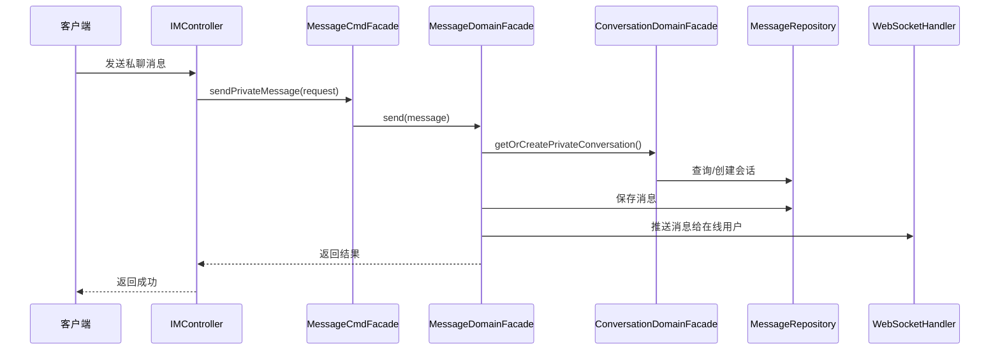
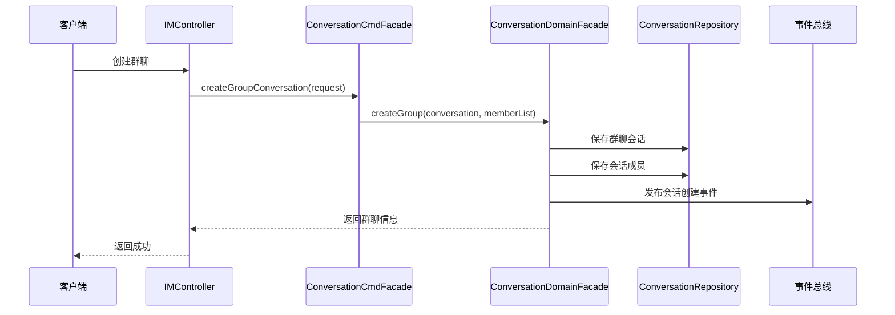
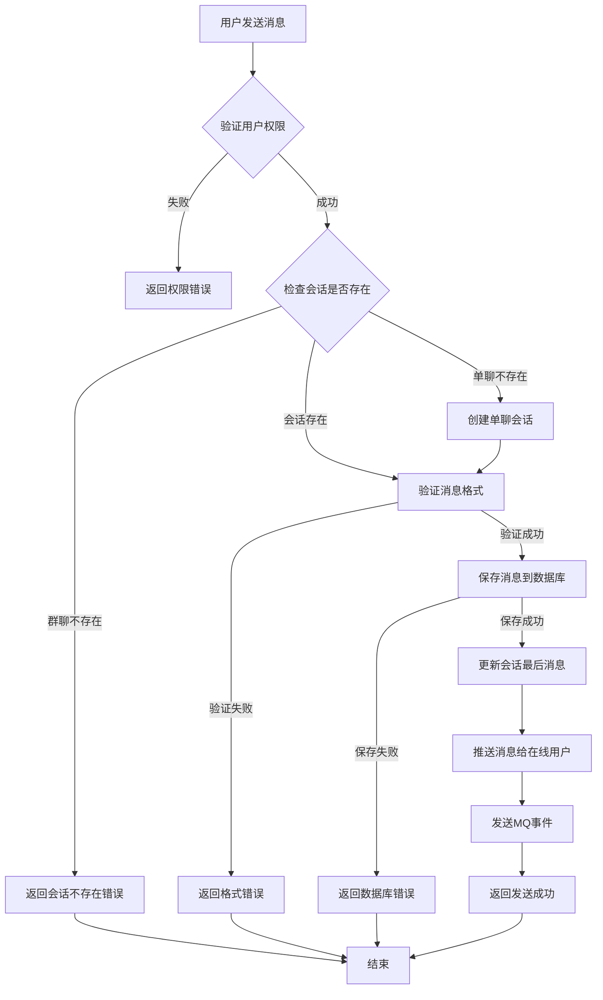
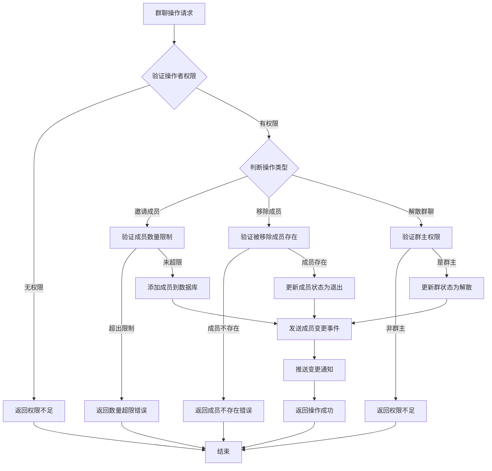
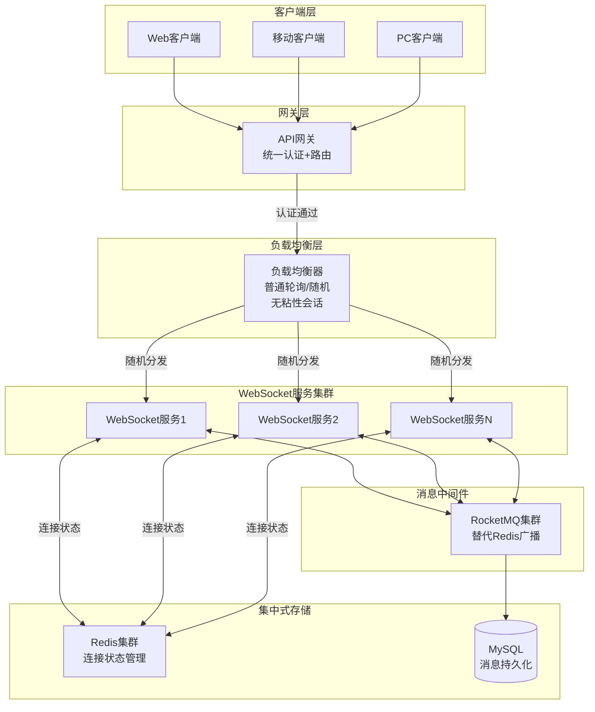
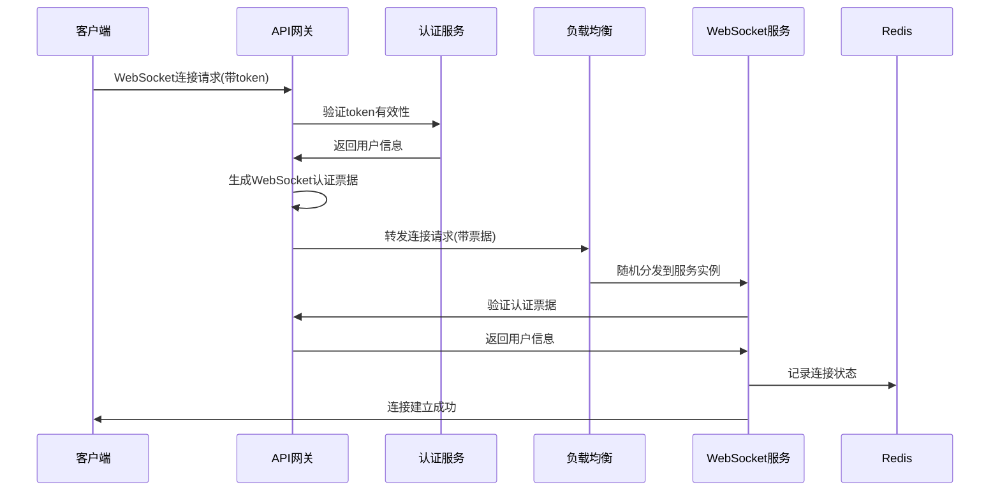
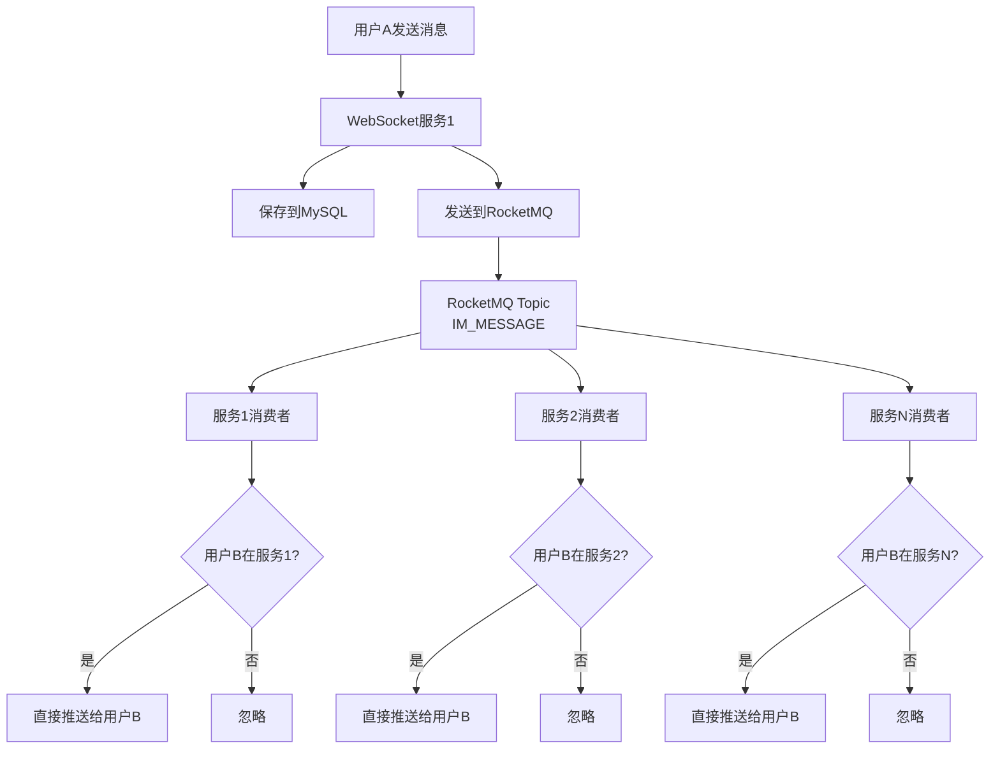
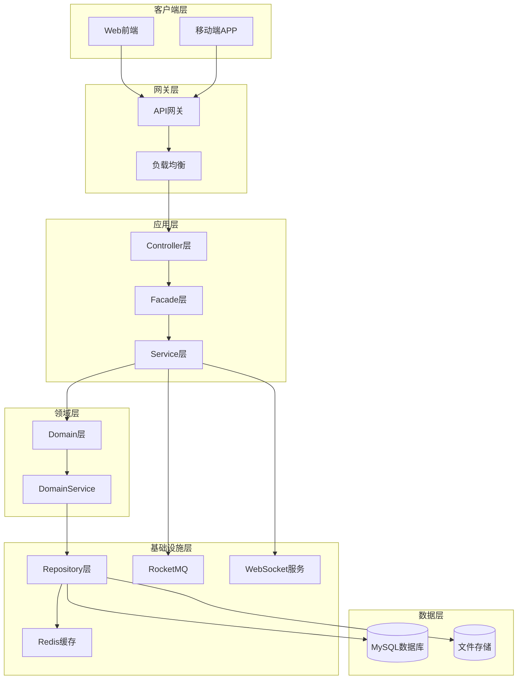
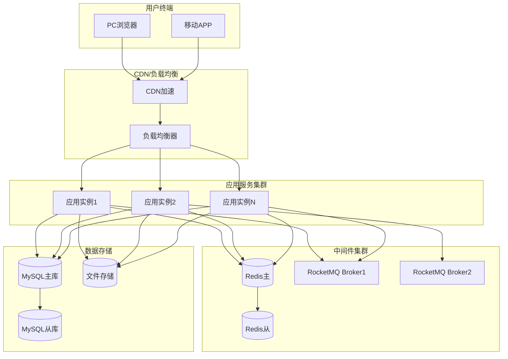

# IM功能升级技术方案

## 文档变更日志
| 日期 | 版本号 | 改动人 | 改动内容 |
|------|--------|--------|----------|
| 2024-12-29 | v1.0 | Claude | 初版技术方案，基于现有消息系统升级为IM功能 |

## 1. 术语
| 中文 | 英文 | 说明 |
|------|------|------|
| 单聊/私聊 | Private Chat | 2个对象直接的沟通，点对点 |
| 群聊 | Group Chat | 3个及以上对象直接的沟通，广播消息 |
| 会话 | Conversation | 单聊或群聊的消息容器 |
| 消息格式 | Message Format | 消息内容类型（文本、图片、文件、语音、视频） |
| 在线状态 | Online Status | 用户当前连接状态 |
| 消息送达 | Message Delivery | 消息成功到达接收方 |
| 消息已读 | Message Read | 接收方已查看消息 |
| 会话成员 | Conversation Member | 参与会话的用户 |
| 成员角色 | Member Role | 会话中用户的权限级别 |

## 2. PRD和交互稿
参考现有消息中心技术方案和以下资料：
- STOMP协议：https://www.cnblogs.com/chase-h/p/18643526
- WebSocket实现：https://www.cnblogs.com/guoapeng/p/17020317.html
- 即时通信设计：https://blog.csdn.net/IEYUDEYINJI/article/details/128722738

### 补充消息关联业务类型
在现有MsgRelatingBizTypeEnum基础上，新增IM相关类型：
```java
//IM功能新增
IM_PRIVATE_CHAT(19, "IM单聊"),
IM_GROUP_CHAT(20, "IM群聊"),
IM_SYSTEM_NOTIFICATION(21, "IM系统通知"),
CONVERSATION(0, "会话"), // 兼容字段，relatingBizType为会话时使用
```

## 3. 用例图
### 聊天模式用例
1. **单聊场景**
   - 用户发起单聊
   - 发送文本/图片/文件消息
   - 消息状态管理（发送中、已送达、已读）
   - 撤回消息
   - 转发消息

2. **群聊场景**
   - 创建群聊
   - 邀请/移除成员
   - 群管理（群主、管理员权限）
   - 群公告管理
   - 退出群聊

3. **系统通知场景**
   - 业务审核通知
   - 订单状态通知
   - 系统公告推送

## 4. 领域模型

### 数据库表设计说明

#### 新增表
1. **t_conversation** - 会话表
2. **t_conversation_member** - 会话成员表

#### 扩展现有表
1. **t_msg_body** - 新增IM相关字段

### 会话设计原则
- A和B单聊与B和A单聊是天然的同一个会话，不能存在多个，而A和B可以创建多个群
- conversation_key，单聊：private_min(id1,id2)_max(id1,id2)，容易判断单聊会话是否存在，保证唯一性
- A的会话列表，跟B的单聊会话看到的是B的logo，而A跟B的群聊会话，看到的是群logo
- 单聊只能有两个成员，每个成员的未读数量直接记录在会话表上，而群聊每个成员的未读数量记录在群成员表上
- 群聊有自己的特性（群管理、群接龙游戏等），单聊是不适合的

### 字段说明
#### conversation_key字段
会话唯一标识，生成规则：
- 单聊：private_min(id1,id2)_max(id1,id2)
- 群聊：group_xxx
- 系统通知：system_{identity_id}
- 平台客服：assistant_{identity_id}

#### conversation_type字段
会话类型：
- private：单聊
- group：群聊
- system：系统通知（买卖家、服务商、商品提交给admin审核结果的通知）
- assistant：平台客服（买卖家、服务商直接向admin咨询，替代之前的留言功能）

#### message_format字段
消息格式类型：
- 0：文本
- 1：图片
- 2：文件
- 3：语音
- 4：视频
- 5：卡片（业务关联消息）

### 领域对象设计

#### 聚合根 (Aggregate Root)

##### Conversation（会话聚合根）
```java
/**
 * 会话聚合根
 */
@Data
@EqualsAndHashCode(callSuper = true)
public class Conversation extends BaseEntity {
    
    private Long conversationId;              // 会话ID
    private String conversationKey;           // 会话唯一标识
    private ConversationType conversationType; // 会话类型值对象
    private String conversationName;          // 会话名称
    private String conversationAvatar;        // 会话头像
    private ConversationStatus status;        // 会话状态值对象
    private List<ConversationMember> memberList; // 会话成员列表（实体）
    private ConversationSetting setting;     // 会话设置值对象
    private Long lastMessageId;              // 最后一条消息ID
    private Long lastActiveTime;             // 最后活跃时间
    private Integer currentMemberCount;      // 当前成员数量
    private Integer maxMemberCount;          // 最大成员数量
    
    // 单聊专用字段
    private MessageUser firstIdentity;       // 第一个身份信息（值对象）
    private MessageUser secondIdentity;      // 第二个身份信息（值对象）
    private Long firstIdentityUnreadCount;   // 第一个身份未读数
    private Long secondIdentityUnreadCount;  // 第二个身份未读数
}
```

##### Message（消息聚合根 - 扩展现有）
```java
/**
 * 消息聚合根 - 扩展现有
 */
@Data
@EqualsAndHashCode(callSuper = true)
public class Message extends BaseEntity {
    
    // 现有字段保持不变
    private MessageBody messageBody;         // 消息体实体
    private Sender sender;                   // 发送者值对象
    private List<Receiver> receiverList;     // 接收者列表值对象
    
    // 新增IM相关字段
    private MessageType messageType;         // 消息类型值对象
    private String conversationId;          // 会话ID
    private MessageFormat messageFormat;    // 消息格式值对象
    private Long replyToMessageId;          // 回复消息ID
    private String fileUrl;                 // 文件URL
    private Long fileSize;                  // 文件大小
    private Integer duration;               // 音视频时长
    private Boolean isRecalled;             // 是否已撤回
    private Long recallTime;                // 撤回时间
}
```

#### 实体 (Entity)

##### ConversationMember（会话成员实体）
```java
/**
 * 会话成员实体
 */
@Data
@EqualsAndHashCode(callSuper = true)
public class ConversationMember extends CommonEntity {
    
    private Long memberId;                   // 成员ID
    private Long conversationId;             // 会话ID
    private MessageUser memberUser;          // 成员用户信息（值对象）
    private MemberRole memberRole;           // 成员角色（值对象）
    private MemberStatus memberStatus;       // 成员状态（值对象）
    private Long joinTime;                   // 加入时间
    private Long exitTime;                   // 退出时间
    private Long lastReadMessageId;          // 最后已读消息ID
    private Long unreadCount;                // 未读消息数（群聊专用）
    private Boolean muteNotification;        // 是否静音通知
}
```

##### MessageBody（消息体实体 - 扩展现有）
```java
/**
 * 消息体实体 - 扩展现有
 */
@Data
@EqualsAndHashCode(callSuper = true)
public class MessageBody extends CommonEntity {
    
    // 现有字段保持不变
    private Long messageId;                  // 消息ID
    private String title;                    // 标题
    private String content;                  // 内容
    private Integer relatingBizType;         // 关联业务类型
    private String relatingBizId;            // 关联业务ID
    private Long relatingParentMsgId;        // 关联父消息ID
    
    // 新增IM相关字段
    private Integer messageType;             // 消息类型
    private String conversationId;          // 会话ID
    private Integer messageFormat;           // 消息格式
    private Long replyToMessageId;          // 回复消息ID
    private String fileUrl;                 // 文件URL
    private Long fileSize;                  // 文件大小
    private Integer duration;               // 音视频时长
    private Boolean isRecalled;             // 是否已撤回
    private Long recallTime;                // 撤回时间
}
```

#### 值对象 (Value Object)

##### ConversationType（会话类型值对象）
```java
/**
 * 会话类型值对象
 */
@Data
@EqualsAndHashCode(callSuper = true)
public class ConversationType extends BaseValueObject {
    private String type;                     // 类型编码
    private String typeName;                 // 类型名称
    private Integer maxMemberCount;          // 最大成员数量
}
```

##### ConversationStatus（会话状态值对象）
```java
/**
 * 会话状态值对象
 */
@Data
@EqualsAndHashCode(callSuper = true)
public class ConversationStatus extends BaseValueObject {
    private Integer status;                  // 状态编码
    private String statusName;               // 状态名称
    private Long statusChangeTime;           // 状态变更时间
}
```

##### ConversationSetting（会话设置值对象）
```java
/**
 * 会话设置值对象
 */
@Data
@EqualsAndHashCode(callSuper = true)
public class ConversationSetting extends BaseValueObject {
    private Boolean allowInvite;             // 是否允许邀请新成员
    private Boolean allowMemberExit;         // 是否允许成员退出
    private Boolean enableMessageHistory;    // 是否启用消息历史
    private Integer messageRetentionDays;    // 消息保留天数
    private Boolean enableNotification;      // 是否启用通知
}
```

##### MemberRole（成员角色值对象）
```java
/**
 * 成员角色值对象
 */
@Data
@EqualsAndHashCode(callSuper = true)
public class MemberRole extends BaseValueObject {
    private Integer role;                    // 角色编码
    private String roleName;                 // 角色名称
    private List<String> permissions;        // 权限列表
}
```

##### MemberStatus（成员状态值对象）
```java
/**
 * 成员状态值对象
 */
@Data
@EqualsAndHashCode(callSuper = true)
public class MemberStatus extends BaseValueObject {
    private Integer status;                  // 状态编码
    private String statusName;               // 状态名称
    private Long statusChangeTime;           // 状态变更时间
}
```

##### MessageType（消息类型值对象 - 扩展现有）
```java
/**
 * 消息类型值对象 - 扩展现有
 */
@Data
@EqualsAndHashCode(callSuper = true)
public class MessageType extends BaseValueObject {
    private Integer type;                    // 类型编码
    private String typeName;                 // 类型名称
    private MessageFormat format;            // 消息格式值对象
}
```

##### MessageFormat（消息格式值对象）
```java
/**
 * 消息格式值对象
 */
@Data
@EqualsAndHashCode(callSuper = true)
public class MessageFormat extends BaseValueObject {
    private Integer format;                  // 格式编码
    private String formatName;               // 格式名称
    private String mimeType;                 // MIME类型
    private Long maxSize;                    // 最大文件大小
}
```

### 领域事件 (Domain Event)

#### 会话相关事件
```java
// 会话创建事件
public class ConversationCreatedEvent extends BaseDomainEvent {
    private Long conversationId;
    private String conversationType;
    private List<String> memberIds;
}

// 会话解散事件
public class ConversationDissolvedEvent extends BaseDomainEvent {
    private Long conversationId;
    private String operatorId;
}

// 成员加入事件
public class MemberJoinedEvent extends BaseDomainEvent {
    private Long conversationId;
    private String memberId;
    private String inviterId;
}

// 成员退出事件
public class MemberExitedEvent extends BaseDomainEvent {
    private Long conversationId;
    private String memberId;
    private String exitType; // 主动退出/被移除
}
```

#### 消息相关事件
```java
// IM消息发送事件
public class IMMessageSentEvent extends BaseDomainEvent {
    private Long messageId;
    private String conversationId;
    private String senderId;
    private Integer messageFormat;
}

// 消息撤回事件
public class MessageRecalledEvent extends BaseDomainEvent {
    private Long messageId;
    private String operatorId;
    private Long recallTime;
}

// 消息已读事件
public class MessageReadEvent extends BaseDomainEvent {
    private Long messageId;
    private String readerId;
    private Long readTime;
}
```

### 领域服务 (Domain Service)

业务逻辑通过DomainService的静态方法实现，不在领域对象中编写业务逻辑：

#### 1. ConversationDomainService（会话领域服务）
```java
public class ConversationDomainService {
    
    private static final String CONVERSATION_INSERT_LOCK_PREFIX = "CONVERSATION_INSERT_";
    private static final String CONVERSATION_UPDATE_LOCK_PREFIX = "CONVERSATION_UPDATE_";
    
    /**
     * 生成会话唯一标识
     */
    public static String generateConversationKey(ConversationType type, String... memberIds) {
        switch (type.getType()) {
            case "private":
                // 单聊：private_min(id1,id2)_max(id1,id2)
                List<String> sortedIds = Arrays.stream(memberIds).sorted().collect(Collectors.toList());
                return String.format("private_%s_%s", sortedIds.get(0), sortedIds.get(1));
            case "group":
                // 群聊：group_随机UUID
                return "group_" + UUID.randomUUID().toString().replace("-", "");
            case "system":
                // 系统通知：system_{identity_id}
                return "system_" + memberIds[0];
            case "assistant":
                // 平台客服：assistant_{identity_id}
                return "assistant_" + memberIds[0];
            default:
                throw new IllegalArgumentException("Unknown conversation type: " + type.getType());
        }
    }
    
    /**
     * 验证成员数量限制
     */
    public static void validateMemberCount(Conversation conversation, int newMemberCount) {
        AssertUtil.that(conversation != null, BasicErrorCode.PARAM_ERROR, "conversation null");
        AssertUtil.that(newMemberCount <= conversation.getMaxMemberCount(), 
                        BasicErrorCode.BUSINESS_ERROR, "超过最大成员数量限制");
    }
    
    /**
     * 验证用户是否有权限操作会话
     */
    public static void validateOperationPermission(Conversation conversation, String operatorId, String permission) {
        AssertUtil.that(conversation != null, BasicErrorCode.PARAM_ERROR, "conversation null");
        
        ConversationMember operator = conversation.getMemberList().stream()
                .filter(member -> operatorId.equals(member.getMemberUser().getIdentityId()))
                .findFirst()
                .orElse(null);
        
        AssertUtil.that(operator != null, BasicErrorCode.PERMISSION_DENIED, "用户不在会话中");
        AssertUtil.that(operator.getMemberRole().getPermissions().contains(permission), 
                        BasicErrorCode.PERMISSION_DENIED, "权限不足");
    }
    
    /**
     * 计算单聊未读数量
     */
    public static void calculatePrivateChatUnreadCount(Conversation conversation, String identityId) {
        if (!"private".equals(conversation.getConversationType().getType())) {
            return;
        }
        
        // 根据身份ID判断是第一个还是第二个身份
        if (conversation.getFirstIdentity().getIdentityId().equals(identityId)) {
            // 计算第一个身份的未读数
            // 这里需要调用Repository查询未读消息数量
        } else if (conversation.getSecondIdentity().getIdentityId().equals(identityId)) {
            // 计算第二个身份的未读数
        }
    }
    
    /**
     * 获取分布式锁键 - 插入操作
     */
    public static String getDistributedLockKeyForInsert(String conversationKey) {
        return UniqueKeyUtil.generateUniqueKey(CONVERSATION_INSERT_LOCK_PREFIX, conversationKey);
    }
    
    /**
     * 获取分布式锁键 - 更新操作
     */
    public static String getDistributedLockKeyForUpdate(Long conversationId) {
        return UniqueKeyUtil.generateUniqueKey(CONVERSATION_UPDATE_LOCK_PREFIX, conversationId);
    }
}
```

#### 2. MessageDomainService（消息领域服务 - 扩展现有）
```java
public class MessageDomainService {
    
    // ... 现有方法保持不变
    
    /**
     * 判断是否为IM消息
     */
    public static boolean isIMMessage(Message message) {
        AssertUtil.that(message != null, BasicErrorCode.PARAM_ERROR, "message null");
        
        Integer relatingBizType = message.getMessageBody().getRelatingBizType();
        return relatingBizType != null && (relatingBizType == 19 || relatingBizType == 20 || relatingBizType == 21);
    }
    
    /**
     * 判断是否为业务消息
     */
    public static boolean isBusinessMessage(Message message) {
        return !isIMMessage(message);
    }
    
    /**
     * 撤回消息
     */
    public static void recallMessage(Message message, String operatorId) {
        AssertUtil.that(message != null, BasicErrorCode.PARAM_ERROR, "message null");
        AssertUtil.that(!message.getIsRecalled(), BasicErrorCode.BUSINESS_ERROR, "消息已撤回");
        
        // 验证撤回权限（只有发送者可以撤回，或者管理员）
        String senderId = message.getSender().getSenderUser().getIdentityId();
        AssertUtil.that(senderId.equals(operatorId), BasicErrorCode.PERMISSION_DENIED, "只能撤回自己的消息");
        
        // 验证撤回时间限制（比如2分钟内）
        long currentTime = System.currentTimeMillis();
        long sendTime = message.getCreateTime();
        long timeDiff = currentTime - sendTime;
        AssertUtil.that(timeDiff <= 2 * 60 * 1000, BasicErrorCode.BUSINESS_ERROR, "超过撤回时间限制");
        
        message.setIsRecalled(true);
        message.setRecallTime(currentTime);
    }
    
    /**
     * 验证消息格式
     */
    public static void validateMessageFormat(Message message) {
        AssertUtil.that(message != null, BasicErrorCode.PARAM_ERROR, "message null");
        
        MessageFormat format = message.getMessageFormat();
        if (format == null) {
            return;
        }
        
        // 验证文件大小限制
        if (message.getFileSize() != null && message.getFileSize() > format.getMaxSize()) {
            throw new BusinessException(BasicErrorCode.BUSINESS_ERROR, "文件大小超过限制");
        }
        
        // 验证内容长度
        String content = message.getMessageBody().getContent();
        if (format.getFormat() == 0 && content != null && content.length() > format.getMaxSize()) {
            throw new BusinessException(BasicErrorCode.BUSINESS_ERROR, "文本内容过长");
        }
    }
    
    /**
     * 填充会话相关信息
     */
    public static void fillConversationInfo(Message message, Conversation conversation) {
        AssertUtil.that(message != null, BasicErrorCode.PARAM_ERROR, "message null");
        AssertUtil.that(conversation != null, BasicErrorCode.PARAM_ERROR, "conversation null");
        
        message.setConversationId(conversation.getConversationId().toString());
        message.getMessageBody().setConversationId(conversation.getConversationId().toString());
    }
}
```

#### 3. ConversationMemberDomainService（会话成员领域服务）
```java
public class ConversationMemberDomainService {
    
    /**
     * 更新成员角色
     */
    public static void updateMemberRole(ConversationMember member, MemberRole newRole, String operatorId) {
        AssertUtil.that(member != null, BasicErrorCode.PARAM_ERROR, "member null");
        AssertUtil.that(newRole != null, BasicErrorCode.PARAM_ERROR, "newRole null");
        
        // 验证操作权限（只有群主可以设置管理员，管理员和群主可以设置普通成员）
        MemberRole operatorRole = getCurrentMemberRole(member.getConversationId(), operatorId);
        validateRoleChangePermission(operatorRole, member.getMemberRole(), newRole);
        
        member.setMemberRole(newRole);
    }
    
    /**
     * 成员退出会话
     */
    public static void exitConversation(ConversationMember member) {
        AssertUtil.that(member != null, BasicErrorCode.PARAM_ERROR, "member null");
        AssertUtil.that(MemberStatus.ACTIVE.equals(member.getMemberStatus().getStatus()), 
                        BasicErrorCode.BUSINESS_ERROR, "成员状态异常");
        
        member.setMemberStatus(MemberStatus.exited());
        member.setExitTime(System.currentTimeMillis());
    }
    
    /**
     * 更新最后已读消息
     */
    public static void updateLastReadMessage(ConversationMember member, Long messageId) {
        AssertUtil.that(member != null, BasicErrorCode.PARAM_ERROR, "member null");
        AssertUtil.that(messageId != null, BasicErrorCode.PARAM_ERROR, "messageId null");
        
        // 验证消息ID有效性
        if (member.getLastReadMessageId() != null && messageId <= member.getLastReadMessageId()) {
            return; // 不能回退已读位置
        }
        
        member.setLastReadMessageId(messageId);
        // 未读数的重新计算在Repository层处理
    }
    
    /**
     * 计算群聊未读数量
     */
    public static Long calculateGroupUnreadCount(ConversationMember member, Long totalMessageCount) {
        if (member.getLastReadMessageId() == null) {
            return totalMessageCount;
        }
        // 具体计算逻辑在Repository层实现
        return 0L;
    }
    
    private static MemberRole getCurrentMemberRole(Long conversationId, String identityId) {
        // 这里需要调用Repository查询当前用户在会话中的角色
        // 为了示例，返回普通成员角色
        return MemberRole.member();
    }
    
    private static void validateRoleChangePermission(MemberRole operatorRole, MemberRole currentRole, MemberRole newRole) {
        // 验证角色变更权限的具体逻辑
        // 群主可以设置任何角色，管理员只能设置普通成员
    }
}
```

## 5. 时序图

### 单聊发送消息时序图


### 群聊创建时序图


## 6. 应用服务层

### Facade接口设计

#### ConversationCmdFacade（会话命令门面）
```java
/**
 * 会话命令门面
 */
public interface ConversationCmdFacade {
    
    /**
     * 创建单聊会话
     */
    ConversationDTO createPrivateConversation(CreatePrivateConversationRequest request);
    
    /**
     * 创建群聊会话
     */
    ConversationDTO createGroupConversation(CreateGroupConversationRequest request);
    
    /**
     * 邀请成员加入群聊
     */
    boolean inviteMembersToGroup(InviteMembersRequest request);
    
    /**
     * 移除群聊成员
     */
    boolean removeMemberFromGroup(RemoveMemberRequest request);
    
    /**
     * 更新会话设置
     */
    boolean updateConversationSetting(UpdateConversationSettingRequest request);
    
    /**
     * 解散群聊
     */
    boolean dissolveGroup(DissolveGroupRequest request);
    
    /**
     * 退出群聊
     */
    boolean exitGroup(ExitGroupRequest request);
}
```

#### ConversationQueryFacade（会话查询门面）
```java
/**
 * 会话查询门面
 */
public interface ConversationQueryFacade {
    
    /**
     * 分页查询用户会话列表
     */
    PageList<ConversationDTO> pageUserConversations(QueryUserConversationsParam param, PageParam pageParam);
    
    /**
     * 查询会话详情
     */
    ConversationDTO getConversationDetail(QueryConversationDetailParam param);
    
    /**
     * 查询会话成员列表
     */
    List<ConversationMemberDTO> getConversationMembers(QueryConversationMembersParam param);
    
    /**
     * 查询用户在会话中的角色和权限
     */
    ConversationMemberDTO getUserRoleInConversation(QueryUserRoleParam param);
    
    /**
     * 查询会话消息历史
     */
    PageList<MessageDTO> pageConversationMessages(QueryConversationMessagesParam param, PageParam pageParam);
}
```

#### MessageCmdFacade（消息命令门面 - 扩展现有）
```java
/**
 * 消息命令门面 - 扩展现有
 */
public interface MessageCmdFacade {
    
    // 现有方法保持不变
    
    /**
     * 发送IM私聊消息
     */
    MessageDTO sendPrivateMessage(SendPrivateMessageRequest request);
    
    /**
     * 发送IM群聊消息
     */
    MessageDTO sendGroupMessage(SendGroupMessageRequest request);
    
    /**
     * 撤回消息
     */
    boolean recallMessage(RecallMessageRequest request);
    
    /**
     * 转发消息
     */
    MessageDTO forwardMessage(ForwardMessageRequest request);
    
    /**
     * 标记消息已读
     */
    boolean markMessageRead(MarkMessageReadRequest request);
    
    /**
     * 批量标记会话消息已读
     */
    boolean markConversationRead(MarkConversationReadRequest request);
}
```

#### MessageQueryFacade（消息查询门面 - 扩展现有）
```java
/**
 * 消息查询门面 - 扩展现有
 */
public interface MessageQueryFacade {
    
    // 现有方法保持不变
    
    /**
     * 查询IM消息列表
     */
    PageList<MessageDTO> pageIMMessages(QueryIMMessagesParam param, PageParam pageParam);
    
    /**
     * 查询会话中的消息
     */
    PageList<MessageDTO> pageConversationMessages(QueryConversationMessagesParam param, PageParam pageParam);
    
    /**
     * 查询消息详情（包含回复信息）
     */
    MessageDetailDTO getMessageDetail(QueryMessageDetailParam param);
    
    /**
     * 搜索消息内容
     */
    PageList<MessageDTO> searchMessages(SearchMessagesParam param, PageParam pageParam);
    
    /**
     * 查询用户未读消息统计
     */
    UnreadStatisticDTO getUnreadStatistic(QueryUnreadStatisticParam param);
}
```

### DomainFacade接口设计

#### ConversationDomainFacade（会话领域门面）
```java
/**
 * 会话领域门面
 */
public interface ConversationDomainFacade {
    
    /**
     * 获取或创建单聊会话
     */
    Conversation getOrCreatePrivateConversation(String firstIdentityId, String secondIdentityId);
    
    /**
     * 创建群聊会话
     */
    Conversation createGroupConversation(Conversation conversation, List<ConversationMember> members);
    
    /**
     * 添加会话成员
     */
    boolean addMember(Long conversationId, ConversationMember member);
    
    /**
     * 移除会话成员
     */
    boolean removeMember(Long conversationId, String memberId, String operatorId);
    
    /**
     * 更新最后消息信息
     */
    boolean updateLastMessage(Long conversationId, Long messageId, Long activeTime);
    
    /**
     * 解散会话
     */
    boolean dissolveConversation(Long conversationId, String operatorId);
    
    /**
     * 更新会话设置
     */
    boolean updateSetting(Long conversationId, ConversationSetting setting);
    
    /**
     * 查询会话详情
     */
    Conversation getById(Long conversationId);
    
    /**
     * 查询用户会话列表
     */
    List<Conversation> getUserConversations(String identityId);
    
    /**
     * 通过会话key查询
     */
    Conversation getByConversationKey(String conversationKey);
}
```

#### MessageDomainFacade（消息领域门面 - 扩展现有）
```java
/**
 * 消息领域门面 - 扩展现有
 */
public interface MessageDomainFacade {
    
    // 现有方法保持不变
    
    /**
     * 发送IM消息
     */
    boolean sendIMMessage(Message message);
    
    /**
     * 撤回消息
     */
    boolean recallMessage(Long messageId, String operatorId);
    
    /**
     * 查询会话消息
     */
    PageList<Message> pageConversationMessages(String conversationId, PageParam pageParam);
    
    /**
     * 更新消息状态
     */
    boolean updateMessageStatus(Long messageId, Integer status);
    
    /**
     * 查询IM消息列表
     */
    List<Message> getIMMessages(QueryIMMessagesParam param);
}
```

## 7. 领域服务层

### DomainService设计

#### ConversationDomainService（会话领域服务）
```java
/**
 * 会话领域服务
 */
public class ConversationDomainService {
    
    /**
     * 生成会话唯一标识
     */
    public static String generateConversationKey(ConversationType type, String... memberIds);
    
    /**
     * 验证成员数量限制
     */
    public static void validateMemberCount(Conversation conversation, int newMemberCount);
    
    /**
     * 验证用户是否有权限操作会话
     */
    public static void validateOperationPermission(Conversation conversation, String operatorId, String permission);
    
    /**
     * 计算单聊未读数量
     */
    public static void calculatePrivateChatUnreadCount(Conversation conversation, String identityId);
    
    /**
     * 获取分布式锁键 - 插入操作
     */
    public static String getDistributedLockKeyForInsert(String conversationKey);
    
    /**
     * 获取分布式锁键 - 更新操作
     */
    public static String getDistributedLockKeyForUpdate(Long conversationId);
}
```

#### MessageDomainService（消息领域服务 - 扩展现有）
```java
/**
 * 消息领域服务 - 扩展现有
 */
public class MessageDomainService {
    
    // 现有方法保持不变
    
    /**
     * 判断是否为IM消息
     */
    public static boolean isIMMessage(Message message);
    
    /**
     * 判断是否为业务消息
     */
    public static boolean isBusinessMessage(Message message);
    
    /**
     * 撤回消息
     */
    public static void recallMessage(Message message, String operatorId);
    
    /**
     * 验证消息格式
     */
    public static void validateMessageFormat(Message message);
    
    /**
     * 填充会话相关信息
     */
    public static void fillConversationInfo(Message message, Conversation conversation);
}
```

#### ConversationMemberDomainService（会话成员领域服务）
```java
/**
 * 会话成员领域服务
 */
public class ConversationMemberDomainService {
    
    /**
     * 更新成员角色
     */
    public static void updateMemberRole(ConversationMember member, MemberRole newRole, String operatorId);
    
    /**
     * 成员退出会话
     */
    public static void exitConversation(ConversationMember member);
    
    /**
     * 更新最后已读消息
     */
    public static void updateLastReadMessage(ConversationMember member, Long messageId);
    
    /**
     * 计算群聊未读数量
     */
    public static Long calculateGroupUnreadCount(ConversationMember member, Long totalMessageCount);
}
```

### DomainStatusFacade设计

#### ConversationStatusFacade（会话状态机门面）
```java
/**
 * 会话状态机门面
 */
public interface ConversationStatusFacade {
    
    /**
     * 激活会话
     */
    boolean activeConversation(Long conversationId);
    
    /**
     * 静音会话
     */
    boolean muteConversation(Long conversationId, String operatorId);
    
    /**
     * 归档会话
     */
    boolean archiveConversation(Long conversationId, String operatorId);
    
    /**
     * 解散会话
     */
    boolean dissolveConversation(Long conversationId, String operatorId);
    
    /**
     * 检查会话状态是否可操作
     */
    boolean canOperate(Long conversationId, String operation);
}
```

## 8. 仓储层

### Repository接口设计

#### ConversationRepository（会话仓储接口）
```java
/**
 * 会话仓储接口
 */
public interface ConversationRepository {
    
    /**
     * 保存会话
     */
    boolean save(Conversation conversation);
    
    /**
     * 更新会话（使用consumer方式）
     */
    boolean update(Long conversationId, Consumer<Conversation> updater);
    
    /**
     * 查询会话详情
     */
    Conversation getById(Long conversationId);
    
    /**
     * 通过会话key查询
     */
    Conversation getByConversationKey(String conversationKey);
    
    /**
     * 查询用户会话列表
     */
    PageList<Conversation> pageUserConversations(String identityId, PageParam pageParam);
    
    /**
     * 查询会话成员列表
     */
    List<ConversationMember> getMembers(Long conversationId);
    
    /**
     * 批量查询会话
     */
    List<Conversation> listByIds(List<Long> conversationIds);
    
    /**
     * 删除会话
     */
    boolean delete(Long conversationId);
}
```

#### ConversationMemberRepository（会话成员仓储接口）
```java
/**
 * 会话成员仓储接口
 */
public interface ConversationMemberRepository {
    
    /**
     * 保存会话成员
     */
    boolean save(ConversationMember member);
    
    /**
     * 更新会话成员（使用consumer方式）
     */
    boolean update(Long memberId, Consumer<ConversationMember> updater);
    
    /**
     * 查询会话成员
     */
    ConversationMember getById(Long memberId);
    
    /**
     * 查询用户在会话中的成员信息
     */
    ConversationMember getByConversationAndUser(Long conversationId, String identityId);
    
    /**
     * 查询会话所有成员
     */
    List<ConversationMember> listByConversationId(Long conversationId);
    
    /**
     * 查询用户参与的所有会话
     */
    List<ConversationMember> listByUserId(String identityId);
    
    /**
     * 批量保存成员
     */
    boolean batchSave(List<ConversationMember> members);
    
    /**
     * 移除成员
     */
    boolean removeMember(Long conversationId, String identityId);
    
    /**
     * 计算会话未读数量
     */
    Long calculateUnreadCount(Long conversationId, String identityId, Long lastReadMessageId);
}
```

### 数据库表设计

#### 新增表

##### t_conversation（会话表）
```sql
CREATE TABLE t_conversation (
    conversation_id BIGINT PRIMARY KEY COMMENT '会话ID',
    conversation_key VARCHAR(100) NOT NULL UNIQUE COMMENT '会话唯一标识',
    conversation_type VARCHAR(20) NOT NULL COMMENT '会话类型(private/group/system/assistant)',
    conversation_name VARCHAR(100) COMMENT '会话名称',
    conversation_avatar VARCHAR(255) COMMENT '会话头像',
    status INT DEFAULT 1 COMMENT '会话状态(1正常2解散3归档)',
    setting JSON COMMENT '会话设置',
    last_message_id BIGINT COMMENT '最后一条消息ID',
    last_active_time BIGINT COMMENT '最后活跃时间',
    current_member_count INT DEFAULT 0 COMMENT '当前成员数量',
    max_member_count INT DEFAULT 500 COMMENT '最大成员数量',
    
    -- 单聊专用字段
    first_identity_id VARCHAR(50) COMMENT '第一个身份ID',
    first_identity_type INT COMMENT '第一个身份类型',
    first_identity_unread_count BIGINT DEFAULT 0 COMMENT '第一个身份未读数',
    second_identity_id VARCHAR(50) COMMENT '第二个身份ID', 
    second_identity_type INT COMMENT '第二个身份类型',
    second_identity_unread_count BIGINT DEFAULT 0 COMMENT '第二个身份未读数',
    
    source INT DEFAULT 0 COMMENT '来源',
    create_time BIGINT NOT NULL COMMENT '创建时间',
    update_time BIGINT NOT NULL COMMENT '更新时间',
    
    INDEX idx_conversation_key (conversation_key),
    INDEX idx_conversation_type (conversation_type),
    INDEX idx_first_identity (first_identity_id, first_identity_type),
    INDEX idx_second_identity (second_identity_id, second_identity_type),
    INDEX idx_last_active_time (last_active_time)
) COMMENT='会话表';
```

##### t_conversation_member（会话成员表）
```sql
CREATE TABLE t_conversation_member (
    member_id BIGINT PRIMARY KEY COMMENT '成员ID',
    conversation_id BIGINT NOT NULL COMMENT '会话ID',
    identity_id VARCHAR(50) NOT NULL COMMENT '身份ID',
    identity_type INT NOT NULL COMMENT '身份类型',
    nickname VARCHAR(100) COMMENT '昵称',
    avatar VARCHAR(255) COMMENT '头像',
    member_role INT DEFAULT 1 COMMENT '成员角色(1普通成员2管理员3群主)',
    member_status INT DEFAULT 1 COMMENT '成员状态(1正常2已退出)',
    join_time BIGINT NOT NULL COMMENT '加入时间',
    exit_time BIGINT COMMENT '退出时间',
    last_read_message_id BIGINT COMMENT '最后已读消息ID',
    unread_count BIGINT DEFAULT 0 COMMENT '未读消息数(群聊专用)',
    mute_notification BOOLEAN DEFAULT FALSE COMMENT '是否静音通知',
    
    source INT DEFAULT 0 COMMENT '来源',
    create_time BIGINT NOT NULL COMMENT '创建时间',
    update_time BIGINT NOT NULL COMMENT '更新时间',
    
    UNIQUE KEY uk_conversation_member (conversation_id, identity_id, identity_type),
    INDEX idx_identity (identity_id, identity_type),
    INDEX idx_conversation_id (conversation_id),
    INDEX idx_member_status (member_status)
) COMMENT='会话成员表';
```

#### 扩展现有表

##### t_msg_body（扩展IM字段）
```sql
ALTER TABLE t_msg_body ADD COLUMN message_type INT COMMENT '消息类型';
ALTER TABLE t_msg_body ADD COLUMN conversation_id VARCHAR(50) COMMENT '会话ID';
ALTER TABLE t_msg_body ADD COLUMN message_format INT DEFAULT 0 COMMENT '消息格式(0文本1图片2文件3语音4视频5卡片)';
ALTER TABLE t_msg_body ADD COLUMN reply_to_message_id BIGINT COMMENT '回复消息ID';
ALTER TABLE t_msg_body ADD COLUMN file_url VARCHAR(500) COMMENT '文件URL';
ALTER TABLE t_msg_body ADD COLUMN file_size BIGINT COMMENT '文件大小';
ALTER TABLE t_msg_body ADD COLUMN duration INT COMMENT '音视频时长(秒)';
ALTER TABLE t_msg_body ADD COLUMN is_recalled BOOLEAN DEFAULT FALSE COMMENT '是否已撤回';
ALTER TABLE t_msg_body ADD COLUMN recall_time BIGINT COMMENT '撤回时间';

-- 添加索引
ALTER TABLE t_msg_body ADD INDEX idx_conversation_id (conversation_id);
ALTER TABLE t_msg_body ADD INDEX idx_message_type (message_type);
ALTER TABLE t_msg_body ADD INDEX idx_message_format (message_format);
ALTER TABLE t_msg_body ADD INDEX idx_reply_to_message_id (reply_to_message_id);
```

## 9. 流程处理器

### 消息处理器
```java
/**
 * IM消息处理器
 */
@Component
public class IMMessageProcessor {
    
    /**
     * 处理私聊消息
     */
    public void processPrivateMessage(IMMessageSentEvent event);
    
    /**
     * 处理群聊消息
     */
    public void processGroupMessage(IMMessageSentEvent event);
    
    /**
     * 处理消息撤回
     */
    public void processMessageRecall(MessageRecalledEvent event);
    
    /**
     * 处理消息已读
     */
    public void processMessageRead(MessageReadEvent event);
}
```

### 会话处理器
```java
/**
 * 会话处理器
 */
@Component
public class ConversationProcessor {
    
    /**
     * 处理会话创建
     */
    public void processConversationCreated(ConversationCreatedEvent event);
    
    /**
     * 处理成员加入
     */
    public void processMemberJoined(MemberJoinedEvent event);
    
    /**
     * 处理成员退出
     */
    public void processMemberExited(MemberExitedEvent event);
    
    /**
     * 处理会话解散
     */
    public void processConversationDissolved(ConversationDissolvedEvent event);
}
```

## 10. WebSocket协议

### STOMP协议集成

#### WebSocket配置
```java
/**
 * WebSocket配置
 */
@Configuration
@EnableWebSocketMessageBroker
public class WebSocketConfig implements WebSocketMessageBrokerConfigurer {

    @Override
    public void configureMessageBroker(MessageBrokerRegistry config) {
        // 启用内存消息代理，用于向客户端发送消息
        config.enableSimpleBroker("/topic", "/queue");
        // 设置应用程序的消息前缀
        config.setApplicationDestinationPrefixes("/app");
        // 设置点对点消息前缀
        config.setUserDestinationPrefix("/user");
    }

    @Override
    public void registerStompEndpoints(StompEndpointRegistry registry) {
        // 注册WebSocket端点
        registry.addEndpoint("/ws/im")
                .setAllowedOriginPatterns("*")
                .withSockJS();
    }
}
```

#### 消息推送服务
```java
/**
 * IM WebSocket服务
 */
@Service
public class IMWebSocketService {
    
    @Autowired
    private SimpMessagingTemplate messagingTemplate;
    
    /**
     * 推送私聊消息
     */
    public void sendPrivateMessage(String receiverId, MessageDTO message);
    
    /**
     * 推送群聊消息
     */
    public void sendGroupMessage(String conversationId, MessageDTO message);
    
    /**
     * 推送系统通知
     */
    public void sendSystemNotification(String userId, Object notification);
    
    /**
     * 推送消息状态更新
     */
    public void sendMessageStatusUpdate(String conversationId, MessageStatusUpdateDTO status);
}
```

### WebSocket消息控制器
```java
/**
 * IM WebSocket控制器
 */
@Controller
public class IMWebSocketController {
    
    @Autowired
    private MessageCmdFacade messageCmdFacade;
    
    /**
     * 发送私聊消息
     */
    @MessageMapping("/private.send")
    public void sendPrivateMessage(@Payload SendPrivateMessageRequest request, 
                                   SimpMessageHeaderAccessor headerAccessor);
    
    /**
     * 发送群聊消息
     */
    @MessageMapping("/group.send")
    public void sendGroupMessage(@Payload SendGroupMessageRequest request,
                                SimpMessageHeaderAccessor headerAccessor);
    
    /**
     * 标记消息已读
     */
    @MessageMapping("/message.read")
    public void markMessageRead(@Payload MarkMessageReadRequest request,
                               SimpMessageHeaderAccessor headerAccessor);
}
```

## 11. 流程图

### IM消息发送流程


### 群聊管理流程


## 12. 关键方案设计与选型

### 核心架构决策

基于深度技术分析和优化建议，设计出更先进的分布式WebSocket架构：

#### 12.1 架构优化问题分析

##### 原方案存在的问题
| 问题类型 | 具体问题 | 影响 | 解决方案 |
|---------|----------|------|----------|
| **粘性会话局限性** | 节点宕机导致用户连接中断 | 可用性差 | 集中式会话管理 |
| **Redis广播瓶颈** | Pub/Sub性能瓶颈，不支持持久化 | 消息丢失风险 | 完全使用RocketMQ |
| **内存会话管理** | ConcurrentHashMap占用内存高，不易扩展 | 扩展性差 | Redis分布式存储 |
| **缺乏状态监控** | 无法及时发现异常连接 | 资源浪费 | 心跳机制+监控 |
| **安全认证不足** | WebSocket连接缺乏统一认证 | 安全风险 | API网关统一认证 |

#### 12.2 优化后的分布式架构（推荐）

##### 无粘性会话的分布式架构


##### 核心设计原则
1. **无粘性会话**：任何服务器都能处理任何用户的请求
2. **状态外置**：所有连接状态存储在Redis，服务器无状态
3. **统一消息队列**：完全使用RocketMQ，废弃Redis广播
4. **API网关认证**：利用现有网关和token体系
5. **心跳监控**：完善的连接状态监控机制

#### 12.3 WebSocket连接认证方案

##### 通过API网关的认证流程


##### API网关配置示例
```yaml
# API网关WebSocket代理配置
websocket:
  routes:
    - path: /ws/im
      authentication: 
        required: true
        token_header: "Authorization"
        token_validation_url: "http://auth-service/validate"
      upstream:
        service: "websocket-service"
        load_balancer: "round_robin"  # 不使用粘性会话
        health_check: true
      timeout:
        connect: 30s
        read: 300s
        write: 300s
```

##### WebSocket认证拦截器（简化版）
```java
/**
 * WebSocket认证拦截器（网关后简化版）
 */
@Component
@Slf4j
public class GatewayWebSocketAuthInterceptor implements HandshakeInterceptor {
    
    @Override
    public boolean beforeHandshake(ServerHttpRequest request, 
                                 ServerHttpResponse response,
                                 WebSocketHandler wsHandler, 
                                 Map<String, Object> attributes) throws Exception {
        
        // 1. 从网关传递的Header中获取用户信息
        String userInfo = request.getHeaders().getFirst("X-Gateway-User-Info");
        String authTicket = request.getHeaders().getFirst("X-Gateway-Auth-Ticket");
        
        if (StringUtils.isEmpty(userInfo) || StringUtils.isEmpty(authTicket)) {
            log.warn("WebSocket握手失败：缺少网关认证信息");
            return false;
        }
        
        // 2. 验证认证票据（可选，增强安全性）
        if (!validateAuthTicket(authTicket)) {
            log.warn("WebSocket握手失败：认证票据无效");
            return false;
        }
        
        // 3. 解析用户信息
        UserInfo user = JsonUtil.parseObject(userInfo, UserInfo.class);
        
        // 4. 连接数限制检查
        if (!checkConnectionLimit(user.getUserId())) {
            log.warn("WebSocket握手失败：连接数超限, userId: {}", user.getUserId());
            return false;
        }
        
        // 5. 存储用户信息供后续使用
        attributes.put("userId", user.getUserId());
        attributes.put("userInfo", user);
        attributes.put("connectTime", System.currentTimeMillis());
        
        log.info("WebSocket握手成功, userId: {}", user.getUserId());
        return true;
    }
    
    private boolean checkConnectionLimit(String userId) {
        // 通过Redis检查用户当前连接数
        String connectionCountKey = "ws:user:connections:" + userId;
        Long currentCount = redisTemplate.opsForValue().increment(connectionCountKey, 1);
        redisTemplate.expire(connectionCountKey, Duration.ofHours(1));
        
        if (currentCount > MAX_CONNECTIONS_PER_USER) {
            redisTemplate.opsForValue().decrement(connectionCountKey);
            return false;
        }
        return true;
    }
}
```

#### 12.4 集中式会话管理方案

##### Redis分布式会话管理器
```java
/**
 * 分布式WebSocket会话管理器
 */
@Component
@Slf4j
public class DistributedWebSocketSessionManager {
    
    @Autowired
    private RedisTemplate<String, Object> redisTemplate;
    
    @Autowired
    private RocketMQMessageProducer messageProducer;
    
    // 本地连接缓存，只用于快速推送，不用于状态管理
    private final Map<String, WebSocketSession> localSessions = new ConcurrentHashMap<>();
    
    private static final String USER_CONNECTION_KEY = "ws:user:connection:";
    private static final String SERVER_CONNECTIONS_KEY = "ws:server:connections:";
    private static final String CONNECTION_DETAIL_KEY = "ws:connection:detail:";

    /**
     * 用户连接上线
     */
    public void onUserConnect(String userId, WebSocketSession session) {
        String serverId = getServerId();
        String sessionId = session.getId();
        
        // 1. 本地缓存
        localSessions.put(userId, session);
        
        // 2. Redis记录连接状态
        Map<String, Object> connectionInfo = new HashMap<>();
        connectionInfo.put("userId", userId);
        connectionInfo.put("sessionId", sessionId);
        connectionInfo.put("serverId", serverId);
        connectionInfo.put("connectTime", System.currentTimeMillis());
        connectionInfo.put("lastActiveTime", System.currentTimeMillis());
        connectionInfo.put("status", "ONLINE");
        
        String connectionKey = CONNECTION_DETAIL_KEY + sessionId;
        String userConnectionKey = USER_CONNECTION_KEY + userId;
        String serverConnectionsKey = SERVER_CONNECTIONS_KEY + serverId;
        
        // 原子操作：记录连接详情
        redisTemplate.opsForHash().putAll(connectionKey, connectionInfo);
        redisTemplate.expire(connectionKey, Duration.ofHours(24));
        
        // 记录用户当前连接
        redisTemplate.opsForValue().set(userConnectionKey, sessionId, Duration.ofHours(24));
        
        // 记录服务器连接列表
        redisTemplate.opsForSet().add(serverConnectionsKey, sessionId);
        redisTemplate.expire(serverConnectionsKey, Duration.ofHours(24));
        
        log.info("用户连接成功: userId={}, sessionId={}, serverId={}", userId, sessionId, serverId);
        
        // 3. 发送用户上线事件
        UserOnlineEvent event = new UserOnlineEvent(userId, serverId, sessionId);
        messageProducer.sendMessage("USER_ONLINE", event);
        
        // 4. 推送离线消息
        pushOfflineMessages(userId);
    }

    /**
     * 用户连接断开
     */
    public void onUserDisconnect(String userId, String sessionId) {
        String serverId = getServerId();
        
        // 1. 清理本地缓存
        localSessions.remove(userId);
        
        // 2. 清理Redis状态
        String connectionKey = CONNECTION_DETAIL_KEY + sessionId;
        String userConnectionKey = USER_CONNECTION_KEY + userId;
        String serverConnectionsKey = SERVER_CONNECTIONS_KEY + serverId;
        
        redisTemplate.delete(connectionKey);
        redisTemplate.delete(userConnectionKey);
        redisTemplate.opsForSet().remove(serverConnectionsKey, sessionId);
        
        log.info("用户连接断开: userId={}, sessionId={}, serverId={}", userId, sessionId, serverId);
        
        // 3. 发送用户下线事件
        UserOfflineEvent event = new UserOfflineEvent(userId, serverId, sessionId);
        messageProducer.sendMessage("USER_OFFLINE", event);
    }

    /**
     * 查找用户当前连接的服务器
     */
    public String findUserServerLocation(String userId) {
        String userConnectionKey = USER_CONNECTION_KEY + userId;
        String sessionId = (String) redisTemplate.opsForValue().get(userConnectionKey);
        
        if (sessionId == null) {
            return null; // 用户离线
        }
        
        String connectionKey = CONNECTION_DETAIL_KEY + sessionId;
        Object serverIdObj = redisTemplate.opsForHash().get(connectionKey, "serverId");
        
        return serverIdObj != null ? serverIdObj.toString() : null;
    }

    /**
     * 向本地用户发送消息
     */
    public boolean sendToLocalUser(String userId, Object message) {
        WebSocketSession session = localSessions.get(userId);
        if (session == null || !session.isOpen()) {
            return false;
        }
        
        try {
            String messageText = JsonUtil.toJsonString(message);
            session.sendMessage(new TextMessage(messageText));
            
            // 更新最后活跃时间
            updateLastActiveTime(userId);
            return true;
        } catch (Exception e) {
            log.error("发送消息失败", e);
            // 连接异常，清理会话
            onUserDisconnect(userId, session.getId());
            return false;
        }
    }

    /**
     * 检查用户是否在当前服务器在线
     */
    public boolean isUserOnlineLocally(String userId) {
        WebSocketSession session = localSessions.get(userId);
        return session != null && session.isOpen();
    }

    /**
     * 心跳检测更新
     */
    public void updateLastActiveTime(String userId) {
        String userConnectionKey = USER_CONNECTION_KEY + userId;
        String sessionId = (String) redisTemplate.opsForValue().get(userConnectionKey);
        
        if (sessionId != null) {
            String connectionKey = CONNECTION_DETAIL_KEY + sessionId;
            redisTemplate.opsForHash().put(connectionKey, "lastActiveTime", System.currentTimeMillis());
        }
    }

    /**
     * 清理过期连接
     */
    @Scheduled(fixedRate = 60000) // 每分钟清理一次
    public void cleanupExpiredConnections() {
        long currentTime = System.currentTimeMillis();
        long expireThreshold = currentTime - Duration.ofMinutes(5).toMillis(); // 5分钟无活动视为过期
        
        Iterator<Map.Entry<String, WebSocketSession>> iterator = localSessions.entrySet().iterator();
        while (iterator.hasNext()) {
            Map.Entry<String, WebSocketSession> entry = iterator.next();
            String userId = entry.getKey();
            WebSocketSession session = entry.getValue();
            
            if (!session.isOpen()) {
                iterator.remove();
                onUserDisconnect(userId, session.getId());
                continue;
            }
            
            // 检查Redis中的最后活跃时间
            String userConnectionKey = USER_CONNECTION_KEY + userId;
            String sessionId = (String) redisTemplate.opsForValue().get(userConnectionKey);
            
            if (sessionId != null) {
                String connectionKey = CONNECTION_DETAIL_KEY + sessionId;
                Object lastActiveTimeObj = redisTemplate.opsForHash().get(connectionKey, "lastActiveTime");
                
                if (lastActiveTimeObj != null) {
                    long lastActiveTime = Long.parseLong(lastActiveTimeObj.toString());
                    if (lastActiveTime < expireThreshold) {
                        log.warn("清理过期连接: userId={}, sessionId={}", userId, sessionId);
                        try {
                            session.close();
                        } catch (Exception e) {
                            log.error("关闭过期连接失败", e);
                        }
                        iterator.remove();
                        onUserDisconnect(userId, sessionId);
                    }
                }
            }
        }
    }
}
```

#### 12.5 完全基于RocketMQ的消息分发

##### 消息分发架构


##### 优化后的RocketMQ消息生产者
```java
/**
 * 优化的RocketMQ消息生产者
 */
@Service
@Slf4j
public class OptimizedRocketMQProducer {
    
    @Autowired
    private RocketMQTemplate rocketMQTemplate;
    
    @Autowired
    private DistributedWebSocketSessionManager sessionManager;
    
    private static final String TOPIC_IM_MESSAGE = "IM_MESSAGE_TOPIC";
    
    /**
     * 发送私聊消息（智能路由）
     */
    public void sendPrivateMessage(String senderId, String receiverId, MessageDTO message) {
        try {
            // 1. 先查找接收者在哪个服务器
            String targetServerId = sessionManager.findUserServerLocation(receiverId);
            
            if (targetServerId == null) {
                // 用户离线，存储离线消息
                offlineMessageService.store(receiverId, message);
                log.info("用户{}离线，消息已存储: messageId={}", receiverId, message.getMessageId());
                return;
            }
            
            // 2. 构建消息事件
            PrivateMessageEvent event = PrivateMessageEvent.builder()
                    .messageId(message.getMessageId())
                    .senderId(senderId)
                    .receiverId(receiverId)
                    .targetServerId(targetServerId) // 指定目标服务器
                    .message(message)
                    .timestamp(System.currentTimeMillis())
                    .build();
            
            // 3. 发送到RocketMQ（带目标服务器标签）
            Message<PrivateMessageEvent> mqMessage = MessageBuilder
                    .withPayload(event)
                    .setHeader(MessageConst.PROPERTY_KEYS, receiverId)
                    .setHeader(MessageConst.PROPERTY_TAGS, "PRIVATE_MESSAGE")
                    .setHeader("targetServerId", targetServerId) // 自定义Header
                    .build();
            
            rocketMQTemplate.asyncSend(TOPIC_IM_MESSAGE, mqMessage, new SendCallback() {
                @Override
                public void onSuccess(SendResult sendResult) {
                    log.debug("私聊消息发送成功: messageId={}, targetServer={}", 
                            message.getMessageId(), targetServerId);
                }
                
                @Override
                public void onException(Throwable e) {
                    log.error("私聊消息发送失败: messageId={}", message.getMessageId(), e);
                    // 发送失败，存储离线消息
                    offlineMessageService.store(receiverId, message);
                }
            });
            
        } catch (Exception e) {
            log.error("发送私聊消息异常", e);
            offlineMessageService.store(receiverId, message);
        }
    }
    
    /**
     * 发送群聊消息（批量分发）
     */
    public void sendGroupMessage(String senderId, String conversationId, 
                                List<String> memberIds, MessageDTO message) {
        try {
            // 1. 按服务器分组成员
            Map<String, List<String>> serverMemberMap = groupMembersByServer(memberIds);
            
            // 2. 为每个服务器发送一条消息
            for (Map.Entry<String, List<String>> entry : serverMemberMap.entrySet()) {
                String targetServerId = entry.getKey();
                List<String> targetMembers = entry.getValue();
                
                if ("OFFLINE".equals(targetServerId)) {
                    // 离线用户，存储离线消息
                    targetMembers.forEach(memberId -> 
                        offlineMessageService.store(memberId, message));
                    continue;
                }
                
                GroupMessageEvent event = GroupMessageEvent.builder()
                        .messageId(message.getMessageId())
                        .senderId(senderId)
                        .conversationId(conversationId)
                        .targetServerId(targetServerId)
                        .targetMemberIds(targetMembers) // 只包含目标服务器的成员
                        .message(message)
                        .timestamp(System.currentTimeMillis())
                        .build();
                
                Message<GroupMessageEvent> mqMessage = MessageBuilder
                        .withPayload(event)
                        .setHeader(MessageConst.PROPERTY_KEYS, conversationId)
                        .setHeader(MessageConst.PROPERTY_TAGS, "GROUP_MESSAGE")
                        .setHeader("targetServerId", targetServerId)
                        .build();
                
                rocketMQTemplate.asyncSend(TOPIC_IM_MESSAGE, mqMessage, new SendCallback() {
                    @Override
                    public void onSuccess(SendResult sendResult) {
                        log.debug("群聊消息发送成功: messageId={}, targetServer={}, memberCount={}", 
                                message.getMessageId(), targetServerId, targetMembers.size());
                    }
                    
                    @Override
                    public void onException(Throwable e) {
                        log.error("群聊消息发送失败: messageId={}, targetServer={}", 
                                message.getMessageId(), targetServerId, e);
                    }
                });
            }
            
        } catch (Exception e) {
            log.error("发送群聊消息异常", e);
        }
    }
    
    /**
     * 按服务器分组成员
     */
    private Map<String, List<String>> groupMembersByServer(List<String> memberIds) {
        Map<String, List<String>> serverMemberMap = new HashMap<>();
        
        for (String memberId : memberIds) {
            String serverId = sessionManager.findUserServerLocation(memberId);
            if (serverId == null) {
                serverId = "OFFLINE";
            }
            
            serverMemberMap.computeIfAbsent(serverId, k -> new ArrayList<>()).add(memberId);
        }
        
        return serverMemberMap;
    }
}
```

##### 优化后的RocketMQ消息消费者
```java
/**
 * 优化的RocketMQ消息消费者
 */
@Component
@Slf4j
public class OptimizedRocketMQConsumer {
    
    @Autowired
    private DistributedWebSocketSessionManager sessionManager;
    
    private String currentServerId = getServerId();
    
    /**
     * 消费私聊消息（服务器过滤）
     */
    @RocketMQMessageListener(
        topic = "IM_MESSAGE_TOPIC",
        selectorExpression = "PRIVATE_MESSAGE",
        consumerGroup = "im-private-message-consumer"
    )
    public void consumePrivateMessage(PrivateMessageEvent event) {
        try {
            // 1. 检查是否为当前服务器的消息
            String targetServerId = event.getTargetServerId();
            if (!currentServerId.equals(targetServerId)) {
                // 不是发给当前服务器的，忽略
                return;
            }
            
            String receiverId = event.getReceiverId();
            MessageDTO message = event.getMessage();
            
            // 2. 检查用户是否在当前服务器在线
            if (!sessionManager.isUserOnlineLocally(receiverId)) {
                log.warn("用户{}不在当前服务器或已离线，存储离线消息", receiverId);
                offlineMessageService.store(receiverId, message);
                return;
            }
            
            // 3. 推送消息
            WebSocketMessageResponse response = WebSocketMessageResponse.builder()
                    .type("NEW_MESSAGE")
                    .data(message)
                    .timestamp(System.currentTimeMillis())
                    .build();
            
            boolean sent = sessionManager.sendToLocalUser(receiverId, response);
            if (sent) {
                log.info("私聊消息推送成功: receiverId={}, messageId={}", 
                        receiverId, message.getMessageId());
            } else {
                log.warn("私聊消息推送失败，存储离线消息: receiverId={}", receiverId);
                offlineMessageService.store(receiverId, message);
            }
            
        } catch (Exception e) {
            log.error("处理私聊消息事件失败", e);
        }
    }
    
    /**
     * 消费群聊消息（批量推送）
     */
    @RocketMQMessageListener(
        topic = "IM_MESSAGE_TOPIC", 
        selectorExpression = "GROUP_MESSAGE",
        consumerGroup = "im-group-message-consumer"
    )
    public void consumeGroupMessage(GroupMessageEvent event) {
        try {
            // 1. 检查是否为当前服务器的消息
            String targetServerId = event.getTargetServerId();
            if (!currentServerId.equals(targetServerId)) {
                return;
            }
            
            List<String> targetMemberIds = event.getTargetMemberIds();
            MessageDTO message = event.getMessage();
            
            WebSocketMessageResponse response = WebSocketMessageResponse.builder()
                    .type("NEW_MESSAGE")
                    .data(message)
                    .timestamp(System.currentTimeMillis())
                    .build();
            
            int successCount = 0;
            int failedCount = 0;
            
            // 2. 批量推送给目标成员
            for (String memberId : targetMemberIds) {
                if (sessionManager.isUserOnlineLocally(memberId)) {
                    boolean sent = sessionManager.sendToLocalUser(memberId, response);
                    if (sent) {
                        successCount++;
                    } else {
                        failedCount++;
                        offlineMessageService.store(memberId, message);
                    }
                } else {
                    failedCount++;
                    offlineMessageService.store(memberId, message);
                }
            }
            
            log.info("群聊消息推送完成: conversationId={}, messageId={}, 成功={}人, 失败={}人", 
                    event.getConversationId(), message.getMessageId(), successCount, failedCount);
                    
        } catch (Exception e) {
            log.error("处理群聊消息事件失败", e);
        }
    }
}
```

#### 12.6 心跳机制与连接监控

##### WebSocket心跳处理
```java
/**
 * WebSocket心跳处理器
 */
@Component
@Slf4j
public class WebSocketHeartbeatHandler {
    
    @Autowired
    private DistributedWebSocketSessionManager sessionManager;
    
    /**
     * 处理客户端心跳
     */
    public void handleHeartbeat(WebSocketSession session, String userId) {
        try {
            // 1. 更新最后活跃时间
            sessionManager.updateLastActiveTime(userId);
            
            // 2. 响应心跳
            HeartbeatResponse response = HeartbeatResponse.builder()
                    .type("HEARTBEAT_RESPONSE")
                    .timestamp(System.currentTimeMillis())
                    .serverId(getServerId())
                    .build();
            
            session.sendMessage(new TextMessage(JsonUtil.toJsonString(response)));
            
        } catch (Exception e) {
            log.error("处理心跳失败: userId={}", userId, e);
        }
    }
    
    /**
     * 服务端主动心跳检测
     */
    @Scheduled(fixedRate = 30000) // 每30秒检测一次
    public void serverHeartbeatCheck() {
        sessionManager.cleanupExpiredConnections();
        
        // 记录连接统计
        ServerConnectionStats stats = sessionManager.getServerStats();
        log.info("服务器连接统计: {}", JsonUtil.toJsonString(stats));
        
        // 发送统计信息到监控系统
        monitoringService.reportConnectionStats(stats);
    }
}
```

### 最终优化架构总结

**核心改进**：
1. **放弃粘性会话**：使用Redis集中式状态管理，任何服务器都能处理任何用户请求
2. **完全使用RocketMQ**：废弃Redis广播，所有消息分发通过RocketMQ，支持持久化和重试
3. **API网关认证**：利用现有token体系和网关进行统一认证
4. **智能消息路由**：根据用户位置精准投递，减少无效广播
5. **完善监控机制**：心跳检测、连接清理、状态监控

**性能提升**：
- 并发连接数：2-3万（无粘性会话限制）
- 消息可靠性：100%（RocketMQ持久化）
- 故障恢复：秒级（无状态服务）
- 扩展性：线性扩展（Redis + RocketMQ集群）

**技术栈**：
- WebSocket：Spring WebSocket（原生，非STOMP）
- 消息队列：RocketMQ（替代Redis广播）
- 状态管理：Redis集群（集中式存储）
- 认证：API网关 + 现有token体系
- 监控：心跳机制 + 连接清理

## 13. 接口定义

### REST API接口

#### 会话管理接口
```java
@RestController
@RequestMapping("/api/v1/conversations")
public class ConversationController {
    
    /**
     * 获取用户会话列表
     */
    @GetMapping("/list")
    public Response<PageList<ConversationResponseVO>> getUserConversations(
            @RequestParam(defaultValue = "1") Integer pageNum,
            @RequestParam(defaultValue = "20") Integer pageSize) {
        // 实现逻辑
    }
    
    /**
     * 创建群聊
     */
    @PostMapping("/group")
    public Response<ConversationResponseVO> createGroup(@RequestBody CreateGroupRequestVO request) {
        // 实现逻辑
    }
    
    /**
     * 邀请成员
     */
    @PostMapping("/{conversationId}/members")
    public Response<Boolean> inviteMembers(@PathVariable Long conversationId,
                                         @RequestBody InviteMembersRequestVO request) {
        // 实现逻辑
    }
    
    /**
     * 移除成员
     */
    @DeleteMapping("/{conversationId}/members/{memberId}")
    public Response<Boolean> removeMember(@PathVariable Long conversationId,
                                        @PathVariable String memberId) {
        // 实现逻辑
    }
}
```

#### 消息管理接口
```java
@RestController
@RequestMapping("/api/v1/messages")
public class IMMessageController {
    
    /**
     * 发送私聊消息
     */
    @PostMapping("/private")
    public Response<MessageResponseVO> sendPrivateMessage(@RequestBody SendPrivateMessageRequestVO request) {
        // 实现逻辑
    }
    
    /**
     * 发送群聊消息  
     */
    @PostMapping("/group")
    public Response<MessageResponseVO> sendGroupMessage(@RequestBody SendGroupMessageRequestVO request) {
        // 实现逻辑
    }
    
    /**
     * 撤回消息
     */
    @PutMapping("/{messageId}/recall")
    public Response<Boolean> recallMessage(@PathVariable Long messageId) {
        // 实现逻辑
    }
    
    /**
     * 获取会话消息历史
     */
    @GetMapping("/conversation/{conversationId}")
    public Response<PageList<MessageResponseVO>> getConversationMessages(
            @PathVariable String conversationId,
            @RequestParam(defaultValue = "1") Integer pageNum,
            @RequestParam(defaultValue = "20") Integer pageSize) {
        // 实现逻辑
    }
    
    /**
     * 标记消息已读
     */
    @PutMapping("/{messageId}/read")
    public Response<Boolean> markMessageRead(@PathVariable Long messageId) {
        // 实现逻辑
    }
}
```

### WebSocket协议定义

#### 客户端发送消息格式
```json
{
    "type": "SEND_PRIVATE_MESSAGE",
    "data": {
        "receiverId": "user123",
        "content": "Hello",
        "messageFormat": 0,
        "replyToMessageId": null
    }
}
```

#### 服务端推送消息格式
```json
{
    "type": "NEW_MESSAGE",
    "data": {
        "messageId": 12345,
        "conversationId": "conv_123",
        "senderId": "user456",
        "content": "Hello",
        "messageFormat": 0,
        "sendTime": 1640995200000
    }
}
```

## 14. 系统结构

### 整体架构图


### 部署架构图


## 15. 功能列表

### 基础聊天功能
- [x] 单聊消息发送/接收
- [x] 群聊消息发送/接收  
- [x] 文本消息支持
- [x] 图片消息支持
- [x] 文件消息支持
- [x] 语音消息支持（后期）
- [x] 视频消息支持（后期）
- [x] 消息撤回（2分钟内）
- [x] 消息转发
- [x] 消息回复
- [x] 消息已读状态

### 会话管理功能
- [x] 创建单聊会话
- [x] 创建群聊会话
- [x] 会话列表展示
- [x] 会话置顶
- [x] 会话静音
- [x] 会话归档
- [x] 未读消息计数
- [x] 最后消息预览

### 群聊管理功能
- [x] 邀请成员加入
- [x] 移除群成员
- [x] 群成员角色管理（群主/管理员/成员）
- [x] 群聊信息设置
- [x] 群公告管理（后期）
- [x] 群文件共享（后期）
- [x] 解散群聊
- [x] 退出群聊

### 系统通知功能
- [x] 业务审核通知
- [x] 订单状态通知
- [x] 系统公告推送
- [x] 平台客服对话

### 高级功能
- [x] 消息搜索
- [x] 消息历史记录
- [x] 在线状态显示
- [x] 离线消息推送（后期）
- [x] 消息加密（后期）
- [x] 消息审核（后期）

## 16. QA

### 性能优化
1. **消息分页加载**：会话消息按页加载，默认20条/页
2. **缓存策略**：用户在线状态、活跃会话列表缓存到Redis
3. **数据库优化**：合理建立索引，读写分离
4. **WebSocket连接管理**：连接池管理，心跳检测

### 安全性考虑
1. **权限验证**：接口层和WebSocket层双重权限验证
2. **消息过滤**：敏感词过滤，防止恶意内容
3. **频率限制**：消息发送频率限制，防止刷屏
4. **数据加密**：传输层TLS加密，敏感数据脱敏

### 可扩展性设计
1. **水平扩展**：无状态设计，支持集群部署
2. **消息持久化**：RocketMQ保证消息可靠性
3. **存储扩展**：支持分库分表，文件存储可扩展
4. **协议扩展**：基于STOMP标准协议，易于扩展

### 容错处理
1. **消息重试**：发送失败自动重试机制
2. **离线消息**：用户离线时消息持久化存储
3. **连接断线**：WebSocket断线自动重连
4. **数据备份**：重要数据多副本存储

### 监控告警
1. **性能监控**：消息发送成功率、延迟监控
2. **资源监控**：WebSocket连接数、内存使用率
3. **业务监控**：活跃用户数、消息量统计
4. **异常告警**：系统异常、性能瓶颈及时告警

### 兼容性保证
1. **向下兼容**：现有消息系统功能保持不变
2. **数据兼容**：现有消息数据无缝迁移
3. **接口兼容**：现有API接口继续可用
4. **客户端兼容**：支持不同版本客户端接入
