# IM功能升级技术方案

## 文档变更日志
| 日期 | 版本号 | 改动人 | 改动内容 |
|------|--------|--------|----------|
| 2024-12-29 | v1.0 | Claude | 初版技术方案，基于现有消息系统升级为IM功能 |

## 1. 术语
| 中文 | 英文 | 说明 |
|------|------|------|
| 单聊/私聊 | Private Chat | 2个对象直接的沟通，点对点 |
| 群聊 | Group Chat | 3个及以上对象直接的沟通，广播消息 |
| 会话 | Conversation | 单聊或群聊的消息容器 |
| 消息格式 | Message Format | 消息内容类型（文本、图片、文件、语音、视频） |
| 在线状态 | Online Status | 用户当前连接状态 |
| 消息送达 | Message Delivery | 消息成功到达接收方 |
| 消息已读 | Message Read | 接收方已查看消息 |
| 会话成员 | Conversation Member | 参与会话的用户 |
| 成员角色 | Member Role | 会话中用户的权限级别 |

## 2. PRD和交互稿
参考现有消息中心技术方案和以下资料：
- STOMP协议：https://www.cnblogs.com/chase-h/p/18643526
- WebSocket实现：https://www.cnblogs.com/guoapeng/p/17020317.html
- 即时通信设计：https://blog.csdn.net/IEYUDEYINJI/article/details/128722738

### 补充消息关联业务类型
在现有MsgRelatingBizTypeEnum基础上，新增IM相关类型：
```java
//IM功能新增
IM_PRIVATE_CHAT(19, "IM单聊"),
IM_GROUP_CHAT(20, "IM群聊"),
IM_SYSTEM_NOTIFICATION(21, "IM系统通知"),
CONVERSATION(0, "会话"), // 兼容字段，relatingBizType为会话时使用
```

## 3. 用例图

### 3.1 IM功能整体用例图

```mermaid
graph TB
    subgraph "用户角色"
        User[普通用户]
        Admin[管理员]
        System[系统]
    end
    
    subgraph "单聊功能"
        UC1[发起单聊]
        UC2[发送消息]
        UC3[接收消息]
        UC4[撤回消息]
        UC5[转发消息]
        UC6[标记已读]
    end
    
    subgraph "群聊功能"
        UC7[创建群聊]
        UC8[邀请成员]
        UC9[移除成员]
        UC10[群聊管理]
        UC11[退出群聊]
        UC12[解散群聊]
    end
    
    subgraph "会话管理"
        UC13[查看会话列表]
        UC14[会话置顶]
        UC15[会话静音]
        UC16[会话归档]
        UC17[删除会话]
    end
    
    subgraph "系统通知"
        UC18[业务审核通知]
        UC19[订单状态通知]
        UC20[系统公告]
        UC21[平台客服]
    end
    
    User --> UC1
    User --> UC2
    User --> UC3
    User --> UC4
    User --> UC5
    User --> UC6
    User --> UC7
    User --> UC8
    User --> UC9
    User --> UC10
    User --> UC11
    User --> UC13
    User --> UC14
    User --> UC15
    User --> UC16
    User --> UC17
    User --> UC21
    
    Admin --> UC12
    Admin --> UC18
    Admin --> UC19
    Admin --> UC20
    
    System --> UC18
    System --> UC19
    System --> UC20
```

### 3.2 核心用例详细描述

#### 3.2.1 单聊消息发送用例
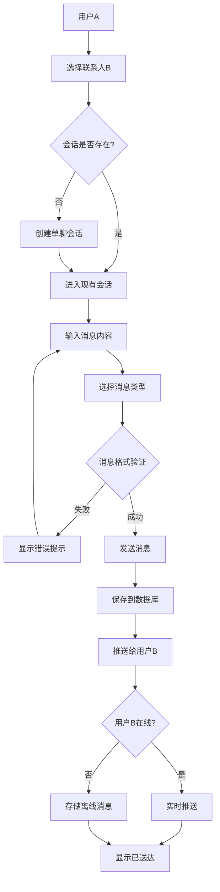
```mermaid
graph TD
    A[用户A] --> B[选择联系人B]
    B --> C{会话是否存在?}
    C -->|否| D[创建单聊会话]
    C -->|是| E[进入现有会话]
    D --> E
    E --> F[输入消息内容]
    F --> G[选择消息类型]
    G --> H{消息格式验证}
    H -->|失败| I[显示错误提示]
    H -->|成功| J[发送消息]
    J --> K[保存到数据库]
    K --> L[推送给用户B]
    L --> M{用户B在线?}
    M -->|是| N[实时推送]
    M -->|否| O[存储离线消息]
    N --> P[显示已送达]
    O --> P
    I --> F
```

#### 3.2.2 群聊创建用例
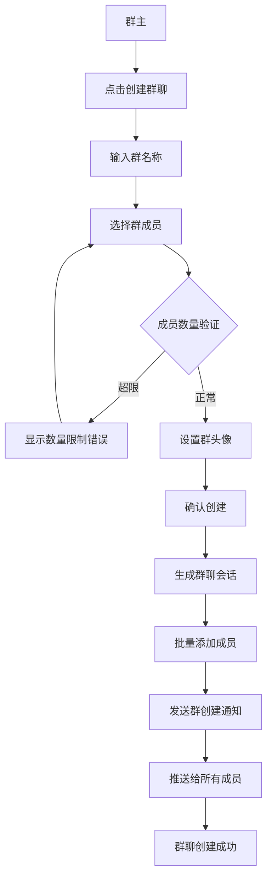
```mermaid
graph TD
    A[群主] --> B[点击创建群聊]
    B --> C[输入群名称]
    C --> D[选择群成员]
    D --> E{成员数量验证}
    E -->|超限| F[显示数量限制错误]
    E -->|正常| G[设置群头像]
    G --> H[确认创建]
    H --> I[生成群聊会话]
    I --> J[批量添加成员]
    J --> K[发送群创建通知]
    K --> L[推送给所有成员]
    L --> M[群聊创建成功]
    F --> D
```

#### 3.2.3 WebSocket连接建立用例
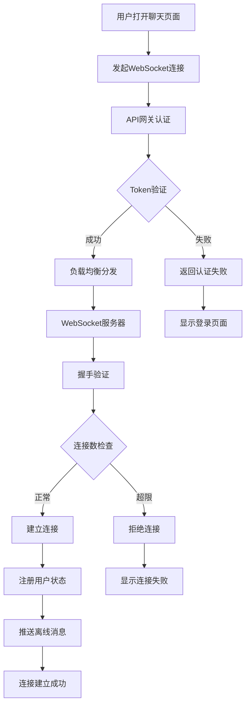
```mermaid
graph TD
    A[用户打开聊天页面] --> B[发起WebSocket连接]
    B --> C[API网关认证]
    C --> D{Token验证}
    D -->|失败| E[返回认证失败]
    D -->|成功| F[负载均衡分发]
    F --> G[WebSocket服务器]
    G --> H[握手验证]
    H --> I{连接数检查}
    I -->|超限| J[拒绝连接]
    I -->|正常| K[建立连接]
    K --> L[注册用户状态]
    L --> M[推送离线消息]
    M --> N[连接建立成功]
    E --> O[显示登录页面]
    J --> P[显示连接失败]
```

### 3.3 技术方案关键决策用例

#### 3.3.1 消息路由决策用例
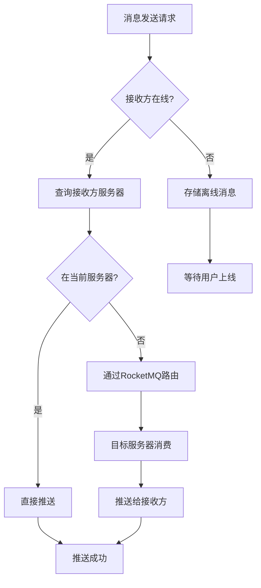
```mermaid
graph TD
    A[消息发送请求] --> B{接收方在线?}
    B -->|否| C[存储离线消息]
    B -->|是| D[查询接收方服务器]
    D --> E{在当前服务器?}
    E -->|是| F[直接推送]
    E -->|否| G[通过RocketMQ路由]
    G --> H[目标服务器消费]
    H --> I[推送给接收方]
    F --> J[推送成功]
    I --> J
    C --> K[等待用户上线]
```

#### 3.3.2 集群扩展决策用例
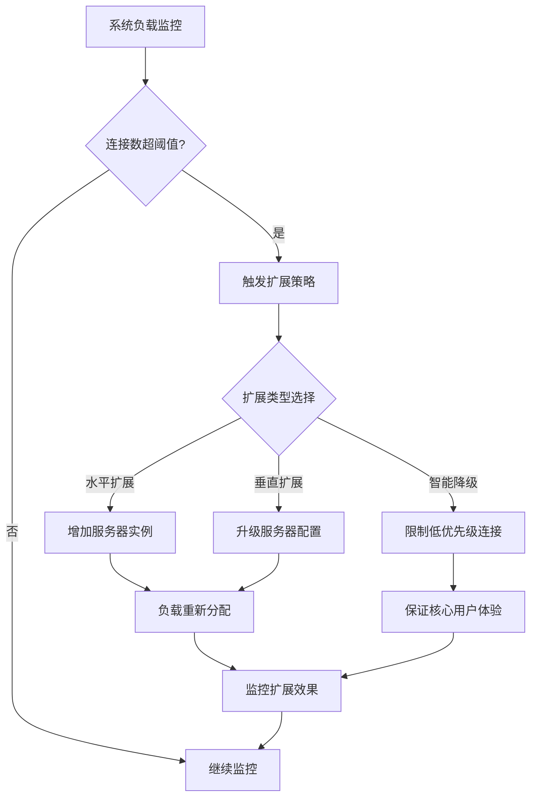
```mermaid
graph TD
    A[系统负载监控] --> B{连接数超阈值?}
    B -->|否| C[继续监控]
    B -->|是| D[触发扩展策略]
    D --> E{扩展类型选择}
    E -->|水平扩展| F[增加服务器实例]
    E -->|垂直扩展| G[升级服务器配置]
    E -->|智能降级| H[限制低优先级连接]
    F --> I[负载重新分配]
    G --> I
    H --> J[保证核心用户体验]
    I --> K[监控扩展效果]
    J --> K
    K --> C
```

#### 3.3.3 技术栈选型决策用例
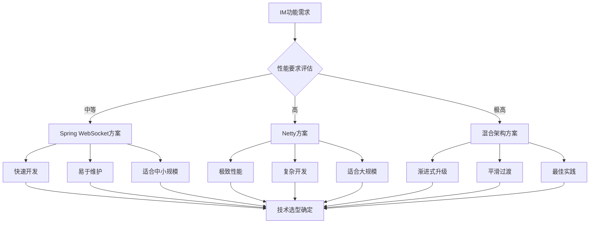
```mermaid
graph TD
    A[IM功能需求] --> B{性能要求评估}
    B -->|中等| C[Spring WebSocket方案]
    B -->|高| D[Netty方案]
    B -->|极高| E[混合架构方案]
    
    C --> F[快速开发]
    C --> G[易于维护]
    C --> H[适合中小规模]
    
    D --> I[极致性能]
    D --> J[复杂开发]
    D --> K[适合大规模]
    
    E --> L[渐进式升级]
    E --> M[平滑过渡]
    E --> N[最佳实践]
    
    F --> O[技术选型确定]
    G --> O
    H --> O
    I --> O
    J --> O
    K --> O
    L --> O
    M --> O
    N --> O
```

### 3.4 异常处理用例

#### 3.4.1 网络异常处理用例
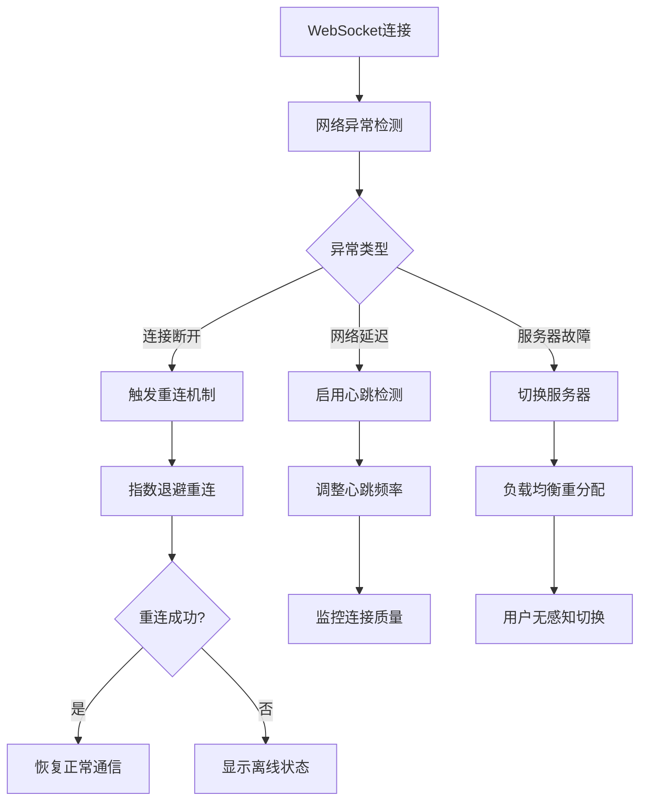
```mermaid
graph TD
    A[WebSocket连接] --> B[网络异常检测]
    B --> C{异常类型}
    C -->|连接断开| D[触发重连机制]
    C -->|网络延迟| E[启用心跳检测]
    C -->|服务器故障| F[切换服务器]
    
    D --> G[指数退避重连]
    G --> H{重连成功?}
    H -->|是| I[恢复正常通信]
    H -->|否| J[显示离线状态]
    
    E --> K[调整心跳频率]
    K --> L[监控连接质量]
    
    F --> M[负载均衡重分配]
    M --> N[用户无感知切换]
```

#### 3.4.2 消息可靠性保证用例
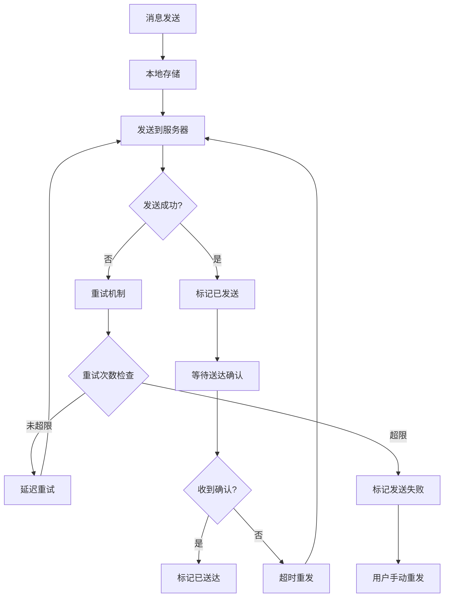
```mermaid
graph TD
    A[消息发送] --> B[本地存储]
    B --> C[发送到服务器]
    C --> D{发送成功?}
    D -->|是| E[标记已发送]
    D -->|否| F[重试机制]
    F --> G{重试次数检查}
    G -->|未超限| H[延迟重试]
    G -->|超限| I[标记发送失败]
    H --> C
    E --> J[等待送达确认]
    J --> K{收到确认?}
    K -->|是| L[标记已送达]
    K -->|否| M[超时重发]
    M --> C
    I --> N[用户手动重发]
```

### 3.5 业务扩展用例

#### 3.5.1 多端同步用例
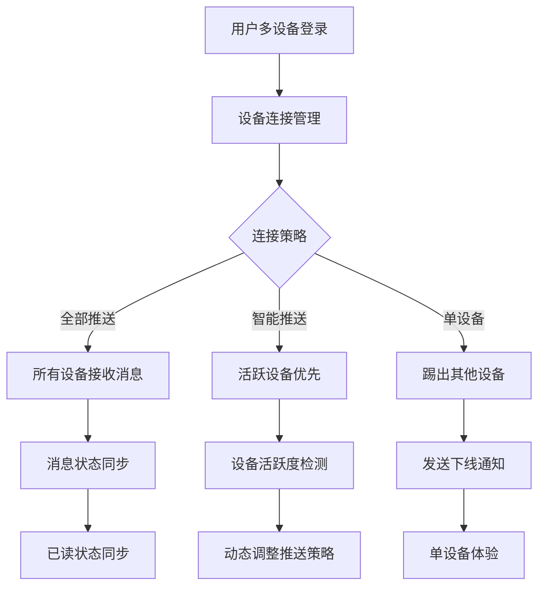
```mermaid
graph TD
    A[用户多设备登录] --> B[设备连接管理]
    B --> C{连接策略}
    C -->|全部推送| D[所有设备接收消息]
    C -->|智能推送| E[活跃设备优先]
    C -->|单设备| F[踢出其他设备]
    
    D --> G[消息状态同步]
    E --> H[设备活跃度检测]
    F --> I[发送下线通知]
    
    G --> J[已读状态同步]
    H --> K[动态调整推送策略]
    I --> L[单设备体验]
```

#### 3.5.2 消息审核用例
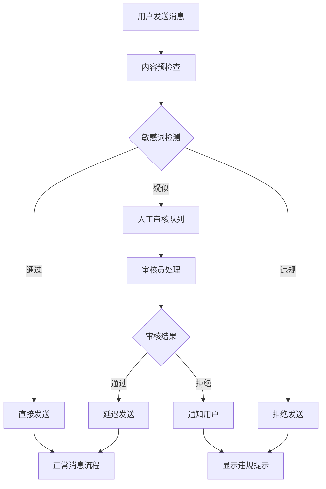
```mermaid
graph TD
    A[用户发送消息] --> B[内容预检查]
    B --> C{敏感词检测}
    C -->|通过| D[直接发送]
    C -->|疑似| E[人工审核队列]
    C -->|违规| F[拒绝发送]
    
    E --> G[审核员处理]
    G --> H{审核结果}
    H -->|通过| I[延迟发送]
    H -->|拒绝| J[通知用户]
    
    D --> K[正常消息流程]
    I --> K
    F --> L[显示违规提示]
    J --> L
```

**参考资料**：
- [用例图设计最佳实践](https://www.visual-paradigm.com/guide/uml-unified-modeling-language/what-is-use-case-diagram/)
- [IM系统用例分析](https://www.cnblogs.com/flashsun/p/14318928.html)
- [WebSocket用例设计](https://developer.mozilla.org/en-US/docs/Web/API/WebSockets_API)

## 4. 领域模型

### 单聊与群聊表设计决策分析

#### 需求分析对比
| 维度 | 单聊 | 群聊 | 共同点 |
|------|------|------|--------|
| **成员数量** | 固定2人 | 3人以上，动态变化 | 都有参与者概念 |
| **成员管理** | 无需管理，天然存在 | 需要邀请/移除机制 | 都需要成员状态 |
| **权限模型** | 无权限概念，平等 | 有群主/管理员/成员角色 | 都需要操作验证 |
| **未读管理** | 直接在会话表记录 | 每个成员独立记录 | 都需要未读计数 |
| **会话特性** | 不可解散，可删除 | 可解散，可退出 | 都有生命周期 |
| **业务规则** | 简单，无复杂逻辑 | 复杂，多种业务场景 | 都是消息容器 |

#### 表设计方案对比

##### 方案A：合并表设计（推荐✅）
**优势**：
- **业务一致性**：用户看到统一的会话列表，符合业务模型
- **查询性能**：单SQL查询用户所有会话，性能更优
- **扩展性强**：新增会话类型（系统通知、客服）只需增加type
- **开发维护**：Repository层统一，减少重复代码
- **行业标准**：微信、钉钉等主流IM都采用类似设计

**劣势**：
- 存在字段冗余（单聊不需要max_member_count等）
- Service层需要处理type分支逻辑

**解决方案**：
```sql
-- 通过数据库约束和默认值处理冗余字段
ALTER TABLE t_conversation ADD CONSTRAINT check_private_chat 
CHECK (
  (conversation_type = 'private' AND max_member_count = 2 AND current_member_count = 2)
  OR 
  (conversation_type != 'private')
);
```

##### 方案B：分离表设计
**优势**：
- 表结构精确，无字段冗余
- 单聊性能极致优化
- 逻辑分离清晰

**劣势**：
- **查询复杂**：`UNION`查询性能差，分页困难
- **ID冲突**：需要全局ID生成策略
- **扩展困难**：新增类型需要新表
- **维护成本**：两套Repository和Service

#### 最终决策：采用合并表设计

**参考资料**：
- [微信架构设计](https://www.infoq.cn/article/the-road-of-the-growth-weixin-background)
- [IM系统设计最佳实践](https://www.cnblogs.com/flashsun/p/14318928.html)
- [大规模IM系统架构设计](https://tech.meituan.com/2018/11/15/dianping-im-arch.html)

### 数据库表设计说明

#### 新增表
1. **t_conversation** - 会话表
2. **t_conversation_member** - 会话成员表

#### 扩展现有表
1. **t_msg_body** - 新增IM相关字段

### 字段说明
#### conversation_key字段
会话唯一标识，生成规则：
- 单聊：private_min(id1,id2)_max(id1,id2)
- 群聊：group_xxx
- 系统通知：system_{identity_id}
- 平台客服：assistant_{identity_id}

#### conversation_type字段
会话类型：
- private：单聊
- group：群聊
- system：系统通知（买卖家、服务商、商品提交给admin审核结果的通知）
- assistant：平台客服（买卖家、服务商直接向admin咨询，替代之前的留言功能）

#### message_format字段
消息格式类型：
- 0：文本
- 1：图片
- 2：文件
- 3：语音
- 4：视频
- 5：卡片（业务关联消息）

### 领域对象设计

#### 聚合根 (Aggregate Root)

##### Conversation（会话聚合根）
```java
/**
 * 会话聚合根 - 合并表设计
 * 统一管理单聊、群聊、系统通知、客服会话，通过conversation_type区分
 */
@Data
@EqualsAndHashCode(callSuper = true)
public class Conversation extends BaseEntity {
    
    private Long conversationId;              // 会话ID
    private String conversationKey;           // 会话唯一标识
    private ConversationType conversationType; // 会话类型值对象
    private String conversationName;          // 会话名称
    private String conversationAvatar;        // 会话头像
    private ConversationStatus status;        // 会话状态值对象
    private List<ConversationMember> memberList; // 会话成员列表（实体）
    private ConversationSetting setting;     // 会话设置值对象
    private Long lastMessageId;              // 最后一条消息ID
    private Long lastActiveTime;             // 最后活跃时间
    private Integer currentMemberCount;      // 当前成员数量
    private Integer maxMemberCount;          // 最大成员数量（单聊固定为2）
    
    // 单聊参与者信息（通过值对象封装）
    private PrivateChatUser firstParticipant;  // 第一个参与者
    private PrivateChatUser secondParticipant; // 第二个参与者
    
    // 系统通知配置（通过值对象封装）
    private SystemNotificationConfig notificationConfig;
    
    // 客服配置（通过值对象封装）  
    private CustomerServiceConfig serviceConfig;
    
    /**
     * 判断是否需要成员表
     */
    public boolean needsMemberTable() {
        return !conversationType.isPrivateChat();
    }
    
    /**
     * 获取单聊对方参与者
     */
    public PrivateChatUser getOtherParticipant(String currentUserId) {
        if (!conversationType.isPrivateChat()) {
            throw new BusinessException("仅单聊支持获取对方信息");
        }
        return firstParticipant.getIdentityId().equals(currentUserId) 
            ? secondParticipant : firstParticipant;
    }
}
```

##### Message（消息聚合根 - 扩展现有）
```java
/**
 * 消息聚合根 - 扩展现有
 */
@Data
@EqualsAndHashCode(callSuper = true)
public class Message extends BaseEntity {
    
    // 现有字段保持不变
    private MessageBody messageBody;         // 消息体实体
    private Sender sender;                   // 发送者值对象
    private List<Receiver> receiverList;     // 接收者列表值对象
    
    // 新增IM相关字段
    private MessageType messageType;         // 消息类型值对象
    private String conversationId;          // 会话ID
    private MessageFormat messageFormat;    // 消息格式值对象
    private Long replyToMessageId;          // 回复消息ID
    private String fileUrl;                 // 文件URL
    private Long fileSize;                  // 文件大小
    private Integer duration;               // 音视频时长
    private Boolean isRecalled;             // 是否已撤回
    private Long recallTime;                // 撤回时间
}
```

#### 实体 (Entity)

##### ConversationMember（会话成员实体）
```java
/**
 * 会话成员实体
 */
@Data
@EqualsAndHashCode(callSuper = true)
public class ConversationMember extends CommonEntity {
    
    private Long memberId;                   // 成员ID
    private Long conversationId;             // 会话ID
    private MessageUser memberUser;          // 成员用户信息（值对象）
    private MemberRole memberRole;           // 成员角色（值对象）
    private MemberStatus memberStatus;       // 成员状态（值对象）
    private Long joinTime;                   // 加入时间
    private Long exitTime;                   // 退出时间
    private Long lastReadMessageId;          // 最后已读消息ID
    private Long unreadCount;                // 未读消息数（群聊专用）
    private Boolean muteNotification;        // 是否静音通知
}
```

##### MessageBody（消息体实体 - 扩展现有）
```java
/**
 * 消息体实体 - 扩展现有
 */
@Data
@EqualsAndHashCode(callSuper = true)
public class MessageBody extends CommonEntity {
    
    // 现有字段保持不变
    private Long messageId;                  // 消息ID
    private String title;                    // 标题
    private String content;                  // 内容
    private Integer relatingBizType;         // 关联业务类型
    private String relatingBizId;            // 关联业务ID
    private Long relatingParentMsgId;        // 关联父消息ID
    
    // 新增IM相关字段
    private Integer messageType;             // 消息类型
    private String conversationId;          // 会话ID
    private Integer messageFormat;           // 消息格式
    private Long replyToMessageId;          // 回复消息ID
    private String fileUrl;                 // 文件URL
    private Long fileSize;                  // 文件大小
    private Integer duration;               // 音视频时长
    private Boolean isRecalled;             // 是否已撤回
    private Long recallTime;                // 撤回时间
}
```

#### 值对象 (Value Object)

##### PrivateChatUser（单聊参与者值对象）
```java
/**
 * 单聊参与者值对象
 */
@Data
@EqualsAndHashCode(callSuper = true)
public class PrivateChatUser extends BaseValueObject {
    private String identityId;               // 身份ID
    private Integer identityType;            // 身份类型
    private UnreadCount unreadCount;         // 未读数信息（值对象）
    
    /**
     * 创建单聊参与者
     */
    public static PrivateChatUser create(String identityId, Integer identityType) {
        return new PrivateChatUser(identityId, identityType, UnreadCount.zero());
    }
}
```

##### UnreadCount（未读计数值对象）
```java
/**
 * 未读计数值对象 - 支持批量标记
 */
@Data
@EqualsAndHashCode(callSuper = true)
public class UnreadCount extends BaseValueObject {
    private Long unreadCount;                // 未读数量
    private Long lastReadMessageId;          // 最后已读消息ID
    private Long lastUpdateTime;             // 最后更新时间
    
    /**
     * 零未读数
     */
    public static UnreadCount zero() {
        return new UnreadCount(0L, null, System.currentTimeMillis());
    }
    
    /**
     * 批量标记已读到指定消息
     */
    public UnreadCount batchMarkReadTo(Long messageId) {
        return new UnreadCount(0L, messageId, System.currentTimeMillis());
    }
}
```

##### MessageReply（消息回复信息值对象）
```java
/**
 * 消息回复信息值对象
 */
@Data
@EqualsAndHashCode(callSuper = true)
public class MessageReply extends BaseValueObject {
    private Long replyToMessageId;           // 回复消息ID
    private String replyToContent;           // 回复消息内容摘要
    private String replyToSenderId;          // 回复消息发送者ID
}
```

##### MessageFile（文件信息值对象）
```java
/**
 * 文件信息值对象
 */
@Data
@EqualsAndHashCode(callSuper = true)
public class MessageFile extends BaseValueObject {
    private String fileUrl;                  // 文件URL
    private String fileName;                 // 文件名称
    private Long fileSize;                   // 文件大小
    private String fileMimeType;             // 文件MIME类型
    private Integer duration;                // 音视频时长(秒)
}
```

##### MessageStatus（消息状态值对象）
```java
/**
 * 消息状态值对象
 */
@Data
@EqualsAndHashCode(callSuper = true)
public class MessageStatus extends BaseValueObject {
    private Boolean isRecalled;              // 是否已撤回
    private Long recallTime;                 // 撤回时间
    private Integer deliveryStatus;          // 投递状态(0发送中1已送达2已读)
}
```

##### MemberJoinInfo（成员加入信息值对象）
```java
/**
 * 成员加入信息值对象
 */
@Data
@EqualsAndHashCode(callSuper = true)
public class MemberJoinInfo extends BaseValueObject {
    private Long joinTime;                   // 加入时间
    private Long exitTime;                   // 退出时间
    private String inviterId;                // 邀请人ID
    private String joinSource;               // 加入来源
}
```

##### MemberSetting（成员设置值对象）
```java
/**
 * 成员设置值对象
 */
@Data
@EqualsAndHashCode(callSuper = true)
public class MemberSetting extends BaseValueObject {
    private Boolean muteNotification;        // 是否静音通知
    private String nickname;                 // 群内昵称
    private Boolean showMemberNickname;      // 是否显示群成员昵称
}
```

##### SystemNotificationConfig（系统通知配置值对象）
```java
/**
 * 系统通知配置值对象
 */
@Data
@EqualsAndHashCode(callSuper = true)
public class SystemNotificationConfig extends BaseValueObject {
    private String notificationType;         // 通知类型
    private Boolean enablePush;              // 是否启用推送
    private String businessModule;           // 业务模块
}
```

##### CustomerServiceConfig（客服配置值对象）
```java
/**
 * 客服配置值对象
 */
@Data
@EqualsAndHashCode(callSuper = true)
public class CustomerServiceConfig extends BaseValueObject {
    private String serviceType;             // 服务类型
    private String businessCategory;         // 业务分类
    private Boolean autoAssign;              // 是否自动分配客服
}
```

##### ConversationType（会话类型值对象）
```java
/**
 * 会话类型值对象
 */
@Data
@EqualsAndHashCode(callSuper = true)
public class ConversationType extends BaseValueObject {
    private String type;                     // 类型编码
    private String typeName;                 // 类型名称
    private Integer maxMemberCount;          // 最大成员数量
    
    /**
     * 判断是否需要成员表
     */
    public boolean needsMemberTable() {
        return !"private".equals(type);
    }
    
    /**
     * 判断是否为单聊
     */
    public boolean isPrivateChat() {
        return "private".equals(type);
    }
}
```

##### ConversationStatus（会话状态值对象）
```java
/**
 * 会话状态值对象
 */
@Data
@EqualsAndHashCode(callSuper = true)
public class ConversationStatus extends BaseValueObject {
    private Integer status;                  // 状态编码
    private String statusName;               // 状态名称
    private Long statusChangeTime;           // 状态变更时间
}
```

##### ConversationSetting（会话设置值对象）
```java
/**
 * 会话设置值对象
 */
@Data
@EqualsAndHashCode(callSuper = true)
public class ConversationSetting extends BaseValueObject {
    private Boolean allowInvite;             // 是否允许邀请新成员
    private Boolean allowMemberExit;         // 是否允许成员退出
    private Boolean enableMessageHistory;    // 是否启用消息历史
    private Integer messageRetentionDays;    // 消息保留天数
    private Boolean enableNotification;      // 是否启用通知
}
```

##### MemberRole（成员角色值对象）
```java
/**
 * 成员角色值对象
 */
@Data
@EqualsAndHashCode(callSuper = true)
public class MemberRole extends BaseValueObject {
    private Integer role;                    // 角色编码
    private String roleName;                 // 角色名称
    private List<String> permissions;        // 权限列表
}
```

##### MemberStatus（成员状态值对象）
```java
/**
 * 成员状态值对象
 */
@Data
@EqualsAndHashCode(callSuper = true)
public class MemberStatus extends BaseValueObject {
    private Integer status;                  // 状态编码
    private String statusName;               // 状态名称
    private Long statusChangeTime;           // 状态变更时间
}
```

##### MessageType（消息类型值对象 - 扩展现有）
```java
/**
 * 消息类型值对象 - 扩展现有
 */
@Data
@EqualsAndHashCode(callSuper = true)
public class MessageType extends BaseValueObject {
    private Integer type;                    // 类型编码
    private String typeName;                 // 类型名称
    private MessageFormat format;            // 消息格式值对象
}
```

##### MessageFormat（消息格式值对象）
```java
/**
 * 消息格式值对象
 */
@Data
@EqualsAndHashCode(callSuper = true)
public class MessageFormat extends BaseValueObject {
    private Integer format;                  // 格式编码
    private String formatName;               // 格式名称
    private String mimeType;                 // MIME类型
    private Long maxSize;                    // 最大文件大小
}
```

### 领域事件 (Domain Event)

#### 会话相关事件
```java
// 会话创建事件
public class ConversationCreatedEvent extends BaseDomainEvent {
    private Long conversationId;
    private String conversationType;
    private List<String> memberIds;
}

// 会话解散事件
public class ConversationDissolvedEvent extends BaseDomainEvent {
    private Long conversationId;
    private String operatorId;
}

// 成员加入事件
public class MemberJoinedEvent extends BaseDomainEvent {
    private Long conversationId;
    private String memberId;
    private String inviterId;
}

// 成员退出事件
public class MemberExitedEvent extends BaseDomainEvent {
    private Long conversationId;
    private String memberId;
    private String exitType; // 主动退出/被移除
}
```

#### 消息相关事件
```java
// IM消息发送事件
public class IMMessageSentEvent extends BaseDomainEvent {
    private Long messageId;
    private String conversationId;
    private String senderId;
    private Integer messageFormat;
}

// 消息撤回事件
public class MessageRecalledEvent extends BaseDomainEvent {
    private Long messageId;
    private String operatorId;
    private Long recallTime;
}

// 消息已读事件
public class MessageReadEvent extends BaseDomainEvent {
    private Long messageId;
    private String readerId;
    private Long readTime;
}
```

### 领域服务 (Domain Service)

业务逻辑通过DomainService的静态方法实现，不在领域对象中编写业务逻辑：

#### 1. ConversationDomainService（会话领域服务）
```java
public class ConversationDomainService {
    
    /**
     * 生成会话唯一标识
     */
    public static String generateConversationKey(ConversationType type, String... memberIds);
    
    /**
     * 验证成员数量限制
     */
    public static void validateMemberCount(Conversation conversation, int newMemberCount);
    
    /**
     * 验证用户是否有权限操作会话
     */
    public static void validateOperationPermission(Conversation conversation, String operatorId, String permission);
    
    /**
     * 计算单聊未读数量
     */
    public static void calculatePrivateChatUnreadCount(Conversation conversation, String identityId);
    
    /**
     * 获取分布式锁键
     */
    public static String getDistributedLockKey(String conversationKey);
}
```

#### 2. MessageDomainService（消息领域服务 - 扩展现有）
```java
public class MessageDomainService {
    
    // 现有方法保持不变
    
    /**
     * 判断是否为IM消息
     */
    public static boolean isIMMessage(Message message);
    
    /**
     * 撤回消息
     */
    public static void recallMessage(Message message, String operatorId);
    
    /**
     * 验证消息格式
     */
    public static void validateMessageFormat(Message message);
    
    /**
     * 填充会话相关信息
     */
    public static void fillConversationInfo(Message message, Conversation conversation);
}
```

#### 3. ConversationMemberDomainService（会话成员领域服务）
```java
public class ConversationMemberDomainService {
    
    /**
     * 更新成员角色
     */
    public static void updateMemberRole(ConversationMember member, MemberRole newRole, String operatorId);
    
    /**
     * 成员退出会话
     */
    public static void exitConversation(ConversationMember member);
    
    /**
     * 更新最后已读消息
     */
    public static void updateLastReadMessage(ConversationMember member, Long messageId);
    
    /**
     * 计算群聊未读数量
     */
    public static Long calculateGroupUnreadCount(ConversationMember member, Long totalMessageCount);
}
```

**详细实现请参考第7章"领域服务层"。**

**参考资料**：
- [DDD领域建模实践](https://www.cnblogs.com/daxnet/p/ddd-domain-modeling.html)
- [领域事件设计模式](https://martinfowler.com/eaaDev/DomainEvent.html)

## 5. 时序图

### 单聊发送消息时序图（修正版）
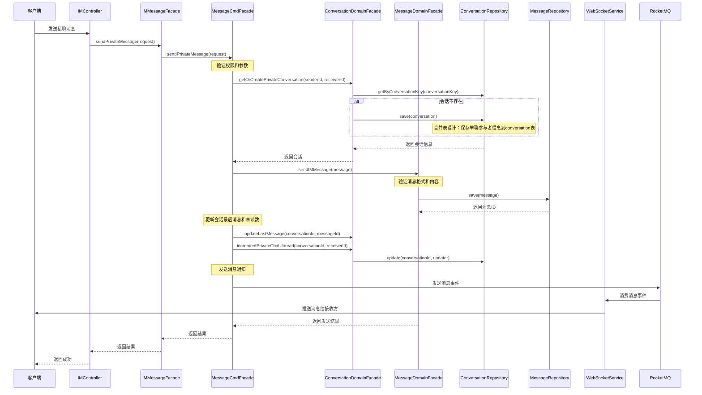
```mermaid
sequenceDiagram
    participant Client as 客户端
    participant Controller as IMController
    participant Facade as IMMessageFacade
    participant CmdFacade as MessageCmdFacade
    participant ConvDomainFacade as ConversationDomainFacade
    participant MsgDomainFacade as MessageDomainFacade
    participant ConvRepo as ConversationRepository
    participant MsgRepo as MessageRepository
    participant WebSocket as WebSocketService
    participant MQ as RocketMQ
    
    Client->>Controller: 发送私聊消息
    Controller->>Facade: sendPrivateMessage(request)
    Facade->>CmdFacade: sendPrivateMessage(request)
    
    Note over CmdFacade: 验证权限和参数
    CmdFacade->>ConvDomainFacade: getOrCreatePrivateConversation(senderId, receiverId)
    ConvDomainFacade->>ConvRepo: getByConversationKey(conversationKey)
    
    alt 会话不存在
        ConvDomainFacade->>ConvRepo: save(conversation)
        Note over ConvRepo: 合并表设计：保存单聊参与者信息到conversation表
    end
    
    ConvRepo-->>ConvDomainFacade: 返回会话信息
    ConvDomainFacade-->>CmdFacade: 返回会话
    
    CmdFacade->>MsgDomainFacade: sendIMMessage(message)
    Note over MsgDomainFacade: 验证消息格式和内容
    MsgDomainFacade->>MsgRepo: save(message)
    MsgRepo-->>MsgDomainFacade: 返回消息ID
    
    Note over CmdFacade: 更新会话最后消息和未读数
    CmdFacade->>ConvDomainFacade: updateLastMessage(conversationId, messageId)
    CmdFacade->>ConvDomainFacade: incrementPrivateChatUnread(conversationId, receiverId)
    ConvDomainFacade->>ConvRepo: update(conversationId, updater)
    
    Note over CmdFacade: 发送消息通知
    CmdFacade->>MQ: 发送消息事件
    MQ->>WebSocket: 消费消息事件
    WebSocket->>Client: 推送消息给接收方
    
    MsgDomainFacade-->>CmdFacade: 返回发送结果
    CmdFacade-->>Facade: 返回结果
    Facade-->>Controller: 返回结果
    Controller-->>Client: 返回成功
```

### 群聊创建时序图（修正版）
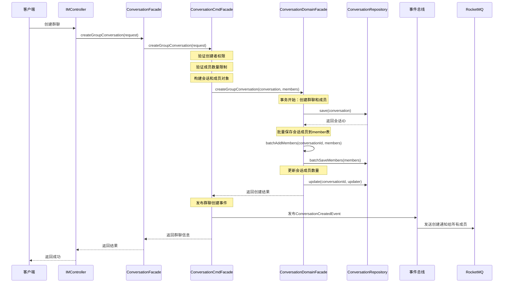
```mermaid
sequenceDiagram
    participant Client as 客户端
    participant Controller as IMController
    participant Facade as ConversationFacade
    participant CmdFacade as ConversationCmdFacade
    participant DomainFacade as ConversationDomainFacade
    participant ConvRepo as ConversationRepository
    participant EventBus as 事件总线
    participant MQ as RocketMQ
    
    Client->>Controller: 创建群聊
    Controller->>Facade: createGroupConversation(request)
    Facade->>CmdFacade: createGroupConversation(request)
    
    Note over CmdFacade: 验证创建者权限
    Note over CmdFacade: 验证成员数量限制
    Note over CmdFacade: 构建会话和成员对象
    
    CmdFacade->>DomainFacade: createGroupConversation(conversation, members)
    
    Note over DomainFacade: 事务开始：创建群聊和成员
    DomainFacade->>ConvRepo: save(conversation)
    ConvRepo-->>DomainFacade: 返回会话ID
    
    Note over DomainFacade: 批量保存会话成员到member表
    DomainFacade->>DomainFacade: batchAddMembers(conversationId, members)
    DomainFacade->>ConvRepo: batchSaveMembers(members)
    
    Note over DomainFacade: 更新会话成员数量
    DomainFacade->>ConvRepo: update(conversationId, updater)
    
    DomainFacade-->>CmdFacade: 返回创建结果
    
    Note over CmdFacade: 发布群聊创建事件
    CmdFacade->>EventBus: 发布ConversationCreatedEvent
    EventBus->>MQ: 发送创建通知给所有成员
    
    CmdFacade-->>Facade: 返回群聊信息
    Facade-->>Controller: 返回结果
    Controller-->>Client: 返回成功
```

### Spring WebSocket详细交互时序图

#### WebSocket连接建立时序图
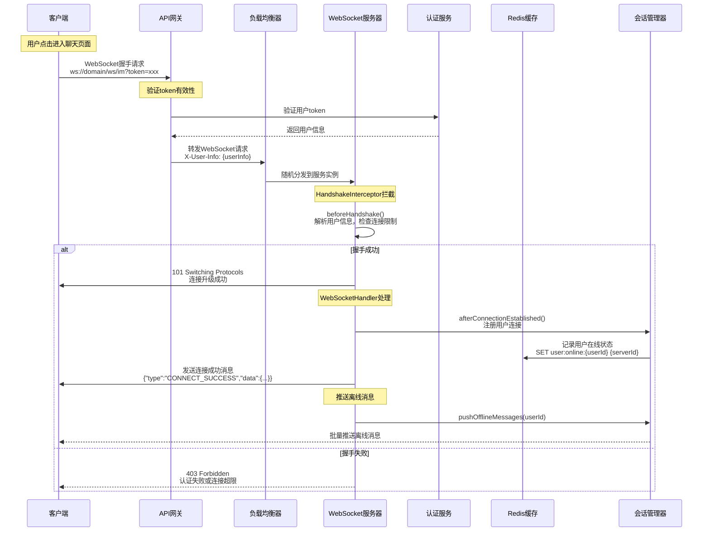
```mermaid
sequenceDiagram
    participant Client as 客户端
    participant Gateway as API网关
    participant LB as 负载均衡器
    participant Server as WebSocket服务器
    participant AuthService as 认证服务
    participant Redis as Redis缓存
    participant SessionMgr as 会话管理器
    
    Note over Client: 用户点击进入聊天页面
    
    Client->>Gateway: WebSocket握手请求<br/>ws://domain/ws/im?token=xxx
    Note over Gateway: 验证token有效性
    Gateway->>AuthService: 验证用户token
    AuthService-->>Gateway: 返回用户信息
    
    Gateway->>LB: 转发WebSocket请求<br/>X-User-Info: {userInfo}
    LB->>Server: 随机分发到服务实例
    
    Note over Server: HandshakeInterceptor拦截
    Server->>Server: beforeHandshake()<br/>解析用户信息，检查连接限制
    
    alt 握手成功
        Server->>Client: 101 Switching Protocols<br/>连接升级成功
        
        Note over Server: WebSocketHandler处理
        Server->>SessionMgr: afterConnectionEstablished()<br/>注册用户连接
        SessionMgr->>Redis: 记录用户在线状态<br/>SET user:online:{userId} {serverId}
        
        Server->>Client: 发送连接成功消息<br/>{"type":"CONNECT_SUCCESS","data":{...}}
        
        Note over Server: 推送离线消息
        Server->>SessionMgr: pushOfflineMessages(userId)
        SessionMgr-->>Client: 批量推送离线消息
        
    else 握手失败
        Server-->>Client: 403 Forbidden<br/>认证失败或连接超限
    end
```

#### WebSocket消息发送时序图
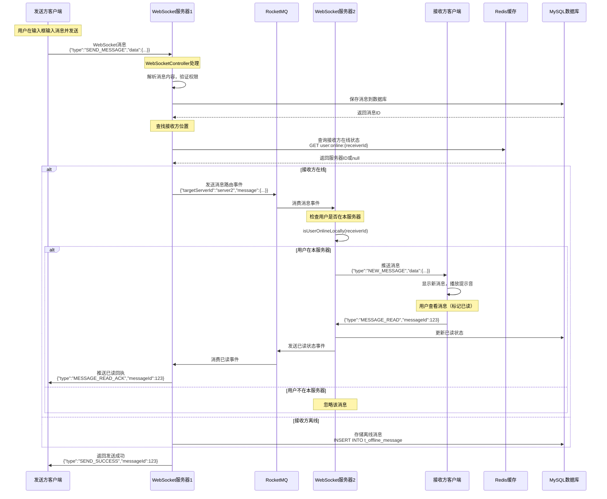
```mermaid
sequenceDiagram
    participant Client1 as 发送方客户端
    participant Server1 as WebSocket服务器1
    participant MQ as RocketMQ
    participant Server2 as WebSocket服务器2
    participant Client2 as 接收方客户端
    participant Redis as Redis缓存
    participant MySQL as MySQL数据库
    
    Note over Client1: 用户在输入框输入消息并发送
    
    Client1->>Server1: WebSocket消息<br/>{"type":"SEND_MESSAGE","data":{...}}
    
    Note over Server1: WebSocketController处理
    Server1->>Server1: 解析消息内容，验证权限
    Server1->>MySQL: 保存消息到数据库
    MySQL-->>Server1: 返回消息ID
    
    Note over Server1: 查找接收方位置
    Server1->>Redis: 查询接收方在线状态<br/>GET user:online:{receiverId}
    Redis-->>Server1: 返回服务器ID或null
    
    alt 接收方在线
        Server1->>MQ: 发送消息路由事件<br/>{"targetServerId":"server2","message":{...}}
        MQ->>Server2: 消费消息事件
        
        Note over Server2: 检查用户是否在本服务器
        Server2->>Server2: isUserOnlineLocally(receiverId)
        
        alt 用户在本服务器
            Server2->>Client2: 推送消息<br/>{"type":"NEW_MESSAGE","data":{...}}
            Client2->>Client2: 显示新消息，播放提示音
            
            Note over Client2: 用户查看消息（标记已读）
            Client2->>Server2: {"type":"MESSAGE_READ","messageId":123}
            Server2->>MySQL: 更新已读状态
            Server2->>MQ: 发送已读状态事件
            MQ->>Server1: 消费已读事件
            Server1->>Client1: 推送已读回执<br/>{"type":"MESSAGE_READ_ACK","messageId":123}
            
        else 用户不在本服务器
            Note over Server2: 忽略该消息
        end
        
    else 接收方离线
        Server1->>MySQL: 存储离线消息<br/>INSERT INTO t_offline_message
    end
    
    Server1->>Client1: 返回发送成功<br/>{"type":"SEND_SUCCESS","messageId":123}
```

#### WebSocket心跳机制时序图
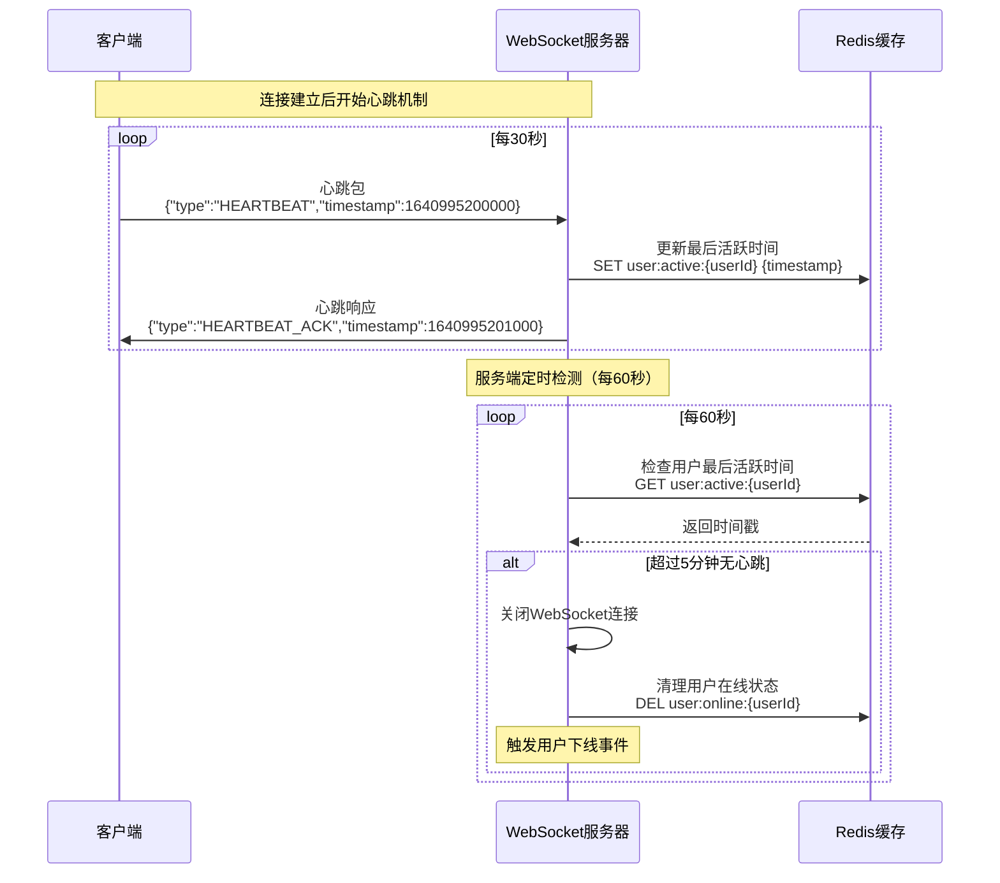
```mermaid
sequenceDiagram
    participant Client as 客户端
    participant Server as WebSocket服务器
    participant Redis as Redis缓存
    
    Note over Client,Server: 连接建立后开始心跳机制
    
    loop 每30秒
        Client->>Server: 心跳包<br/>{"type":"HEARTBEAT","timestamp":1640995200000}
        Server->>Redis: 更新最后活跃时间<br/>SET user:active:{userId} {timestamp}
        Server->>Client: 心跳响应<br/>{"type":"HEARTBEAT_ACK","timestamp":1640995201000}
    end
    
    Note over Server: 服务端定时检测（每60秒）
    
    loop 每60秒
        Server->>Redis: 检查用户最后活跃时间<br/>GET user:active:{userId}
        Redis-->>Server: 返回时间戳
        
        alt 超过5分钟无心跳
            Server->>Server: 关闭WebSocket连接
            Server->>Redis: 清理用户在线状态<br/>DEL user:online:{userId}
            Note over Server: 触发用户下线事件
        end
    end
```

#### WebSocket连接断开时序图
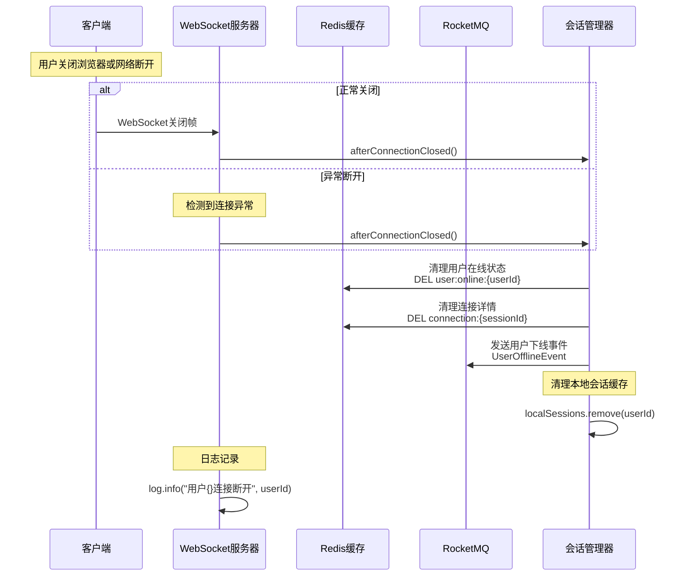
```mermaid
sequenceDiagram
    participant Client as 客户端
    participant Server as WebSocket服务器
    participant Redis as Redis缓存
    participant MQ as RocketMQ
    participant SessionMgr as 会话管理器
    
    Note over Client: 用户关闭浏览器或网络断开
    
    alt 正常关闭
        Client->>Server: WebSocket关闭帧
        Server->>SessionMgr: afterConnectionClosed()
        
    else 异常断开
        Note over Server: 检测到连接异常
        Server->>SessionMgr: afterConnectionClosed()
    end
    
    SessionMgr->>Redis: 清理用户在线状态<br/>DEL user:online:{userId}
    SessionMgr->>Redis: 清理连接详情<br/>DEL connection:{sessionId}
    
    SessionMgr->>MQ: 发送用户下线事件<br/>UserOfflineEvent
    
    Note over SessionMgr: 清理本地会话缓存
    SessionMgr->>SessionMgr: localSessions.remove(userId)
    
    Note over Server: 日志记录
    Server->>Server: log.info("用户{}连接断开", userId)
```

**参考资料**：
- [Spring WebSocket官方文档](https://docs.spring.io/spring-framework/docs/current/reference/html/web.html#websocket)
- [WebSocket协议详解](https://www.ruanyifeng.com/blog/2017/05/websocket.html)
- [Spring WebSocket集群方案](https://www.cnblogs.com/guoapeng/p/17020317.html)

## 6. 应用服务层

### Facade接口设计

#### ConversationCmdFacade（会话命令门面）
```java
/**
 * 会话命令门面
 */
public interface ConversationCmdFacade {
    
    /**
     * 创建单聊会话
     */
    ConversationDTO createPrivateConversation(CreatePrivateConversationRequest request);
    
    /**
     * 创建群聊会话
     */
    ConversationDTO createGroupConversation(CreateGroupConversationRequest request);
    
    /**
     * 邀请成员加入群聊
     */
    boolean inviteMembersToGroup(InviteMembersRequest request);
    
    /**
     * 移除群聊成员
     */
    boolean removeMemberFromGroup(RemoveMemberRequest request);
    
    /**
     * 更新会话设置
     */
    boolean updateConversationSetting(UpdateConversationSettingRequest request);
    
    /**
     * 解散群聊
     */
    boolean dissolveGroup(DissolveGroupRequest request);
    
    /**
     * 退出群聊
     */
    boolean exitGroup(ExitGroupRequest request);
}
```

#### ConversationQueryFacade（会话查询门面）
```java
/**
 * 会话查询门面
 */
public interface ConversationQueryFacade {
    
    /**
     * 分页查询用户会话列表
     */
    PageList<ConversationDTO> pageUserConversations(QueryUserConversationsParam param, PageParam pageParam);
    
    /**
     * 查询会话详情
     */
    ConversationDTO getConversationDetail(QueryConversationDetailParam param);
    
    /**
     * 查询会话成员列表
     */
    List<ConversationMemberDTO> getConversationMembers(QueryConversationMembersParam param);
    
    /**
     * 查询用户在会话中的角色和权限
     */
    ConversationMemberDTO getUserRoleInConversation(QueryUserRoleParam param);
    
    /**
     * 查询会话消息历史
     */
    PageList<MessageDTO> pageConversationMessages(QueryConversationMessagesParam param, PageParam pageParam);
}
```

#### MessageCmdFacade（消息命令门面 - 扩展现有）
```java
/**
 * 消息命令门面 - 扩展现有
 */
public interface MessageCmdFacade {
    
    // 现有方法保持不变
    
    /**
     * 发送IM私聊消息
     */
    MessageDTO sendPrivateMessage(SendPrivateMessageRequest request);
    
    /**
     * 发送IM群聊消息
     */
    MessageDTO sendGroupMessage(SendGroupMessageRequest request);
    
    /**
     * 撤回消息
     */
    boolean recallMessage(RecallMessageRequest request);
    
    /**
     * 转发消息
     */
    MessageDTO forwardMessage(ForwardMessageRequest request);
    
    /**
     * 标记消息已读
     */
    boolean markMessageRead(MarkMessageReadRequest request);
    
    /**
     * 批量标记会话消息已读
     */
    boolean markConversationRead(MarkConversationReadRequest request);
}
```

#### MessageQueryFacade（消息查询门面 - 扩展现有）
```java
/**
 * 消息查询门面 - 扩展现有
 */
public interface MessageQueryFacade {
    
    // 现有方法保持不变
    
    /**
     * 查询IM消息列表
     */
    PageList<MessageDTO> pageIMMessages(QueryIMMessagesParam param, PageParam pageParam);
    
    /**
     * 查询会话中的消息
     */
    PageList<MessageDTO> pageConversationMessages(QueryConversationMessagesParam param, PageParam pageParam);
    
    /**
     * 查询消息详情（包含回复信息）
     */
    MessageDetailDTO getMessageDetail(QueryMessageDetailParam param);
    
    /**
     * 搜索消息内容
     */
    PageList<MessageDTO> searchMessages(SearchMessagesParam param, PageParam pageParam);
    
    /**
     * 查询用户未读消息统计
     */
    UnreadStatisticDTO getUnreadStatistic(QueryUnreadStatisticParam param);
}
```

### DomainFacade接口设计

#### ConversationDomainFacade（会话领域门面）
```java
/**
 * 会话领域门面 - 聚合根统一管理
 * 会话成员作为实体由聚合根统一管理，不单独创建DomainFacade
 */
public interface ConversationDomainFacade {
    
    // === 会话管理 ===
    /**
     * 获取或创建单聊会话
     */
    Conversation getOrCreatePrivateConversation(String firstIdentityId, String secondIdentityId);
    
    /**
     * 创建群聊会话
     */
    Conversation createGroupConversation(Conversation conversation, List<ConversationMember> members);
    
    /**
     * 更新最后消息信息
     */
    boolean updateLastMessage(Long conversationId, Long messageId, Long activeTime);
    
    /**
     * 解散会话
     */
    boolean dissolveConversation(Long conversationId, String operatorId);
    
    /**
     * 更新会话设置
     */
    boolean updateSetting(Long conversationId, ConversationSetting setting);
    
    /**
     * 查询会话详情
     */
    Conversation getById(Long conversationId);
    
    /**
     * 查询用户会话列表
     */
    List<Conversation> getUserConversations(String identityId);
    
    /**
     * 通过会话key查询
     */
    Conversation getByConversationKey(String conversationKey);
    
    // === 会话成员管理（实体管理纳入聚合根） ===
    /**
     * 添加会话成员
     */
    boolean addMember(Long conversationId, ConversationMember member);
    
    /**
     * 批量添加会话成员
     */
    boolean batchAddMembers(Long conversationId, List<ConversationMember> members);
    
    /**
     * 移除会话成员
     */
    boolean removeMember(Long conversationId, String memberId, String operatorId);
    
    /**
     * 更新成员角色
     */
    boolean updateMemberRole(Long conversationId, String memberId, MemberRole newRole, String operatorId);
    
    /**
     * 查询会话成员列表
     */
    List<ConversationMember> getConversationMembers(Long conversationId);
    
    /**
     * 查询用户在会话中的成员信息
     */
    ConversationMember getUserMemberInfo(Long conversationId, String identityId);
    
    // === 未读消息管理 ===
    /**
     * 单聊未读数增加
     */
    boolean incrementPrivateChatUnread(Long conversationId, String receiverId);
    
    /**
     * 群聊未读数增加
     */
    boolean incrementGroupChatUnread(Long conversationId, List<String> memberIds);
    
    /**
     * 标记单聊消息已读
     */
    boolean markPrivateChatRead(Long conversationId, String readerId, Long messageId);
    
    /**
     * 标记群聊消息已读
     */
    boolean markGroupChatRead(Long conversationId, String readerId, Long messageId);
    
    /**
     * 批量标记消息已读（支持防抖批量方案）
     */
    boolean batchMarkMessagesRead(Long conversationId, String readerId, List<Long> messageIds);
}
```

#### MessageDomainFacade（消息领域门面 - 扩展现有）
```java
/**
 * 消息领域门面 - 扩展现有
 */
public interface MessageDomainFacade {
    
    // 现有方法保持不变
    
    /**
     * 发送IM消息
     */
    boolean sendIMMessage(Message message);
    
    /**
     * 撤回消息
     */
    boolean recallMessage(Long messageId, String operatorId);
    
    /**
     * 查询会话消息
     */
    PageList<Message> pageConversationMessages(String conversationId, PageParam pageParam);
    
    /**
     * 更新消息状态
     */
    boolean updateMessageStatus(Long messageId, Integer status);
    
    /**
     * 查询IM消息列表
     */
    List<Message> getIMMessages(QueryIMMessagesParam param);
}
```

## 7. 领域服务层

### DomainService设计

#### ConversationDomainService（会话领域服务）
```java
/**
 * 会话领域服务
 */
public class ConversationDomainService {
    
    private static final String CONVERSATION_INSERT_LOCK_PREFIX = "CONVERSATION_INSERT_";
    private static final String CONVERSATION_UPDATE_LOCK_PREFIX = "CONVERSATION_UPDATE_";
    
    /**
     * 生成会话唯一标识
     */
    public static String generateConversationKey(ConversationType type, String... memberIds) {
        switch (type.getType()) {
            case "private":
                // 单聊：private_min(id1,id2)_max(id1,id2)
                List<String> sortedIds = Arrays.stream(memberIds).sorted().collect(Collectors.toList());
                return String.format("private_%s_%s", sortedIds.get(0), sortedIds.get(1));
            case "group":
                // 群聊：group_随机UUID
                return "group_" + UUID.randomUUID().toString().replace("-", "");
            case "system":
                // 系统通知：system_{identity_id}
                return "system_" + memberIds[0];
            case "assistant":
                // 平台客服：assistant_{identity_id}
                return "assistant_" + memberIds[0];
            default:
                throw new IllegalArgumentException("Unknown conversation type: " + type.getType());
        }
    }
    
    /**
     * 验证成员数量限制
     */
    public static void validateMemberCount(Conversation conversation, int newMemberCount) {
        AssertUtil.that(conversation != null, BasicErrorCode.PARAM_ERROR, "conversation null");
        AssertUtil.that(newMemberCount <= conversation.getMaxMemberCount(), 
                        BasicErrorCode.BUSINESS_ERROR, "超过最大成员数量限制");
    }
    
    /**
     * 验证用户是否有权限操作会话
     */
    public static void validateOperationPermission(Conversation conversation, String operatorId, String permission) {
        AssertUtil.that(conversation != null, BasicErrorCode.PARAM_ERROR, "conversation null");
        
        ConversationMember operator = conversation.getMemberList().stream()
                .filter(member -> operatorId.equals(member.getMemberUser().getIdentityId()))
                .findFirst()
                .orElse(null);
        
        AssertUtil.that(operator != null, BasicErrorCode.PERMISSION_DENIED, "用户不在会话中");
        AssertUtil.that(operator.getMemberRole().getPermissions().contains(permission), 
                        BasicErrorCode.PERMISSION_DENIED, "权限不足");
    }
    
    /**
     * 计算单聊未读数量
     */
    public static void calculatePrivateChatUnreadCount(Conversation conversation, String identityId) {
        if (!"private".equals(conversation.getConversationType().getType())) {
            return;
        }
        
        // 根据身份ID判断是第一个还是第二个身份
        if (conversation.getFirstIdentity().getIdentityId().equals(identityId)) {
            // 计算第一个身份的未读数
            // 这里需要调用Repository查询未读消息数量
        } else if (conversation.getSecondIdentity().getIdentityId().equals(identityId)) {
            // 计算第二个身份的未读数
        }
    }
    
    /**
     * 获取分布式锁键 - 插入操作
     */
    public static String getDistributedLockKeyForInsert(String conversationKey) {
        return UniqueKeyUtil.generateUniqueKey(CONVERSATION_INSERT_LOCK_PREFIX, conversationKey);
    }
    
    /**
     * 获取分布式锁键 - 更新操作
     */
    public static String getDistributedLockKeyForUpdate(Long conversationId) {
        return UniqueKeyUtil.generateUniqueKey(CONVERSATION_UPDATE_LOCK_PREFIX, conversationId);
    }
}
```

#### MessageDomainService（消息领域服务 - 扩展现有）
```java
/**
 * 消息领域服务 - 扩展现有
 */
public class MessageDomainService {
    
    // ... 现有方法保持不变
    
    /**
     * 判断是否为IM消息
     */
    public static boolean isIMMessage(Message message) {
        AssertUtil.that(message != null, BasicErrorCode.PARAM_ERROR, "message null");
        
        Integer relatingBizType = message.getMessageBody().getRelatingBizType();
        return relatingBizType != null && (relatingBizType == 19 || relatingBizType == 20 || relatingBizType == 21);
    }
    
    /**
     * 判断是否为业务消息
     */
    public static boolean isBusinessMessage(Message message) {
        return !isIMMessage(message);
    }
    
    /**
     * 撤回消息
     */
    public static void recallMessage(Message message, String operatorId) {
        AssertUtil.that(message != null, BasicErrorCode.PARAM_ERROR, "message null");
        AssertUtil.that(!message.getIsRecalled(), BasicErrorCode.BUSINESS_ERROR, "消息已撤回");
        
        // 验证撤回权限（只有发送者可以撤回，或者管理员）
        String senderId = message.getSender().getSenderUser().getIdentityId();
        AssertUtil.that(senderId.equals(operatorId), BasicErrorCode.PERMISSION_DENIED, "只能撤回自己的消息");
        
        // 验证撤回时间限制（比如2分钟内）
        long currentTime = System.currentTimeMillis();
        long sendTime = message.getCreateTime();
        long timeDiff = currentTime - sendTime;
        AssertUtil.that(timeDiff <= 2 * 60 * 1000, BasicErrorCode.BUSINESS_ERROR, "超过撤回时间限制");
        
        message.setIsRecalled(true);
        message.setRecallTime(currentTime);
    }
    
    /**
     * 验证消息格式
     */
    public static void validateMessageFormat(Message message) {
        AssertUtil.that(message != null, BasicErrorCode.PARAM_ERROR, "message null");
        
        MessageFormat format = message.getMessageFormat();
        if (format == null) {
            return;
        }
        
        // 验证文件大小限制
        if (message.getFileSize() != null && message.getFileSize() > format.getMaxSize()) {
            throw new BusinessException(BasicErrorCode.BUSINESS_ERROR, "文件大小超过限制");
        }
        
        // 验证内容长度
        String content = message.getMessageBody().getContent();
        if (format.getFormat() == 0 && content != null && content.length() > format.getMaxSize()) {
            throw new BusinessException(BasicErrorCode.BUSINESS_ERROR, "文本内容过长");
        }
    }
    
    /**
     * 填充会话相关信息
     */
    public static void fillConversationInfo(Message message, Conversation conversation) {
        AssertUtil.that(message != null, BasicErrorCode.PARAM_ERROR, "message null");
        AssertUtil.that(conversation != null, BasicErrorCode.PARAM_ERROR, "conversation null");
        
        message.setConversationId(conversation.getConversationId().toString());
        message.getMessageBody().setConversationId(conversation.getConversationId().toString());
    }
}
```

#### ConversationMemberDomainService（会话成员领域服务）
```java
/**
 * 会话成员领域服务
 */
public class ConversationMemberDomainService {
    
    /**
     * 更新成员角色
     */
    public static void updateMemberRole(ConversationMember member, MemberRole newRole, String operatorId) {
        AssertUtil.that(member != null, BasicErrorCode.PARAM_ERROR, "member null");
        AssertUtil.that(newRole != null, BasicErrorCode.PARAM_ERROR, "newRole null");
        
        // 验证操作权限（只有群主可以设置管理员，管理员和群主可以设置普通成员）
        MemberRole operatorRole = getCurrentMemberRole(member.getConversationId(), operatorId);
        validateRoleChangePermission(operatorRole, member.getMemberRole(), newRole);
        
        member.setMemberRole(newRole);
    }
    
    /**
     * 成员退出会话
     */
    public static void exitConversation(ConversationMember member) {
        AssertUtil.that(member != null, BasicErrorCode.PARAM_ERROR, "member null");
        AssertUtil.that(MemberStatus.ACTIVE.equals(member.getMemberStatus().getStatus()), 
                        BasicErrorCode.BUSINESS_ERROR, "成员状态异常");
        
        member.setMemberStatus(MemberStatus.exited());
        member.setExitTime(System.currentTimeMillis());
    }
    
    /**
     * 更新最后已读消息
     */
    public static void updateLastReadMessage(ConversationMember member, Long messageId) {
        AssertUtil.that(member != null, BasicErrorCode.PARAM_ERROR, "member null");
        AssertUtil.that(messageId != null, BasicErrorCode.PARAM_ERROR, "messageId null");
        
        // 验证消息ID有效性
        if (member.getLastReadMessageId() != null && messageId <= member.getLastReadMessageId()) {
            return; // 不能回退已读位置
        }
        
        member.setLastReadMessageId(messageId);
        // 未读数的重新计算在Repository层处理
    }
    
    /**
     * 计算群聊未读数量
     */
    public static Long calculateGroupUnreadCount(ConversationMember member, Long totalMessageCount) {
        if (member.getLastReadMessageId() == null) {
            return totalMessageCount;
        }
        // 具体计算逻辑在Repository层实现
        return 0L;
    }
    
    private static MemberRole getCurrentMemberRole(Long conversationId, String identityId) {
        // 这里需要调用Repository查询当前用户在会话中的角色
        // 为了示例，返回普通成员角色
        return MemberRole.member();
    }
    
    private static void validateRoleChangePermission(MemberRole operatorRole, MemberRole currentRole, MemberRole newRole) {
        // 验证角色变更权限的具体逻辑
        // 群主可以设置任何角色，管理员只能设置普通成员
    }
}
```

### DomainStatusFacade设计

#### ConversationStatusFacade（会话状态机门面）
```java
/**
 * 会话状态机门面
 */
public interface ConversationStatusFacade {
    
    /**
     * 激活会话
     */
    boolean activeConversation(Long conversationId);
    
    /**
     * 静音会话
     */
    boolean muteConversation(Long conversationId, String operatorId);
    
    /**
     * 归档会话
     */
    boolean archiveConversation(Long conversationId, String operatorId);
    
    /**
     * 解散会话
     */
    boolean dissolveConversation(Long conversationId, String operatorId);
    
    /**
     * 检查会话状态是否可操作
     */
    boolean canOperate(Long conversationId, String operation);
}
```

## 8. 仓储层

### Repository接口设计

#### ConversationRepository（会话仓储接口）
```java
/**
 * 会话仓储接口
 */
public interface ConversationRepository {
    
    /**
     * 保存会话
     */
    boolean save(Conversation conversation);
    
    /**
     * 更新会话（使用consumer方式）
     */
    boolean update(Long conversationId, Consumer<Conversation> updater);
    
    /**
     * 查询会话详情
     */
    Conversation getById(Long conversationId);
    
    /**
     * 通过会话key查询
     */
    Conversation getByConversationKey(String conversationKey);
    
    /**
     * 查询用户会话列表
     */
    PageList<Conversation> pageUserConversations(String identityId, PageParam pageParam);
    
    /**
     * 查询会话成员列表
     */
    List<ConversationMember> getMembers(Long conversationId);
    
    /**
     * 批量查询会话
     */
    List<Conversation> listByIds(List<Long> conversationIds);
    
    /**
     * 删除会话
     */
    boolean delete(Long conversationId);
}
```

#### ConversationMemberRepository（会话成员仓储接口）
```java
/**
 * 会话成员仓储接口
 */
public interface ConversationMemberRepository {
    
    /**
     * 保存会话成员
     */
    boolean save(ConversationMember member);
    
    /**
     * 更新会话成员（使用consumer方式）
     */
    boolean update(Long memberId, Consumer<ConversationMember> updater);
    
    /**
     * 查询会话成员
     */
    ConversationMember getById(Long memberId);
    
    /**
     * 查询用户在会话中的成员信息
     */
    ConversationMember getByConversationAndUser(Long conversationId, String identityId);
    
    /**
     * 查询会话所有成员
     */
    List<ConversationMember> listByConversationId(Long conversationId);
    
    /**
     * 查询用户参与的所有会话
     */
    List<ConversationMember> listByUserId(String identityId);
    
    /**
     * 批量保存成员
     */
    boolean batchSave(List<ConversationMember> members);
    
    /**
     * 移除成员
     */
    boolean removeMember(Long conversationId, String identityId);
    
    /**
     * 计算会话未读数量
     */
    Long calculateUnreadCount(Long conversationId, String identityId, Long lastReadMessageId);
}
```

### 数据库表设计

#### 新增表

##### t_conversation（会话表）
```sql
CREATE TABLE t_conversation (
    conversation_id BIGINT PRIMARY KEY COMMENT '会话ID',
    conversation_key VARCHAR(100) NOT NULL UNIQUE COMMENT '会话唯一标识',
    conversation_type VARCHAR(20) NOT NULL COMMENT '会话类型(private/group/system/assistant)',
    conversation_name VARCHAR(100) COMMENT '会话名称',
    conversation_avatar VARCHAR(255) COMMENT '会话头像',
    status INT DEFAULT 1 COMMENT '会话状态(1正常2解散3归档)',
    setting JSON COMMENT '会话设置',
    last_message_id BIGINT COMMENT '最后一条消息ID',
    last_active_time BIGINT COMMENT '最后活跃时间',
    current_member_count INT DEFAULT 0 COMMENT '当前成员数量',
    max_member_count INT DEFAULT 500 COMMENT '最大成员数量',
    
    -- 单聊参与者信息（conversation_type='private'时使用）
    first_identity_id VARCHAR(50) COMMENT '第一个参与者身份ID',
    first_identity_type INT COMMENT '第一个参与者身份类型',
    first_unread_count BIGINT DEFAULT 0 COMMENT '第一个参与者未读数',
    first_last_read_message_id BIGINT COMMENT '第一个参与者最后已读消息ID',
    second_identity_id VARCHAR(50) COMMENT '第二个参与者身份ID', 
    second_identity_type INT COMMENT '第二个参与者身份类型',
    second_unread_count BIGINT DEFAULT 0 COMMENT '第二个参与者未读数',
    second_last_read_message_id BIGINT COMMENT '第二个参与者最后已读消息ID',
    
    -- 系统通知配置（conversation_type='system'时使用）
    notification_type VARCHAR(50) COMMENT '通知类型',
    business_module VARCHAR(50) COMMENT '业务模块',
    
    -- 客服配置（conversation_type='assistant'时使用）
    service_type VARCHAR(50) COMMENT '服务类型',
    business_category VARCHAR(50) COMMENT '业务分类',
    
    source INT DEFAULT 0 COMMENT '来源',
    create_time BIGINT NOT NULL COMMENT '创建时间',
    update_time BIGINT NOT NULL COMMENT '更新时间',
    
    INDEX idx_conversation_key (conversation_key),
    INDEX idx_conversation_type (conversation_type),
    INDEX idx_first_identity (first_identity_id, first_identity_type),
    INDEX idx_second_identity (second_identity_id, second_identity_type),
    INDEX idx_last_active_time (last_active_time),
    
    -- 约束：单聊时必须有两个参与者
    CONSTRAINT check_private_chat CHECK (
        (conversation_type = 'private' AND first_identity_id IS NOT NULL AND second_identity_id IS NOT NULL)
        OR 
        (conversation_type != 'private')
    )
) COMMENT='会话表-合并表设计';
```

##### t_conversation_member（会话成员表）
```sql
CREATE TABLE t_conversation_member (
    member_id BIGINT PRIMARY KEY COMMENT '成员ID',
    conversation_id BIGINT NOT NULL COMMENT '会话ID',
    identity_id VARCHAR(50) NOT NULL COMMENT '身份ID',
    identity_type INT NOT NULL COMMENT '身份类型',
    nickname VARCHAR(100) COMMENT '昵称',
    avatar VARCHAR(255) COMMENT '头像',
    member_role INT DEFAULT 1 COMMENT '成员角色(1普通成员2管理员3群主)',
    member_status INT DEFAULT 1 COMMENT '成员状态(1正常2已退出)',
    join_time BIGINT NOT NULL COMMENT '加入时间',
    exit_time BIGINT COMMENT '退出时间',
    last_read_message_id BIGINT COMMENT '最后已读消息ID',
    unread_count BIGINT DEFAULT 0 COMMENT '未读消息数(群聊专用)',
    mute_notification BOOLEAN DEFAULT FALSE COMMENT '是否静音通知',
    
    source INT DEFAULT 0 COMMENT '来源',
    create_time BIGINT NOT NULL COMMENT '创建时间',
    update_time BIGINT NOT NULL COMMENT '更新时间',
    
    UNIQUE KEY uk_conversation_member (conversation_id, identity_id, identity_type),
    INDEX idx_identity (identity_id, identity_type),
    INDEX idx_conversation_id (conversation_id),
    INDEX idx_member_status (member_status)
) COMMENT='会话成员表';
```

#### 扩展现有表

##### t_msg_body（扩展IM字段）
```sql
ALTER TABLE t_msg_body ADD COLUMN message_type INT COMMENT '消息类型';
ALTER TABLE t_msg_body ADD COLUMN conversation_id VARCHAR(50) COMMENT '会话ID';
ALTER TABLE t_msg_body ADD COLUMN message_format INT DEFAULT 0 COMMENT '消息格式(0文本1图片2文件3语音4视频5卡片)';
ALTER TABLE t_msg_body ADD COLUMN reply_to_message_id BIGINT COMMENT '回复消息ID';
ALTER TABLE t_msg_body ADD COLUMN file_url VARCHAR(500) COMMENT '文件URL';
ALTER TABLE t_msg_body ADD COLUMN file_size BIGINT COMMENT '文件大小';
ALTER TABLE t_msg_body ADD COLUMN duration INT COMMENT '音视频时长(秒)';
ALTER TABLE t_msg_body ADD COLUMN is_recalled BOOLEAN DEFAULT FALSE COMMENT '是否已撤回';
ALTER TABLE t_msg_body ADD COLUMN recall_time BIGINT COMMENT '撤回时间';

-- 添加索引
ALTER TABLE t_msg_body ADD INDEX idx_conversation_id (conversation_id);
ALTER TABLE t_msg_body ADD INDEX idx_message_type (message_type);
ALTER TABLE t_msg_body ADD INDEX idx_message_format (message_format);
ALTER TABLE t_msg_body ADD INDEX idx_reply_to_message_id (reply_to_message_id);
```

## 9. 流程处理器

### 消息处理器
```java
/**
 * IM消息处理器
 */
@Component
public class IMMessageProcessor {
    
    /**
     * 处理私聊消息
     */
    public void processPrivateMessage(IMMessageSentEvent event);
    
    /**
     * 处理群聊消息
     */
    public void processGroupMessage(IMMessageSentEvent event);
    
    /**
     * 处理消息撤回
     */
    public void processMessageRecall(MessageRecalledEvent event);
    
    /**
     * 处理消息已读
     */
    public void processMessageRead(MessageReadEvent event);
}
```

### 会话处理器
```java
/**
 * 会话处理器
 */
@Component
public class ConversationProcessor {
    
    /**
     * 处理会话创建
     */
    public void processConversationCreated(ConversationCreatedEvent event);
    
    /**
     * 处理成员加入
     */
    public void processMemberJoined(MemberJoinedEvent event);
    
    /**
     * 处理成员退出
     */
    public void processMemberExited(MemberExitedEvent event);
    
    /**
     * 处理会话解散
     */
    public void processConversationDissolved(ConversationDissolvedEvent event);
}
```

## 10. 流程图

### IM消息发送流程
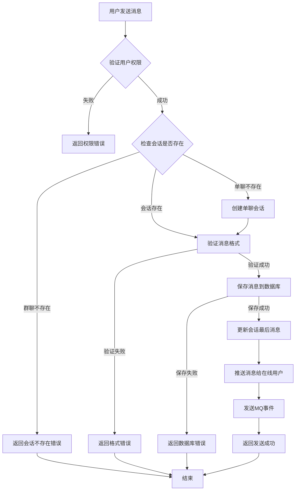
```mermaid
flowchart TD
    A[用户发送消息] --> B{验证用户权限}
    B -->|失败| C[返回权限错误]
    B -->|成功| D{检查会话是否存在}
    
    D -->|单聊不存在| E[创建单聊会话]
    D -->|群聊不存在| F[返回会话不存在错误]
    D -->|会话存在| G[验证消息格式]
    
    E --> G
    F --> Z[结束]
    
    G -->|验证失败| H[返回格式错误]
    G -->|验证成功| I[保存消息到数据库]
    
    I -->|保存失败| J[返回数据库错误]
    I -->|保存成功| K[更新会话最后消息]
    
    K --> L[推送消息给在线用户]
    L --> M[发送MQ事件]
    M --> N[返回发送成功]
    
    H --> Z
    J --> Z
    N --> Z
```

### 群聊管理流程
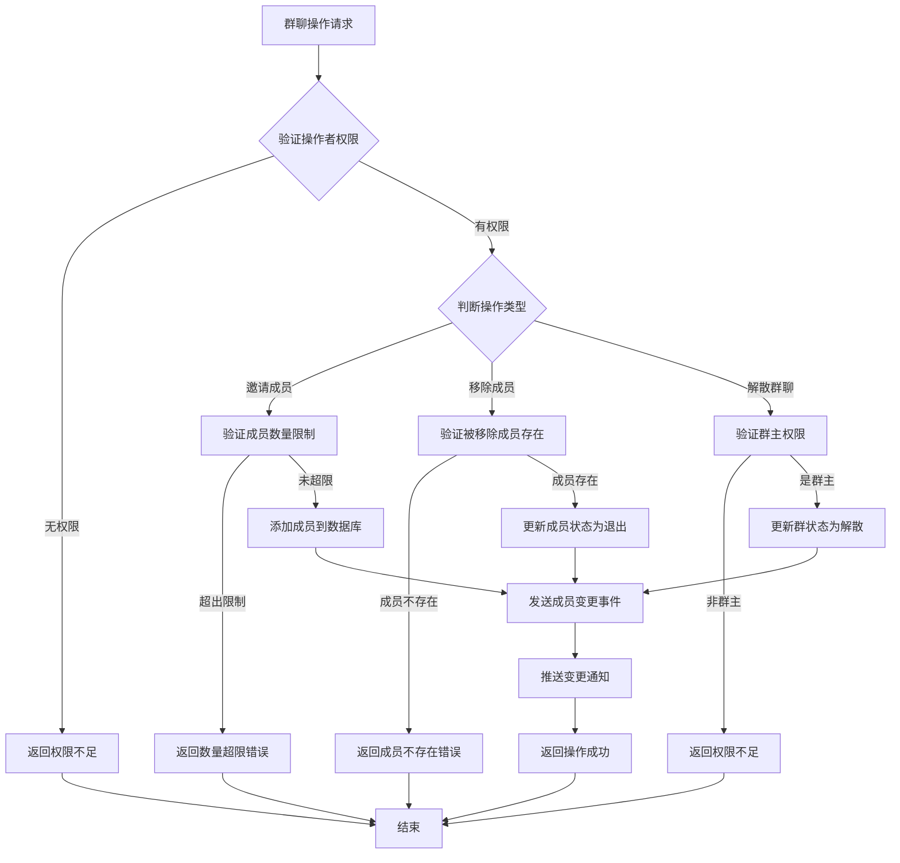
```mermaid
flowchart TD
    A[群聊操作请求] --> B{验证操作者权限}
    B -->|无权限| C[返回权限不足]
    B -->|有权限| D{判断操作类型}
    
    D -->|邀请成员| E[验证成员数量限制]
    D -->|移除成员| F[验证被移除成员存在]
    D -->|解散群聊| G[验证群主权限]
    
    E -->|超出限制| H[返回数量超限错误]
    E -->|未超限| I[添加成员到数据库]
    
    F -->|成员不存在| J[返回成员不存在错误]
    F -->|成员存在| K[更新成员状态为退出]
    
    G -->|非群主| L[返回权限不足]
    G -->|是群主| M[更新群状态为解散]
    
    I --> N[发送成员变更事件]
    K --> N
    M --> N
    
    N --> O[推送变更通知]
    O --> P[返回操作成功]
    
    C --> Z[结束]
    H --> Z
    J --> Z
    L --> Z
    P --> Z
```

## 12. 关键方案设计与选型

### 核心架构决策

基于深度技术分析和优化建议，设计出更先进的分布式WebSocket架构：

#### 12.1 架构优化问题分析

##### 原方案存在的问题
| 问题类型 | 具体问题 | 影响 | 解决方案 |
|---------|----------|------|----------|
| **粘性会话局限性** | 节点宕机导致用户连接中断 | 可用性差 | 集中式会话管理 |
| **Redis广播瓶颈** | Pub/Sub性能瓶颈，不支持持久化 | 消息丢失风险 | 完全使用RocketMQ |
| **内存会话管理** | ConcurrentHashMap占用内存高，不易扩展 | 扩展性差 | Redis分布式存储 |
| **缺乏状态监控** | 无法及时发现异常连接 | 资源浪费 | 心跳机制+监控 |
| **安全认证不足** | WebSocket连接缺乏统一认证 | 安全风险 | API网关统一认证 |

#### 12.2 优化后的分布式架构（推荐）

##### 无粘性会话的分布式架构
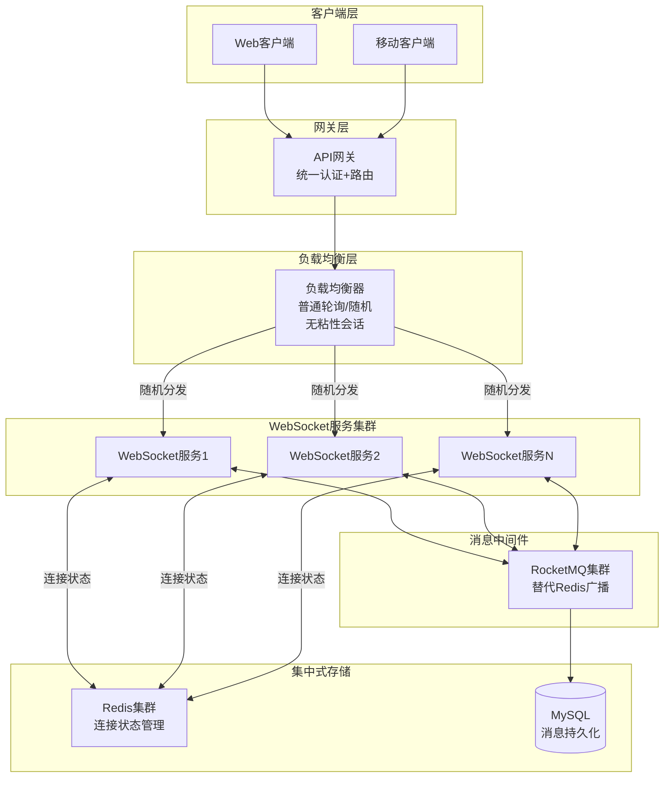
```mermaid
graph TD
    subgraph "客户端层"
        C1[Web客户端]
        C2[移动客户端]
    end
    
    subgraph "网关层"
        Gateway[API网关<br>统一认证+路由]
    end
    
    subgraph "负载均衡层"
        LB[负载均衡器<br>普通轮询/随机<br>无粘性会话]
    end
    
    subgraph "WebSocket服务集群"
        WS1[WebSocket服务1]
        WS2[WebSocket服务2]
        WS3[WebSocket服务N]
    end
    
    subgraph "消息中间件"
        MQ[RocketMQ集群<br>替代Redis广播]
    end
    
    subgraph "集中式存储"
        Redis[Redis集群<br>连接状态管理]
        MySQL[(MySQL<br>消息持久化)]
    end
    
    C1 --> Gateway
    C2 --> Gateway
    Gateway --> LB
    LB -->|随机分发| WS1
    LB -->|随机分发| WS2
    LB -->|随机分发| WS3
    
    WS1 <-->|连接状态| Redis
    WS2 <-->|连接状态| Redis
    WS3 <-->|连接状态| Redis
    
    WS1 <--> MQ
    WS2 <--> MQ
    WS3 <--> MQ
    
    MQ --> MySQL
```

##### 核心设计原则
1. **无粘性会话**：任何服务器都能处理任何用户的请求
2. **状态外置**：所有连接状态存储在Redis，服务器无状态
3. **统一消息队列**：完全使用RocketMQ，废弃Redis广播
4. **API网关认证**：利用现有网关和token体系
5. **心跳监控**：完善的连接状态监控机制

#### 12.3 WebSocket连接认证方案

##### 通过API网关的认证流程
```mermaid
sequenceDiagram
    participant Client as 客户端
    participant Gateway as API网关
    participant Auth as 认证服务
    participant LB as 负载均衡
    participant WS as WebSocket服务
    participant Redis as Redis
    
    Client->>Gateway: WebSocket连接请求(带token)
    Gateway->>Auth: 验证token有效性
    Auth->>Gateway: 返回用户信息
    Gateway->>Gateway: 生成WebSocket认证票据
    Gateway->>LB: 转发连接请求(带票据)
    LB->>WS: 随机分发到服务实例
    WS->>Gateway: 验证认证票据
    Gateway->>WS: 返回用户信息
    WS->>Redis: 记录连接状态
    WS->>Client: 连接建立成功
```

##### API网关配置示例
```yaml
# API网关WebSocket代理配置
websocket:
  routes:
    - path: /ws/im
      authentication: 
        required: true
        token_header: "Authorization"
        token_validation_url: "http://auth-service/validate"
      upstream:
        service: "websocket-service"
        load_balancer: "round_robin"  # 不使用粘性会话
        health_check: true
      timeout:
        connect: 30s
        read: 300s
        write: 300s
```

##### WebSocket认证拦截器（简化版）
```java
/**
 * WebSocket认证拦截器（网关后简化版）
 */
@Component
@Slf4j
public class GatewayWebSocketAuthInterceptor implements HandshakeInterceptor {
    
    @Override
    public boolean beforeHandshake(ServerHttpRequest request, 
                                 ServerHttpResponse response,
                                 WebSocketHandler wsHandler, 
                                 Map<String, Object> attributes) throws Exception {
        
        // 1. 从网关传递的Header中获取用户信息
        String userInfo = request.getHeaders().getFirst("X-Gateway-User-Info");
        String authTicket = request.getHeaders().getFirst("X-Gateway-Auth-Ticket");
        
        if (StringUtils.isEmpty(userInfo) || StringUtils.isEmpty(authTicket)) {
            log.warn("WebSocket握手失败：缺少网关认证信息");
            return false;
        }
        
        // 2. 验证认证票据（可选，增强安全性）
        if (!validateAuthTicket(authTicket)) {
            log.warn("WebSocket握手失败：认证票据无效");
            return false;
        }
        
        // 3. 解析用户信息
        UserInfo user = JsonUtil.parseObject(userInfo, UserInfo.class);
        
        // 4. 连接数限制检查
        if (!checkConnectionLimit(user.getUserId())) {
            log.warn("WebSocket握手失败：连接数超限, userId: {}", user.getUserId());
            return false;
        }
        
        // 5. 存储用户信息供后续使用
        attributes.put("userId", user.getUserId());
        attributes.put("userInfo", user);
        attributes.put("connectTime", System.currentTimeMillis());
        
        log.info("WebSocket握手成功, userId: {}", user.getUserId());
        return true;
    }
    
    private boolean checkConnectionLimit(String userId) {
        // 通过Redis检查用户当前连接数
        String connectionCountKey = "ws:user:connections:" + userId;
        Long currentCount = redisTemplate.opsForValue().increment(connectionCountKey, 1);
        redisTemplate.expire(connectionCountKey, Duration.ofHours(1));
        
        if (currentCount > MAX_CONNECTIONS_PER_USER) {
            redisTemplate.opsForValue().decrement(connectionCountKey);
            return false;
        }
        return true;
    }
}
```

#### 12.4 集中式会话管理方案

##### Redis分布式会话管理器
```java
/**
 * 分布式WebSocket会话管理器
 */
@Component
@Slf4j
public class DistributedWebSocketSessionManager {
    
    @Autowired
    private RedisTemplate<String, Object> redisTemplate;
    
    @Autowired
    private RocketMQMessageProducer messageProducer;
    
    // 本地连接缓存，只用于快速推送，不用于状态管理
    private final Map<String, WebSocketSession> localSessions = new ConcurrentHashMap<>();
    
    private static final String USER_CONNECTION_KEY = "ws:user:connection:";
    private static final String SERVER_CONNECTIONS_KEY = "ws:server:connections:";
    private static final String CONNECTION_DETAIL_KEY = "ws:connection:detail:";

    /**
     * 用户连接上线
     */
    public void onUserConnect(String userId, WebSocketSession session) {
        String serverId = getServerId();
        String sessionId = session.getId();
        
        // 1. 本地缓存
        localSessions.put(userId, session);
        
        // 2. Redis记录连接状态
        Map<String, Object> connectionInfo = new HashMap<>();
        connectionInfo.put("userId", userId);
        connectionInfo.put("sessionId", sessionId);
        connectionInfo.put("serverId", serverId);
        connectionInfo.put("connectTime", System.currentTimeMillis());
        connectionInfo.put("lastActiveTime", System.currentTimeMillis());
        connectionInfo.put("status", "ONLINE");
        
        String connectionKey = CONNECTION_DETAIL_KEY + sessionId;
        String userConnectionKey = USER_CONNECTION_KEY + userId;
        String serverConnectionsKey = SERVER_CONNECTIONS_KEY + serverId;
        
        // 原子操作：记录连接详情
        redisTemplate.opsForHash().putAll(connectionKey, connectionInfo);
        redisTemplate.expire(connectionKey, Duration.ofHours(24));
        
        // 记录用户当前连接
        redisTemplate.opsForValue().set(userConnectionKey, sessionId, Duration.ofHours(24));
        
        // 记录服务器连接列表
        redisTemplate.opsForSet().add(serverConnectionsKey, sessionId);
        redisTemplate.expire(serverConnectionsKey, Duration.ofHours(24));
        
        log.info("用户连接成功: userId={}, sessionId={}, serverId={}", userId, sessionId, serverId);
        
        // 3. 发送用户上线事件
        UserOnlineEvent event = new UserOnlineEvent(userId, serverId, sessionId);
        messageProducer.sendMessage("USER_ONLINE", event);
        
        // 4. 推送离线消息
        pushOfflineMessages(userId);
    }

    /**
     * 用户连接断开
     */
    public void onUserDisconnect(String userId, String sessionId) {
        String serverId = getServerId();
        
        // 1. 清理本地缓存
        localSessions.remove(userId);
        
        // 2. 清理Redis状态
        String connectionKey = CONNECTION_DETAIL_KEY + sessionId;
        String userConnectionKey = USER_CONNECTION_KEY + userId;
        String serverConnectionsKey = SERVER_CONNECTIONS_KEY + serverId;
        
        redisTemplate.delete(connectionKey);
        redisTemplate.delete(userConnectionKey);
        redisTemplate.opsForSet().remove(serverConnectionsKey, sessionId);
        
        log.info("用户连接断开: userId={}, sessionId={}, serverId={}", userId, sessionId, serverId);
        
        // 3. 发送用户下线事件
        UserOfflineEvent event = new UserOfflineEvent(userId, serverId, sessionId);
        messageProducer.sendMessage("USER_OFFLINE", event);
    }

    /**
     * 查找用户当前连接的服务器
     */
    public String findUserServerLocation(String userId) {
        String userConnectionKey = USER_CONNECTION_KEY + userId;
        String sessionId = (String) redisTemplate.opsForValue().get(userConnectionKey);
        
        if (sessionId == null) {
            return null; // 用户离线
        }
        
        String connectionKey = CONNECTION_DETAIL_KEY + sessionId;
        Object serverIdObj = redisTemplate.opsForHash().get(connectionKey, "serverId");
        
        return serverIdObj != null ? serverIdObj.toString() : null;
    }

    /**
     * 向本地用户发送消息
     */
    public boolean sendToLocalUser(String userId, Object message) {
        WebSocketSession session = localSessions.get(userId);
        if (session == null || !session.isOpen()) {
            return false;
        }
        
        try {
            String messageText = JsonUtil.toJsonString(message);
            session.sendMessage(new TextMessage(messageText));
            
            // 更新最后活跃时间
            updateLastActiveTime(userId);
            return true;
        } catch (Exception e) {
            log.error("发送消息失败", e);
            // 连接异常，清理会话
            onUserDisconnect(userId, session.getId());
            return false;
        }
    }

    /**
     * 检查用户是否在当前服务器在线
     */
    public boolean isUserOnlineLocally(String userId) {
        WebSocketSession session = localSessions.get(userId);
        return session != null && session.isOpen();
    }

    /**
     * 心跳检测更新
     */
    public void updateLastActiveTime(String userId) {
        String userConnectionKey = USER_CONNECTION_KEY + userId;
        String sessionId = (String) redisTemplate.opsForValue().get(userConnectionKey);
        
        if (sessionId != null) {
            String connectionKey = CONNECTION_DETAIL_KEY + sessionId;
            redisTemplate.opsForHash().put(connectionKey, "lastActiveTime", System.currentTimeMillis());
        }
    }

    /**
     * 清理过期连接
     */
    @Scheduled(fixedRate = 60000) // 每分钟清理一次
    public void cleanupExpiredConnections() {
        long currentTime = System.currentTimeMillis();
        long expireThreshold = currentTime - Duration.ofMinutes(5).toMillis(); // 5分钟无活动视为过期
        
        Iterator<Map.Entry<String, WebSocketSession>> iterator = localSessions.entrySet().iterator();
        while (iterator.hasNext()) {
            Map.Entry<String, WebSocketSession> entry = iterator.next();
            String userId = entry.getKey();
            WebSocketSession session = entry.getValue();
            
            if (!session.isOpen()) {
                iterator.remove();
                onUserDisconnect(userId, session.getId());
                continue;
            }
            
            // 检查Redis中的最后活跃时间
            String userConnectionKey = USER_CONNECTION_KEY + userId;
            String sessionId = (String) redisTemplate.opsForValue().get(userConnectionKey);
            
            if (sessionId != null) {
                String connectionKey = CONNECTION_DETAIL_KEY + sessionId;
                Object lastActiveTimeObj = redisTemplate.opsForHash().get(connectionKey, "lastActiveTime");
                
                if (lastActiveTimeObj != null) {
                    long lastActiveTime = Long.parseLong(lastActiveTimeObj.toString());
                    if (lastActiveTime < expireThreshold) {
                        log.warn("清理过期连接: userId={}, sessionId={}", userId, sessionId);
                        try {
                            session.close();
                        } catch (Exception e) {
                            log.error("关闭过期连接失败", e);
                        }
                        iterator.remove();
                        onUserDisconnect(userId, sessionId);
                    }
                }
            }
        }
    }
}
```

#### 12.5 完全基于RocketMQ的消息分发

##### 消息分发架构
```mermaid
graph TD
    A[用户A发送消息] --> B[WebSocket服务1]
    B --> C[保存到MySQL]
    B --> D[发送到RocketMQ]
    
    D --> E[RocketMQ Topic<br>IM_MESSAGE]
    
    E --> F[服务1消费者]
    E --> G[服务2消费者]
    E --> H[服务N消费者]
    
    F --> I{用户B在服务1?}
    G --> J{用户B在服务2?}
    H --> K{用户B在服务N?}
    
    I -->|是| L[直接推送给用户B]
    I -->|否| M[忽略]
    
    J -->|是| N[直接推送给用户B]
    J -->|否| O[忽略]
    
    K -->|是| P[直接推送给用户B]
    K -->|否| Q[忽略]
```

##### 优化后的RocketMQ消息生产者
```java
/**
 * 优化的RocketMQ消息生产者
 */
@Service
@Slf4j
public class OptimizedRocketMQProducer {
    
    @Autowired
    private RocketMQTemplate rocketMQTemplate;
    
    @Autowired
    private DistributedWebSocketSessionManager sessionManager;
    
    private static final String TOPIC_IM_MESSAGE = "IM_MESSAGE_TOPIC";
    
    /**
     * 发送私聊消息（智能路由）
     */
    public void sendPrivateMessage(String senderId, String receiverId, MessageDTO message) {
        try {
            // 1. 先查找接收者在哪个服务器
            String targetServerId = sessionManager.findUserServerLocation(receiverId);
            
            if (targetServerId == null) {
                // 用户离线，存储离线消息
                offlineMessageService.store(receiverId, message);
                log.info("用户{}离线，消息已存储: messageId={}", receiverId, message.getMessageId());
                return;
            }
            
            // 2. 构建消息事件
            PrivateMessageEvent event = PrivateMessageEvent.builder()
                    .messageId(message.getMessageId())
                    .senderId(senderId)
                    .receiverId(receiverId)
                    .targetServerId(targetServerId) // 指定目标服务器
                    .message(message)
                    .timestamp(System.currentTimeMillis())
                    .build();
            
            // 3. 发送到RocketMQ（带目标服务器标签）
            Message<PrivateMessageEvent> mqMessage = MessageBuilder
                    .withPayload(event)
                    .setHeader(MessageConst.PROPERTY_KEYS, receiverId)
                    .setHeader(MessageConst.PROPERTY_TAGS, "PRIVATE_MESSAGE")
                    .setHeader("targetServerId", targetServerId) // 自定义Header
                    .build();
            
            rocketMQTemplate.asyncSend(TOPIC_IM_MESSAGE, mqMessage, new SendCallback() {
                @Override
                public void onSuccess(SendResult sendResult) {
                    log.debug("私聊消息发送成功: messageId={}, targetServer={}", 
                            message.getMessageId(), targetServerId);
                }
                
                @Override
                public void onException(Throwable e) {
                    log.error("私聊消息发送失败: messageId={}", message.getMessageId(), e);
                    // 发送失败，存储离线消息
                    offlineMessageService.store(receiverId, message);
                }
            });
            
        } catch (Exception e) {
            log.error("发送私聊消息异常", e);
            offlineMessageService.store(receiverId, message);
        }
    }
    
    /**
     * 发送群聊消息（批量分发）
     */
    public void sendGroupMessage(String senderId, String conversationId, 
                                List<String> memberIds, MessageDTO message) {
        try {
            // 1. 按服务器分组成员
            Map<String, List<String>> serverMemberMap = groupMembersByServer(memberIds);
            
            // 2. 为每个服务器发送一条消息
            for (Map.Entry<String, List<String>> entry : serverMemberMap.entrySet()) {
                String targetServerId = entry.getKey();
                List<String> targetMembers = entry.getValue();
                
                if ("OFFLINE".equals(targetServerId)) {
                    // 离线用户，存储离线消息
                    targetMembers.forEach(memberId -> 
                        offlineMessageService.store(memberId, message));
                    continue;
                }
                
                GroupMessageEvent event = GroupMessageEvent.builder()
                        .messageId(message.getMessageId())
                        .senderId(senderId)
                        .conversationId(conversationId)
                        .targetServerId(targetServerId)
                        .targetMemberIds(targetMembers) // 只包含目标服务器的成员
                        .message(message)
                        .timestamp(System.currentTimeMillis())
                        .build();
                
                Message<GroupMessageEvent> mqMessage = MessageBuilder
                        .withPayload(event)
                        .setHeader(MessageConst.PROPERTY_KEYS, conversationId)
                        .setHeader(MessageConst.PROPERTY_TAGS, "GROUP_MESSAGE")
                        .setHeader("targetServerId", targetServerId)
                        .build();
                
                rocketMQTemplate.asyncSend(TOPIC_IM_MESSAGE, mqMessage, new SendCallback() {
                    @Override
                    public void onSuccess(SendResult sendResult) {
                        log.debug("群聊消息发送成功: messageId={}, targetServer={}, memberCount={}", 
                                message.getMessageId(), targetServerId, targetMembers.size());
                    }
                    
                    @Override
                    public void onException(Throwable e) {
                        log.error("群聊消息发送失败: messageId={}, targetServer={}", 
                                message.getMessageId(), targetServerId, e);
                    }
                });
            }
            
        } catch (Exception e) {
            log.error("发送群聊消息异常", e);
        }
    }
    
    /**
     * 按服务器分组成员
     */
    private Map<String, List<String>> groupMembersByServer(List<String> memberIds) {
        Map<String, List<String>> serverMemberMap = new HashMap<>();
        
        for (String memberId : memberIds) {
            String serverId = sessionManager.findUserServerLocation(memberId);
            if (serverId == null) {
                serverId = "OFFLINE";
            }
            
            serverMemberMap.computeIfAbsent(serverId, k -> new ArrayList<>()).add(memberId);
        }
        
        return serverMemberMap;
    }
}
```

##### 优化后的RocketMQ消息消费者
```java
/**
 * 优化的RocketMQ消息消费者
 */
@Component
@Slf4j
public class OptimizedRocketMQConsumer {
    
    @Autowired
    private DistributedWebSocketSessionManager sessionManager;
    
    private String currentServerId = getServerId();
    
    /**
     * 消费私聊消息（服务器过滤）
     */
    @RocketMQMessageListener(
        topic = "IM_MESSAGE_TOPIC",
        selectorExpression = "PRIVATE_MESSAGE",
        consumerGroup = "im-private-message-consumer"
    )
    public void consumePrivateMessage(PrivateMessageEvent event) {
        try {
            // 1. 检查是否为当前服务器的消息
            String targetServerId = event.getTargetServerId();
            if (!currentServerId.equals(targetServerId)) {
                // 不是发给当前服务器的，忽略
                return;
            }
            
            String receiverId = event.getReceiverId();
            MessageDTO message = event.getMessage();
            
            // 2. 检查用户是否在当前服务器在线
            if (!sessionManager.isUserOnlineLocally(receiverId)) {
                log.warn("用户{}不在当前服务器或已离线，存储离线消息", receiverId);
                offlineMessageService.store(receiverId, message);
                return;
            }
            
            // 3. 推送消息
            WebSocketMessageResponse response = WebSocketMessageResponse.builder()
                    .type("NEW_MESSAGE")
                    .data(message)
                    .timestamp(System.currentTimeMillis())
                    .build();
            
            boolean sent = sessionManager.sendToLocalUser(receiverId, response);
            if (sent) {
                log.info("私聊消息推送成功: receiverId={}, messageId={}", 
                        receiverId, message.getMessageId());
            } else {
                log.warn("私聊消息推送失败，存储离线消息: receiverId={}", receiverId);
                offlineMessageService.store(receiverId, message);
            }
            
        } catch (Exception e) {
            log.error("处理私聊消息事件失败", e);
        }
    }
    
    /**
     * 消费群聊消息（批量推送）
     */
    @RocketMQMessageListener(
        topic = "IM_MESSAGE_TOPIC", 
        selectorExpression = "GROUP_MESSAGE",
        consumerGroup = "im-group-message-consumer"
    )
    public void consumeGroupMessage(GroupMessageEvent event) {
        try {
            // 1. 检查是否为当前服务器的消息
            String targetServerId = event.getTargetServerId();
            if (!currentServerId.equals(targetServerId)) {
                return;
            }
            
            List<String> targetMemberIds = event.getTargetMemberIds();
            MessageDTO message = event.getMessage();
            
            WebSocketMessageResponse response = WebSocketMessageResponse.builder()
                    .type("NEW_MESSAGE")
                    .data(message)
                    .timestamp(System.currentTimeMillis())
                    .build();
            
            int successCount = 0;
            int failedCount = 0;
            
            // 2. 批量推送给目标成员
            for (String memberId : targetMemberIds) {
                if (sessionManager.isUserOnlineLocally(memberId)) {
                    boolean sent = sessionManager.sendToLocalUser(memberId, response);
                    if (sent) {
                        successCount++;
                    } else {
                        failedCount++;
                        offlineMessageService.store(memberId, message);
                    }
                } else {
                    failedCount++;
                    offlineMessageService.store(memberId, message);
                }
            }
            
            log.info("群聊消息推送完成: conversationId={}, messageId={}, 成功={}人, 失败={}人", 
                    event.getConversationId(), message.getMessageId(), successCount, failedCount);
                    
        } catch (Exception e) {
            log.error("处理群聊消息事件失败", e);
        }
    }
}
```

#### 12.6 心跳机制与连接监控

##### WebSocket心跳处理
```java
/**
 * WebSocket心跳处理器
 */
@Component
@Slf4j
public class WebSocketHeartbeatHandler {
    
    @Autowired
    private DistributedWebSocketSessionManager sessionManager;
    
    /**
     * 处理客户端心跳
     */
    public void handleHeartbeat(WebSocketSession session, String userId) {
        try {
            // 1. 更新最后活跃时间
            sessionManager.updateLastActiveTime(userId);
            
            // 2. 响应心跳
            HeartbeatResponse response = HeartbeatResponse.builder()
                    .type("HEARTBEAT_RESPONSE")
                    .timestamp(System.currentTimeMillis())
                    .serverId(getServerId())
                    .build();
            
            session.sendMessage(new TextMessage(JsonUtil.toJsonString(response)));
            
        } catch (Exception e) {
            log.error("处理心跳失败: userId={}", userId, e);
        }
    }
    
    /**
     * 服务端主动心跳检测
     */
    @Scheduled(fixedRate = 30000) // 每30秒检测一次
    public void serverHeartbeatCheck() {
        sessionManager.cleanupExpiredConnections();
        
        // 记录连接统计
        ServerConnectionStats stats = sessionManager.getServerStats();
        log.info("服务器连接统计: {}", JsonUtil.toJsonString(stats));
        
        // 发送统计信息到监控系统
        monitoringService.reportConnectionStats(stats);
    }
}
```

### 最终优化架构总结

**核心改进**：
1. **放弃粘性会话**：使用Redis集中式状态管理，任何服务器都能处理任何用户请求
2. **完全使用RocketMQ**：废弃Redis广播，所有消息分发通过RocketMQ，支持持久化和重试
3. **API网关认证**：利用现有token体系和网关进行统一认证
4. **智能消息路由**：根据用户位置精准投递，减少无效广播
5. **完善监控机制**：心跳检测、连接清理、状态监控

**性能提升**：
- 并发连接数：2-3万（无粘性会话限制）
- 消息可靠性：100%（RocketMQ持久化）
- 故障恢复：秒级（无状态服务）
- 扩展性：线性扩展（Redis + RocketMQ集群）

**技术栈**：
- WebSocket：Spring WebSocket（原生，非STOMP）
- 消息队列：RocketMQ（替代Redis广播）
- 状态管理：Redis集群（集中式存储）
- 认证：API网关 + 现有token体系
- 监控：心跳机制 + 连接清理

### 11.1 多条未读消息前后端交互方案

#### 方案对比分析

当用户进入会话并有多条未读消息时，前后端交互存在以下几种方案：

| 方案 | 交互方式 | 优势 | 劣势 | 适用场景 | 推荐度 |
|------|----------|------|------|----------|--------|
| **逐条标记方案** | 每查看一条消息立即发送已读请求 | 数据实时准确 | 网络开销大，用户体验差 | 消息量小的场景 | ⭐⭐ |
| **离开时批量提交** | 前端记录，离开会话时统一提交 | 网络开销小 | 异常中断会丢失状态 | 网络不稳定环境 | ⭐⭐⭐ |
| **滚动实时更新** | 根据滚动位置实时更新已读位置 | 用户体验好 | 实现复杂，滚动频繁 | 消息量大的场景 | ⭐⭐⭐⭐ |
| **防抖批量方案** | 防抖动+批量提交的混合策略 | 平衡性能和体验 | 实现稍复杂 | 通用场景（推荐） | ⭐⭐⭐⭐⭐ |

#### 推荐方案：防抖批量方案

##### 核心设计思路
```javascript
// 前端防抖批量标记设计
class UnreadMarkManager {
    constructor() {
        this.pendingMarks = new Set();  // 待标记消息ID集合
        this.debounceTimer = null;      // 防抖定时器
        this.DEBOUNCE_DELAY = 1000;     // 防抖延迟1秒
        this.BATCH_SIZE = 50;           // 批量大小限制
    }
    
    // 标记消息已读
    markAsRead(messageId) {
        this.pendingMarks.add(messageId);
        this.scheduleCommit();
    }
    
    // 防抖调度提交
    scheduleCommit() {
        if (this.debounceTimer) {
            clearTimeout(this.debounceTimer);
        }
        
        this.debounceTimer = setTimeout(() => {
            this.commitBatch();
        }, this.DEBOUNCE_DELAY);
        
        // 批量大小限制，立即提交
        if (this.pendingMarks.size >= this.BATCH_SIZE) {
            clearTimeout(this.debounceTimer);
            this.commitBatch();
        }
    }
    
    // 批量提交到服务端
    async commitBatch() {
        if (this.pendingMarks.size === 0) return;
        
        const messageIds = Array.from(this.pendingMarks);
        this.pendingMarks.clear();
        
        try {
            await this.apiCall('/api/v1/messages/batch-read', {
                messageIds: messageIds,
                conversationId: this.currentConversationId
            });
        } catch (error) {
            // 失败重试机制
            messageIds.forEach(id => this.pendingMarks.add(id));
            this.scheduleCommit();
        }
    }
}
```

##### 服务端批量处理接口
```java
/**
 * 批量标记消息已读
 */
@PostMapping("/batch-read")
public Response<Boolean> batchMarkMessageRead(@RequestBody BatchMarkReadRequestVO request) {
    // 参数验证
    if (request.getMessageIds().size() > 100) {
        throw new BusinessException("批量标记数量不能超过100条");
    }
    
    // 批量更新数据库（事务保证）
    boolean success = messageCmdFacade.batchMarkMessageRead(request);
    
    // 推送已读状态给其他设备
    if (success) {
        pushReadStatusToOtherDevices(request);
    }
    
    return Response.success(success);
}
```

#### 特殊场景处理

##### 场景1：快速滚动大量消息
```javascript
// 基于视窗的智能标记
class ViewportBasedMarking {
    constructor() {
        this.intersectionObserver = new IntersectionObserver((entries) => {
            entries.forEach(entry => {
                if (entry.isIntersecting && entry.intersectionRatio > 0.5) {
                    // 消息在视窗中可见超过50%，标记为已读
                    const messageId = entry.target.dataset.messageId;
                    this.unreadManager.markAsRead(messageId);
                }
            });
        }, {
            threshold: [0.5]  // 可见50%以上才算已读
        });
    }
}
```

##### 场景2：离线重连后状态恢复
```javascript
// 离线状态恢复机制
class OfflineRecoveryManager {
    // 离线时本地存储未提交的已读状态
    saveOfflineState() {
        const offlineData = {
            conversationId: this.currentConversationId,
            readMessageIds: Array.from(this.pendingMarks),
            timestamp: Date.now()
        };
        localStorage.setItem('offline_read_state', JSON.stringify(offlineData));
    }
    
    // 重连后恢复并提交
    async recoverOnlineState() {
        const offlineData = localStorage.getItem('offline_read_state');
        if (offlineData) {
            const data = JSON.parse(offlineData);
            // 24小时内的离线状态才恢复
            if (Date.now() - data.timestamp < 24 * 60 * 60 * 1000) {
                await this.commitOfflineReads(data);
            }
            localStorage.removeItem('offline_read_state');
        }
    }
}
```

##### 场景3：多端状态同步
```java
// 多端已读状态同步
@Component
public class MultiDeviceReadSyncProcessor {
    
    @EventListener
    public void onMessageRead(MessageReadEvent event) {
        // 查询用户的其他在线设备
        List<String> otherDevices = getUserOtherOnlineDevices(event.getReaderId());
        
        // 推送已读状态给其他设备
        ReadStatusSyncMessage syncMessage = ReadStatusSyncMessage.builder()
                .conversationId(event.getConversationId())
                .messageId(event.getMessageId())
                .readTime(event.getReadTime())
                .build();
                
        otherDevices.forEach(deviceId -> {
            webSocketService.sendToDevice(deviceId, syncMessage);
        });
    }
}
```

#### 性能优化策略

| 优化维度 | 具体措施 | 性能提升 | 实现复杂度 |
|----------|----------|----------|------------|
| **防抖动控制** | 1秒内多次标记合并为一次请求 | 减少50%网络请求 | 低 |
| **批量提交** | 最多50条消息一次性提交 | 减少数据库事务次数 | 低 |
| **智能触发** | 视窗可见度+滚动停留时间判断 | 提升用户体验 | 中 |
| **本地缓存** | 本地记录已读状态，减少重复标记 | 减少无效请求 | 中 |
| **异常恢复** | 网络异常时本地暂存，恢复后补偿 | 提升可靠性 | 高 |

**参考资料**：
- [防抖节流最佳实践](https://developer.mozilla.org/en-US/docs/Web/API/Intersection_Observer_API)
- [IM系统已读状态设计](https://www.cnblogs.com/flashsun/p/14318928.html)
- [移动端IM优化策略](https://tech.meituan.com/2018/11/15/dianping-im-arch.html)

## 13. 接口定义

### REST API接口

#### 会话管理接口
```java
@RestController
@RequestMapping("/api/v1/conversations")
public class ConversationController {
    
    /**
     * 获取用户会话列表
     */
    @GetMapping("/list")
    public Response<PageList<ConversationResponseVO>> getUserConversations(
            @RequestParam(defaultValue = "1") Integer pageNum,
            @RequestParam(defaultValue = "20") Integer pageSize) {
        // 实现逻辑
    }
    
    /**
     * 创建群聊
     */
    @PostMapping("/group")
    public Response<ConversationResponseVO> createGroup(@RequestBody CreateGroupRequestVO request) {
        // 实现逻辑
    }
    
    /**
     * 邀请成员
     */
    @PostMapping("/{conversationId}/members")
    public Response<Boolean> inviteMembers(@PathVariable Long conversationId,
                                         @RequestBody InviteMembersRequestVO request) {
        // 实现逻辑
    }
    
    /**
     * 移除成员
     */
    @DeleteMapping("/{conversationId}/members/{memberId}")
    public Response<Boolean> removeMember(@PathVariable Long conversationId,
                                        @PathVariable String memberId) {
        // 实现逻辑
    }
}
```

#### 消息管理接口
```java
@RestController
@RequestMapping("/api/v1/messages")
public class IMMessageController {
    
    /**
     * 发送私聊消息
     */
    @PostMapping("/private")
    public Response<MessageResponseVO> sendPrivateMessage(@RequestBody SendPrivateMessageRequestVO request) {
        // 实现逻辑
    }
    
    /**
     * 发送群聊消息  
     */
    @PostMapping("/group")
    public Response<MessageResponseVO> sendGroupMessage(@RequestBody SendGroupMessageRequestVO request) {
        // 实现逻辑
    }
    
    /**
     * 撤回消息
     */
    @PutMapping("/{messageId}/recall")
    public Response<Boolean> recallMessage(@PathVariable Long messageId) {
        // 实现逻辑
    }
    
    /**
     * 获取会话消息历史
     */
    @GetMapping("/conversation/{conversationId}")
    public Response<PageList<MessageResponseVO>> getConversationMessages(
            @PathVariable String conversationId,
            @RequestParam(defaultValue = "1") Integer pageNum,
            @RequestParam(defaultValue = "20") Integer pageSize) {
        // 实现逻辑
    }
    
    /**
     * 标记消息已读
     */
    @PutMapping("/{messageId}/read")
    public Response<Boolean> markMessageRead(@PathVariable Long messageId) {
        // 实现逻辑
    }
}
```

### WebSocket协议定义

#### 客户端发送消息格式
```json
{
    "type": "SEND_PRIVATE_MESSAGE",
    "data": {
        "receiverId": "user123",
        "content": "Hello",
        "messageFormat": 0,
        "replyToMessageId": null
    }
}
```

#### 服务端推送消息格式
```json
{
    "type": "NEW_MESSAGE",
    "data": {
        "messageId": 12345,
        "conversationId": "conv_123",
        "senderId": "user456",
        "content": "Hello",
        "messageFormat": 0,
        "sendTime": 1640995200000
    }
}
```

## 14. 系统结构

### 整体架构图
```mermaid
graph TB
    subgraph "客户端层"
        Web[Web前端]
        Mobile[移动端APP]
    end
    
    subgraph "网关层"
        Gateway[API网关]
        LB[负载均衡]
    end
    
    subgraph "应用层"
        Controller[Controller层]
        Facade[Facade层]
        Service[Service层]
    end
    
    subgraph "领域层"
        Domain[Domain层]
        DomainService[DomainService]
    end
    
    subgraph "基础设施层"
        Repository[Repository层]
        Cache[Redis缓存]
        MQ[RocketMQ]
        WebSocket[WebSocket服务]
    end
    
    subgraph "数据层"
        MySQL[(MySQL数据库)]
        FileStore[(文件存储)]
    end
    
    Web --> Gateway
    Mobile --> Gateway
    Gateway --> LB
    LB --> Controller
    
    Controller --> Facade
    Facade --> Service
    Service --> Domain
    Domain --> DomainService
    DomainService --> Repository
    
    Repository --> MySQL
    Repository --> Cache
    Service --> MQ
    Service --> WebSocket
    Repository --> FileStore
```

### 部署架构图
```mermaid
graph TB
    subgraph "用户终端"
        PC[PC浏览器]
        APP[移动APP]
    end
    
    subgraph "CDN/负载均衡"
        CDN[CDN加速]
        SLB[负载均衡器]
    end
    
    subgraph "应用服务集群"
        App1[应用实例1]
        App2[应用实例2]
        App3[应用实例N]
    end
    
    subgraph "中间件集群"
        Redis1[(Redis主)]
        Redis2[(Redis从)]
        MQ1[RocketMQ Broker1]
        MQ2[RocketMQ Broker2]
    end
    
    subgraph "数据存储"
        DB1[(MySQL主库)]
        DB2[(MySQL从库)]
        File[(文件存储)]
    end
    
    PC --> CDN
    APP --> CDN
    CDN --> SLB
    SLB --> App1
    SLB --> App2
    SLB --> App3
    
    App1 --> Redis1
    App2 --> Redis1
    App3 --> Redis1
    Redis1 --> Redis2
    
    App1 --> MQ1
    App2 --> MQ2
    App3 --> MQ1
    
    App1 --> DB1
    App2 --> DB1
    App3 --> DB1
    DB1 --> DB2
    
    App1 --> File
    App2 --> File
    App3 --> File
```

## 15. 功能列表

### 基础聊天功能
- [x] 单聊消息发送/接收
- [x] 群聊消息发送/接收  
- [x] 文本消息支持
- [x] 图片消息支持
- [x] 文件消息支持
- [x] 语音消息支持（后期）
- [x] 视频消息支持（后期）
- [x] 消息撤回（2分钟内）
- [x] 消息转发
- [x] 消息回复
- [x] 消息已读状态

### 会话管理功能
- [x] 创建单聊会话
- [x] 创建群聊会话
- [x] 会话列表展示
- [x] 会话置顶
- [x] 会话静音
- [x] 会话归档
- [x] 未读消息计数
- [x] 最后消息预览

### 群聊管理功能
- [x] 邀请成员加入
- [x] 移除群成员
- [x] 群成员角色管理（群主/管理员/成员）
- [x] 群聊信息设置
- [x] 群公告管理（后期）
- [x] 群文件共享（后期）
- [x] 解散群聊
- [x] 退出群聊

### 系统通知功能
- [x] 业务审核通知
- [x] 订单状态通知
- [x] 系统公告推送
- [x] 平台客服对话

### 高级功能
- [x] 消息搜索
- [x] 消息历史记录
- [x] 在线状态显示
- [x] 离线消息推送（后期）
- [x] 消息加密（后期）
- [x] 消息审核（后期）

## 16. QA

### 质量保证体系

#### 16.1 性能优化策略

##### 数据库性能优化
| 优化项 | 具体措施 | 预期效果 | 监控指标 |
|--------|----------|----------|----------|
| **索引优化** | 会话表按用户ID、类型、活跃时间建索引 | 查询时间<50ms | 慢查询日志 |
| **分页查询** | 消息分页加载，默认20条/页 | 减少内存占用 | 响应时间 |
| **读写分离** | 查询走从库，写入走主库 | 提升并发能力 | QPS统计 |
| **连接池** | 数据库连接池大小优化 | 减少连接创建开销 | 连接数监控 |

##### WebSocket性能优化
| 优化项 | 具体措施 | 性能指标 | 参考文章 |
|--------|----------|----------|----------|
| **连接管理** | 本地+Redis分布式管理 | 支持2-3万并发连接 | [WebSocket性能优化](https://www.cnblogs.com/guoapeng/p/17020317.html) |
| **消息路由** | RocketMQ智能路由，避免广播 | 消息延迟<200ms | [消息队列性能优化](https://rocketmq.apache.org/docs/bestpractice/) |
| **心跳机制** | 30秒心跳+60秒检测 | 及时清理僵死连接 | [WebSocket心跳设计](https://www.ruanyifeng.com/blog/2017/05/websocket.html) |
| **负载均衡** | 无粘性会话，随机分发 | 故障恢复<5秒 | [负载均衡最佳实践](https://nginx.org/en/docs/http/load_balancing.html) |

##### 缓存策略
```java
// 用户在线状态缓存（Redis）
user:online:{userId} -> serverId (TTL: 24小时)

// 会话列表缓存（Redis）
user:conversations:{userId} -> List<ConversationDTO> (TTL: 1小时)

// 热点消息缓存（Redis）
conversation:messages:{conversationId} -> List<MessageDTO> (TTL: 30分钟)
```

#### 16.2 安全防护措施

##### 认证与鉴权
| 安全层级 | 具体措施 | 安全强度 | 实现方式 |
|----------|----------|----------|----------|
| **API网关认证** | 统一token验证 | 高 | JWT + Redis黑名单 |
| **WebSocket认证** | 握手阶段验证用户身份 | 高 | 网关传递用户信息 |
| **权限验证** | 操作前验证用户权限 | 中 | 基于角色的权限控制 |
| **消息过滤** | 敏感词过滤+内容审核 | 中 | 关键词库+AI审核 |

##### 频率限制与防刷
```java
// 消息发送频率限制
user:message:rate:{userId} -> count (TTL: 1分钟, 限制: 100条/分钟)

// 连接频率限制  
user:connect:rate:{userId} -> count (TTL: 1小时, 限制: 10次/小时)

// IP级别限制
ip:message:rate:{ip} -> count (TTL: 1分钟, 限制: 1000条/分钟)
```

**参考资料**：
- [API安全最佳实践](https://owasp.org/www-project-api-security/)
- [WebSocket安全防护](https://portswigger.net/web-security/websockets)

#### 16.3 可扩展性设计

##### 水平扩展能力
| 扩展维度 | 扩展方式 | 扩展上限 | 技术实现 |
|----------|----------|----------|----------|
| **应用层扩展** | 无状态服务+负载均衡 | 无理论上限 | Docker + K8S |
| **数据库扩展** | 分库分表+读写分离 | 千万级数据 | ShardingSphere |
| **缓存扩展** | Redis集群 | TB级缓存 | Redis Cluster |
| **消息队列扩展** | RocketMQ集群 | 万级TPS | RocketMQ NameServer |

##### 存储扩展策略
```sql
-- 按时间分表（消息表）
t_msg_body_202412, t_msg_body_202501, ...

-- 按会话ID分库（会话表）  
conversation_db_0, conversation_db_1, ...

-- 分片键选择
分片键: conversation_id % 16
```

**参考资料**：
- [分库分表实践](https://shardingsphere.apache.org/document/current/cn/overview/)
- [微服务扩展性设计](https://microservices.io/patterns/data/database-per-service.html)

#### 16.4 容错处理机制

##### 故障恢复策略
| 故障类型 | 检测方式 | 恢复策略 | 恢复时间 |
|----------|----------|----------|----------|
| **服务实例宕机** | 健康检查 | 自动重启+负载转移 | <30秒 |
| **数据库异常** | 连接监控 | 主从切换 | <60秒 |
| **Redis故障** | 心跳检测 | 集群故障转移 | <10秒 |
| **网络分区** | 超时检测 | 断路器+降级 | 立即 |

##### 消息可靠性保证
```mermaid
graph TD
    A[消息发送] --> B{保存到数据库}
    B -->|成功| C[发送到MQ]
    B -->|失败| D[返回失败]
    C -->|成功| E[推送给接收方]
    C -->|失败| F[标记为离线消息]
    E -->|推送失败| F
    F --> G[等待用户上线重试]
```

**参考资料**：
- [分布式系统容错设计](https://martinfowler.com/articles/microservice-trade-offs.html)
- [Netflix容错实践](https://netflixtechblog.com/making-the-netflix-api-more-resilient-a8ec62159c2d)

#### 16.5 监控告警体系

##### 系统监控指标
| 监控类型 | 关键指标 | 告警阈值 | 监控工具 |
|----------|----------|----------|----------|
| **性能监控** | 消息延迟、QPS、响应时间 | 延迟>500ms | Prometheus + Grafana |
| **资源监控** | CPU、内存、网络、磁盘 | CPU>80% | Node Exporter |
| **业务监控** | 在线用户数、消息成功率 | 成功率<99% | 自定义指标 |
| **错误监控** | 异常率、错误日志 | 异常率>1% | ELK Stack |

##### 关键业务指标
```java
// 核心业务监控指标
- 同时在线用户数: user.online.count
- 消息发送成功率: message.send.success.rate  
- WebSocket连接数: websocket.connection.count
- 平均消息延迟: message.latency.avg
- 会话创建成功率: conversation.create.success.rate
```

**参考资料**：
- [微服务监控最佳实践](https://prometheus.io/docs/practices/instrumentation/)
- [分布式链路追踪](https://opentracing.io/guides/java/)

#### 16.6 兼容性保证

##### 向下兼容策略
| 兼容维度 | 兼容措施 | 风险等级 | 测试验证 |
|----------|----------|----------|----------|
| **数据库兼容** | 只新增字段，不修改现有 | 低 | 自动化测试 |
| **API兼容** | 新增接口，保留旧接口 | 低 | 接口测试 |
| **消息格式** | 版本化消息协议 | 中 | 兼容性测试 |
| **客户端兼容** | 渐进式功能推送 | 中 | 多版本测试 |

##### 版本管理策略
```java
// API版本管理
/api/v1/messages (现有业务消息)
/api/v1/im/messages (新增IM消息)

// WebSocket协议版本
{"version": "1.0", "type": "SEND_MESSAGE", "data": {...}}

// 数据库字段兼容
现有字段: 保持不变
新增字段: 默认值 + NULL约束
```

**参考资料**：
- [API版本管理策略](https://restfulapi.net/versioning/)
- [向下兼容性设计](https://martinfowler.com/articles/evolvingAPI.html)

#### 16.7 测试保证体系

##### 测试策略
| 测试类型 | 覆盖范围 | 测试工具 | 目标指标 |
|----------|----------|----------|----------|
| **单元测试** | 核心业务逻辑 | JUnit + Mockito | 覆盖率>80% |
| **集成测试** | 服务间交互 | TestContainers | 主要场景覆盖 |
| **性能测试** | 并发能力 | JMeter + K6 | 2万并发连接 |
| **压力测试** | 极限负载 | Artillery | 找到性能瓶颈 |

##### 关键测试场景
```java
// 核心功能测试
1. 单聊消息发送接收
2. 群聊消息广播  
3. 消息撤回
4. 离线消息推送
5. 会话创建管理

// 异常场景测试
1. 网络断开重连
2. 服务重启恢复
3. 数据库故障切换
4. Redis故障处理
5. 消息队列异常
```

**参考资料**：
- [测试金字塔实践](https://martinfowler.com/bliki/TestPyramid.html)
- [WebSocket测试策略](https://www.baeldung.com/spring-websockets-test)

### 质量保证总结

通过以上6个维度的质量保证措施，确保IM系统能够：

1. **高性能**：支持2-3万并发连接，消息延迟<200ms
2. **高安全**：多层次安全防护，防止恶意攻击
3. **高可用**：99.9%可用性，故障快速恢复
4. **可扩展**：支持水平扩展，应对业务增长
5. **可监控**：全方位监控，及时发现问题
6. **向下兼容**：平滑升级，不影响现有功能
